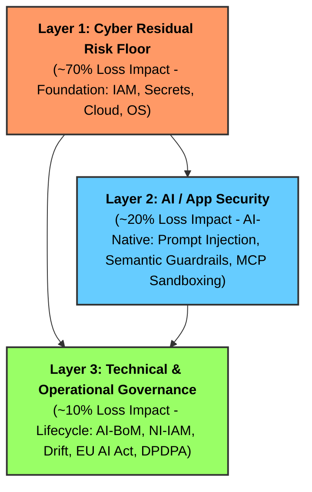

# 🔱 OWASP TriSuElla-AIDLCA Framework
> **AI-Driven Development Life Cycle & Autonomous Agent Governance (LLMSecOps)**  
> **Software Version**: 3.0.1 | **Framework Version**: 3.0.1 | **Status**: Institutionalized (Production-Ready & CI-Verified)  
> **Consolidated Invariants**: 299 Checks | **Rules**: 198 | **Domain Families**: 25

[](templates/.github/workflows/trisuella-gate.yml)
[](TRISUELLA_MASTER_RULES_AND_CHECKS.md)
[-success.svg)](https://github.com/OWASP/OWASP-TriSuElla-AIDLCA-Framework/actions)
[](#-progress--implementation-milestones-v301-institutionalized--ci-verified)
[-blue.svg)](https://www.linkedin.com/in/bhaskerkpatel/)
[](https://www.linkedin.com/in/bhaskerkpatel/)
[](TRISUELLA_MASTER_RULES_AND_CHECKS.md)
[](ai-bom.json)

---

## 🏛️ Executive Overview

The **TriSuElla-AIDLCA Framework** is an enterprise-grade, policy-governed architecture and security standard for **AI-assisted software engineering and autonomous multi-agent systems**. It ensures that machine intelligence operates with deterministic execution, zero-trust cryptographic verification, and coordinated human-in-the-loop governance.

Rooted in the symbolic **Trident (Trishula)** of Nordic and Sanskrit principles:
- 🔴 **SISU (Resilience & Execution)**: Agents execute with deterministic bounds, crash recovery, and safety invariants.
- 🔵 **TILLIT (Trust & Governance)**: Zero Trust ("Never Trust, Always Verify"), cryptographic identity, and tamper-evident audit trails.
- 🟢 **DUGNAD (Collective Collaboration)**: Multi-agent handoffs with mandatory **Dual-Key Human-in-the-Loop (HITL)** approval gates.

---

## 📈 Progress & Implementation Milestones (v3.0.1 Institutionalized & CI-Verified)

The framework has achieved **100% Institutionalized Implementation** across all governance pillars, automated tooling, and multi-cloud posture standards:

| Governance Pillar / Component | Scope & Standards | Progress | Status |
| :--- | :--- | :---: | :---: |
| **Master Rulebook & Invariants** | 299 Checks across 25 Domain Families & 198 Rules | 100% | **Institutionalized** |
| **Zero Trust Code (ZTC)** | `TRISU-ZTC-01..08` (AST boundary checks, ambient secret removal) | 100% | **Production-Ready** |
| **Open Source Security (OSS)** | `TRISU-OSS-01..06` (Cryptographic lockfile pinning & license scan) | 100% | **Production-Ready** |
| **Turnkey CLI & Packaging** | `trisu.cmd`, `trisu` executable, pip packaging (`pyproject.toml`) | 100% | **Production-Ready** |
| **Multi-Cloud CSPM Framework** | 14 Auditing Standards across AWS, Azure, GCP, Alibaba, OCI | 100% | **Production-Ready** |
| **CycloneDX AI-BoM Generator** | CycloneDX AI v1.6 Bill of Materials generator (`trisu bom`) | 100% | **Production-Ready** |
| **CI/CD Pull Request Policy Gate**| GitHub Actions verified live (Run `34675720411`: dual SARIF + BoM) | 100% | **Verified Passing** |
| **Multi-Agent System (AIDLCAa)** | 8-Agent Pipeline, TRISU-ZTP Envelopes & Dual-Key HITL Gates | 100% | **Production-Ready** |
| **Visual Governance Dashboard** | Sisu Nexus Web UI (`tools/sisu-ui`) & Compliance Datasets | 100% | **Production-Ready** |

---

## 🛡️ The 3-Layer Risk-First AI Security Model

TriSuElla structures security investment according to where real-world operational and financial loss occurs:



---

## 📊 Summary of Master Rules & Checks (299 Total)

All rules are consolidated in [TRISUELLA_MASTER_RULES_AND_CHECKS.md](TRISUELLA_MASTER_RULES_AND_CHECKS.md):

| Section | Domain / Rule Family | Checks | Primary Standards / Anchors |
| :--- | :--- | :---: | :--- |
| **0–1** | Framework Charter & Core LLMSecOps Lifecycle | 15 | STRIDE-AI, ISO 5259, Cosign, AI-BoM |
| **2** | System Security Baseline (`TRISU-BASE`) | 15 | OWASP Top 10 (2026), API Security |
| **3** | AI & Agentic Security (`TRISU-SEC`) | 22 | OWASP LLM Top 10, Tool Sandboxing |
| **4** | Zero Trust Architecture & Code (`TRISU-TRUST`/`ZTC`) | 22 | CISA ZT Maturity Model, NIST SP 800-207, ASVS |
| **5** | Sensitive Data Security (`TRISU-DATA`) | 10 | DPDPA (India), GDPR, HIPAA, L0–L4 Classification |
| **6–8** | DLCA, Infra (`TRISU-INFRA`), Cloud & Multi-Cloud CSPM (`TRISU-CLOUD`/`CSPM`) | 55 | CIS Benchmarks, Multi-Cloud CSPM (AWS, Azure, GCP, Alibaba, OCI) |
| **9–10** | Regional Compliance & Privacy by Design | 51 | Art. 25 GDPR, RBI Cyber Resilience, NIST SSDF |
| **11–13**| Testing, Checklists & CI/CD Gates | 45 | Garak, PyRIT, SAST, 20-Item Review Checklist |
| **14–20**| Tooling, Maturity Model, KPIs & RBI Sutras | 40 | Sisu-UI, RBI 7 Sutras, ISO 42001 AIMS |
| **21** | **Model Context Protocol Security (`TRISU-MCP`)** | **6** | MCP Schema Sanitization, Recursion Bounds, HITL |
| **22** | **EU AI Act High-Risk Compliance (`TRISU-EUAI`)** | **7** | EU Regulation 2024/1689 (Articles 9–15, CE Gate) |
| **23** | **Agentic Identity & Token Delegation (`TRISU-AIAM`)** | **5** | RFC 8693 Token Exchange, SPIFFE/mTLS, Ephemeral Keys |
| **24** | **Open Source & Supply Chain Security (`TRISU-OSS`)** | **6** | OpenSSF, SLSA v1.0, Lockfile Hash Pinning, CycloneDX v1.6 |
| **TOTAL**| **Consolidated Invariants** | **299** | **Mandatory Blocking for [CRITICAL]/[HIGH]** |

---

## ⚡ Quick Start: 30 Seconds to Production Governance

### 1. Turnkey Launchers & Global Pip Installation

The framework provides turnkey zero-setup wrappers and standard pip packaging:

```bash
# Option A: Direct root wrapper (zero install)
.\trisu.cmd check        # Windows (cmd / powershell)
./trisu check            # Linux / macOS / Git Bash

# Option B: Global pip installation (accessible from any directory)
pip install -e tools/trisu-cli
trisu --help
```

### 2. Scaffold Any Project with `trisu init`
Run the CLI to instantly initialize TriSuElla governance in your existing repository:
```bash
trisu init --target /path/to/my-repo
```
This automatically scaffolds:
- `.cursorrules` (Cursor AI)
- `CLAUDE.md` (Claude Code / Claude Projects)
- `.windsurfrules` (Windsurf)
- `.github/copilot-instructions.md` (GitHub Copilot)
- `trisuella.config.yaml` (Project Policy Configuration)
- `.pre-commit-config.yaml` (Local git commit blocker)
- `.github/workflows/trisuella-gate.yml` (CI/CD PR gate)
- `audit.md` & `TRISUELLA-AIDLCA-state.md` (State & compliance tracking)

### 3. Run Policy Audits & Supply Chain Gates
```bash
# Check repository artifact and drop-in template readiness
trisu check

# Run blocking security audit and export OASIS SARIF report
trisu audit --sarif audit.sarif

# Run Open Source Security (OSS) & supply chain audit
trisu oss --sarif oss.sarif

# Validate all 198 rule identifiers and inspect domain breakdown
trisu rules

# Generate a CycloneDX AI v1.6 Bill of Materials (AI-BoM)
trisu bom --output ai-bom.json
```

---

## 📁 Repository Structure

```
OWASP-TriSuElla-AIDLCA-FrameWork/
├── README.md                              # Main project entrypoint & quickstart (v3.0)
├── Usage-Guide.md                         # Comprehensive step-by-step master usage guide
├── TRISUELLA_MASTER_RULES_AND_CHECKS.md   # Unified master rulebook (299 checks, 198 rules)
├── ai-bom.json                            # Machine-readable CycloneDX AI v1.6 BoM
├── trisuella.config.yaml                  # Declarative policy & Multi-Cloud CSPM manifest
├── CLAUDE.md & .cursorrules               # Local IDE workspace assistant rules
├── trisu.cmd & trisu                      # Turnkey CLI wrappers for Windows & Unix
├── LICENSE                                # Open-source Apache-2.0 license
├── templates/                             # Drop-in templates for all IDEs & CI/CD
│   ├── .cursorrules                       # Cursor IDE rules
│   ├── CLAUDE.md                          # Claude Code instructions
│   ├── .windsurfrules                     # Windsurf rules
│   ├── copilot-instructions.md            # GitHub Copilot instructions
│   ├── trisuella.config.yaml              # Declarative policy & CSPM manifest
│   ├── .pre-commit-config.yaml            # Git pre-commit hook
│   └── .github/workflows/trisuella-gate.yml # GitHub Actions PR gate
├── tools/
│   ├── trisu-cli/                         # Gatekeeper CLI (check, audit, oss, init, bom, rules)
│   │   ├── trisu_validator.py             # Python engine with AST parser & supply chain scanner
│   │   ├── pyproject.toml & setup.py      # Pip package definition for global 'trisu' command
│   │   └── README.md                      # CLI usage manual
│   └── sisu-ui/                           # Sisu Nexus visual compliance dashboard
│       ├── index.html                     # Web UI dashboard
│       ├── sisu-ui-design-spec.md         # UI architecture & KPIs spec
│       └── sample-data/                   # Demo compliance & governance dataset
├── TRISUELLA-AIDLCA-Rules/                # Core specifications, workflows & prompts
│   ├── README.md & CHARTER.md             # Philosophy, severity scale & charter
│   ├── FULL_README.md                     # Comprehensive manual, CSPM crosswalk & changelog
│   ├── TRISUELLA-AIDLCA-rules/            # core-workflow.md (active agent prompt)
│   ├── TRISUELLA-AIDLCA-rule-details/     # Modular extensions (MCP, EU AI, Zero Trust, CSPM)
│   ├── prompts/                           # Turnkey prompt library (P, B, T, A, C series)
│   └── docs/                              # Developer guides (faq, which-extensions, vibe-coding)
├── TRISUELLA-AIDLCAa/                     # 8-Stage Autonomous Multi-Agent System
│   └── README.md                          # ZTP message protocol & Dual-Key HITL gates
├── TRISUELLA-AIDLCA-docs/                 # State tracker & crosswalk matrices
│   ├── TRISUELLA-AIDLCA-state.md          # Runtime workflow state & extension tracking
│   └── AICM-AIDLCA-Crosswalk.md           # CSA AICM v1.0.3 to TriSuElla crosswalk
└── Data-Source/                           # Regulatory baselines (RBI, ISO 42001, CSA AICM)
```

---

## 📜 Enforcement Guarantee
TriSuElla operates on a strict **Binary Enforcement Principle**:
- **`[CRITICAL]` / `[HIGH]`**: **Atomic Stop Gate**. Execution halts immediately. Code generation and deployment pipelines block until remediated.
- **`[MEDIUM]` / `[LOW]`**: Advisory. Requires documented justification and signed human steward acceptance in `audit.md`.

---

## 👤 Author & Project Leadership

- **Author & Framework Architect**: **Bhaskar Puppala (PATEL)**
- **LinkedIn**: [linkedin.com/in/bhaskerkpatel](https://www.linkedin.com/in/bhaskerkpatel/)
- **Organization**: [OWASP TriSuElla Working Group](https://github.com/OWASP/OWASP-TriSuElla-AIDLCA-Framework)

*v3.0 Institutionalized Release — Security-first, AI-native. Built for the era of Agentic Autonomy.*
