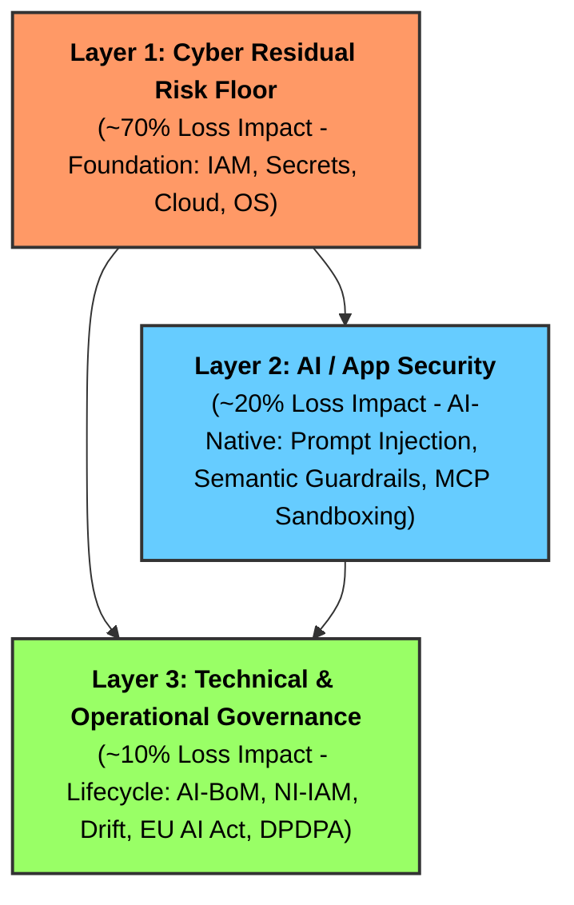
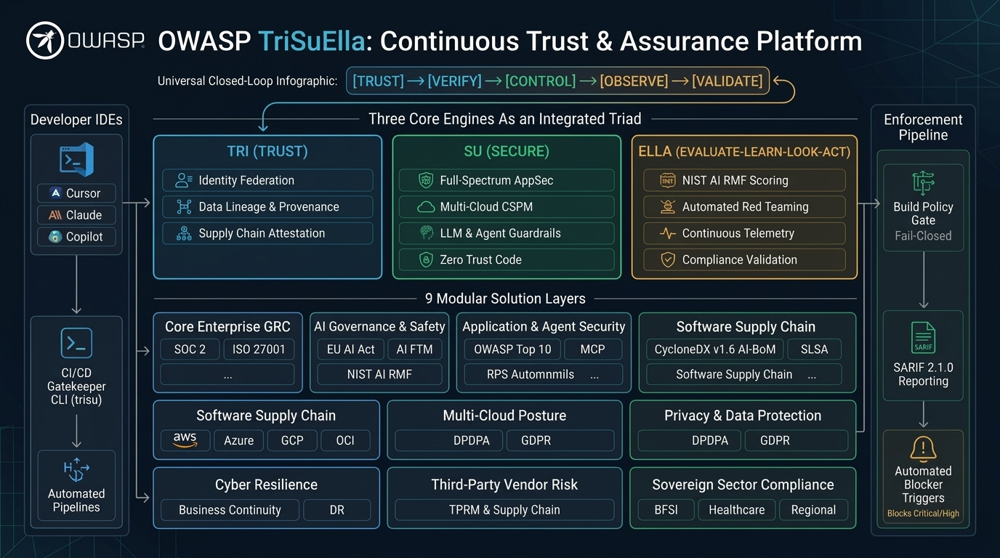

# 🔱 TriSuElla-AIDLCA Framework
> **One Unified Continuous Trust, Risk, Security & Compliance Layer for Conventional Systems, Generative AI & Autonomous Multi-Agent Workloads**  
> **Software Version**: 3.4.0 | **Framework Version**: 3.4.0 | **Status**: Institutionalized (Production-Ready, DevSecOps-Ready & CI-Verified)  
> **Consolidated Invariants**: 338 Checks | **Rules**: 237 | **Domain Families**: 33

[](templates/.github/workflows/trisuella-gate.yml)
[](TRISUELLA_MASTER_RULES_AND_CHECKS.md)
[-success.svg)](https://github.com/OWASP/OWASP-TriSuElla-AIDLCA-Framework/actions)
[](#-progress--implementation-milestones-v340-institutionalized--ci-verified)
[-blue.svg)](https://www.linkedin.com/in/bhaskerkpatel/)
[](https://www.linkedin.com/in/bhaskerkpatel/)
[](TRISUELLA_MASTER_RULES_AND_CHECKS.md)
[](ai-bom.json)
[](wiki/Home.md)

---

## 🏛️ Executive Overview

The **TriSuElla-AIDLCA Framework** is the **Unified Control-and-Validation Layer** across conventional systems, GenAI applications, and autonomous multi-agent ecosystems. Rather than treating compliance and security as disjointed checklists, TriSuElla provides a unified architecture connecting **SOC 2, ISO/IEC 27001, NIST AI RMF (with GenAI Profile NIST.IR.8596), EU AI Act, DPDPA, and the OWASP suite (OWASP Top 10 for LLM Applications 2025, Agentic AI, API, Web, Mobile)**.

### The TriSuElla Operating Formula
$$\text{Trust the component} \longrightarrow \text{Verify the component} \longrightarrow \text{Control its authority} \longrightarrow \text{Observe its behavior} \longrightarrow \text{Continuously validate the outcome}$$

### The Standards as Evaluation Lenses
Each standard represents an evaluation lens answering a specific trust inquiry:
- **ISO/IEC 27001:2022**: *"Do you have an effective information security management system (ISMS)?"* → Control assessment, risk treatment, continual improvement.
- **SOC 2 Type II**: *"Are relevant controls operating effectively across Security, Availability, Integrity, Confidentiality, Privacy?"* → Automated evidence collection, continuous control monitoring.
- **NIST AI RMF 1.0 & GenAI Profile**: *"Are AI risks governed, mapped, measured, and managed?"* → AI risk identification, empirical red teaming, and drift gates.
- **EU AI Act (2024/1689)**: *"Are the applicable AI regulatory obligations satisfied?"* → High-risk AI classification, Annex IV technical dossiers, and human oversight.
- **OWASP Suite**: *"Can the actual application, LLM, or agent be attacked?"* → Adversarial security testing, prompt sandboxing, and runtime validation.
- **🔱 TriSuElla Core**: *"Can we continuously prove that the system, its components, controls, and AI behavior remain trustworthy?"* → Master Control & Assurance Engine.

### The 8-Stage TriSuElla Operational Pipeline
```
1. GOVERN       --> Policies • Ownership • Accountability • Legal Obligations
2. DISCOVER/MAP --> Assets • Applications • Models • Agents • Data • Vendors
3. ASSESS       --> SOC 2 • ISO 27001 • NIST AI RMF • EU AI Act • DPDPA
4. ATTACK/TEST  --> Red Teaming • Prompt Injection • Excessive Agency • AppSec
5. CONTROL      --> Least Privilege • Semantic Guardrails • Tool ACLs • Dual-Key HITL
6. OBSERVE      --> Runtime Telemetry • Output Anomalies • Model Drift • Audit Logs
7. EVIDENCE     --> Cryptographic Ledger • AI-BoM • SARIF • Compliance Dashboard
8. VALIDATE     --> Independent Verification • Re-test • Continuous Assurance
```

Rooted in the symbolic **Trident (Trishula)** of Nordic and Sanskrit principles:
- 🔴 **SISU (Resilience & Execution)**: Agents execute with deterministic bounds, crash recovery, and safety invariants.
- 🔵 **TILLIT (Trust & Governance)**: Zero Trust ("Never Trust, Always Verify"), cryptographic identity, and tamper-evident audit trails.
- 🟢 **DUGNAD (Collective Collaboration)**: Multi-agent handoffs with mandatory **Dual-Key Human-in-the-Loop (HITL)** approval gates.

---

## 📈 Progress & Implementation Milestones (v3.4.0 Institutionalized & CI-Verified)

The framework has achieved **100% Institutionalized Implementation** across all governance pillars, automated tooling, multi-cloud posture standards, and unified trust crosswalks:

| Governance Pillar / Component | Scope & Standards | Progress | Status |
| :--- | :--- | :---: | :---: |
| **Master Rulebook & Invariants** | 338 Checks across 33 Domain Families & 237 Rules | 100% | **Institutionalized** |
| **Unified Continuous Trust Architecture** | 9 Solution Layers & TRI-SU-ELLA Crosswalk Matrix (`trisu matrix`) | 100% | **Production-Ready** |
| **Core GRC & ISMS Extensions** | SOC 2 Type II (`TRISU-SOC2-01..04`), ISO 27001 ISMS (`TRISU-ISMS-01..04`) | 100% | **Production-Ready** |
| **AI Risk Management (NIST AI RMF)** | `TRISU-AIRMF-01..06` (Govern, Map, Measure, Manage, GenAI NIST.IR.8596) | 100% | **Production-Ready** |
| **Full-Spectrum AppSec Suite** | `TRISU-API-01..05`, `TRISU-MOB-01..03`, `TRISU-WEB-01..03` (ASVS, OWASP API/Mobile/Web) | 100% | **Production-Ready** |
| **Data Literacy & Integrity** | `TRISU-DLIT-01..08` (Dataset provenance, vector ACL, air-gap defense) | 100% | **Production-Ready** |
| **Shadow AI & Model Discovery** | `TRISU-SHADOW-01..06` (AST scan, AI-BOM model sync, gateway bypass gate) | 100% | **Production-Ready** |
| **Zero Trust Code (ZTC)** | `TRISU-ZTC-01..08` (AST boundary checks, ambient secret removal) | 100% | **Production-Ready** |
| **Open Source Security (OSS)** | `TRISU-OSS-01..06` (Cryptographic lockfile pinning & license scan) | 100% | **Production-Ready** |
| **Turnkey CLI & Packaging** | `trisu.cmd`, `trisu` executable, pip packaging (`pyproject.toml`) | 100% | **Production-Ready** |
| **Multi-Cloud CSPM Framework** | 14 Auditing Standards across AWS, Azure, GCP, Alibaba, OCI | 100% | **Production-Ready** |
| **CycloneDX AI-BoM Generator** | CycloneDX AI v1.6 Bill of Materials generator (`trisu bom`) | 100% | **Production-Ready** |
| **CI/CD Pull Request Policy Gate**| GitHub Actions verified live (Run `34675720411`: dual SARIF + BoM) | 100% | **Verified Passing** |
| **Multi-Agent System (AIDLCAa)** | 8-Agent Pipeline, TRISU-ZTP Envelopes & Dual-Key HITL Gates | 100% | **Production-Ready** |
| **Visual Governance Dashboard** | Sisu Nexus Web UI (`tools/sisu-ui`) & Compliance Datasets | 100% | **Production-Ready** |

---

## 🌟 Key Solution Features & Capabilities

The TriSuElla-AIDLCA solution provides a full-spectrum, production-grade security and governance engine designed for modern AI engineering and autonomous agent swarms:

### 1. 🛡️ Zero-Dependency Policy Gatekeeper CLI (`TRISU-CLI`)
- **Native Portability**: Runs on Windows (`.\trisu.cmd`), Linux/macOS (`./trisu`), or as a global command via `pip install -e tools/trisu-cli`.
- **Pure Python Standard Library**: Operates with zero third-party dependencies (`argparse`, `ast`, `json`, `re`, `pathlib`), eliminating supply chain risk on the validator itself.
- **Blazing Speed**: Sub-second execution (<1.5s) making it ideal for fast developer feedback and lightweight CI/CD runner jobs.
- **Deterministic Fail-Closed Exit Codes**: Returns `0` on clean state and `1` on blocking `[CRITICAL]` / `[HIGH]` violations.

### 2. 🔍 Hybrid AST Static Application Security Testing (`TRISU-SAST` / `ZTC`)
- **Abstract Syntax Tree (AST) Analysis**: Automatically inspects Python source trees to detect banned dynamic execution sinks (`eval()`, `exec()`), insecure deserialization (`pickle.load/loads`, unloader YAML), and dangerous shell execution (`subprocess.run(shell=True)`).
- **Deterministic Error Handling Enforcement (`TRISU-ZTC-04`)**: Identifies and blocks fail-open naked exception suppressions (`except: pass`), guaranteeing fail-closed security.
- **Boundary & Injection Prevention (`TRISU-ZTC-01`)**: Detects unparameterized SQL f-strings, raw SQL concatenation, and insecure TLS verification bypasses (`verify=False`).

### 3. 🔑 Zero Ambient Credentials & Secret Scanning (`TRISU-ZTC-03`)
- **Multi-Vector Credential Scanner**: Scans all repository files for exposed AWS Access Keys (`AKIA*`), GitHub PATs (`ghp_*`), private RSA/EC/SSH keys, and hardcoded API tokens.
- **Just-In-Time (JIT) Credential Enforcement**: Mandates ephemeral identity retrieval via workload federation and immediate memory zeroization.

### 4. 📦 Software Composition Analysis (SCA) & Supply Chain Security (`TRISU-OSS`)
- **Cryptographic Lockfile Hash Pinning (`TRISU-OSS-01`)**: Enforces exact dependency version pinning with SHA-256 integrity hashes, rejecting floating version ranges (`>=`, `~=`).
- **Open Source License Governance (`TRISU-OSS-03`)**: Prohibits restrictive copyleft contamination (AGPL-3.0, SSPL, EUPL) in commercial releases.
- **Typosquatting & Dependency Confusion Defense (`TRISU-OSS-04`)**: Detects spoofed, malicious, or typosquatted package names.
- **Cryptographic Provenance Attestation (`TRISU-OSS-06`)**: Validates SLSA Level 2+ provenance and container signing metadata.

### 5. 📋 Automated CycloneDX AI v1.6 Bill of Materials (`TRISU-BOM` / `AI-BOM`)
- **AI-BoM Generation**: Produces compliant CycloneDX v1.6 JSON manifests with RFC-4122 UUIDs (`trisu bom --output ai-bom.json`).
- **Model & Prompt Transparency**: Automatically records foundation models (e.g., Claude, GPT, Gemma), reasoning tasks, input/output schemas, risk tiers, and governance properties for regulatory auditability.

### 6. 🤖 Autonomous Agent Confinement & MCP Tool Sandboxing (`TRISU-MCP`)
- **Model Context Protocol (MCP) Guardrails**: Enforces runtime parameter sanitization, recursive execution loop bounds, and out-of-band credential injection defense (`TRISU-MCP-01..06`).
- **Agent Blast-Radius Limits**: Restricts autonomous agent tool execution to least-privilege operations with mandatory human sign-off on mutating calls (`TRISU-ZTC-08`).

### 7. ☁️ Enterprise Multi-Cloud CSPM Framework (`TRISU-CSPM`)
- **14 Unified Cloud Controls**: Standardized security posture across **AWS, Microsoft Azure, Google Cloud (GCP), Alibaba Cloud (Aliyun), and Oracle Cloud Infrastructure (OCI)**.
- **Deep Domain Coverage**: Kubernetes Posture (KSPM), Data Security Posture (DSPM), AI Model Perimeters (AI-CSPM), WORM Storage Object Locks, and Shift-Left IaC validation.

### 8. 👥 Dual-Key Human-in-the-Loop (HITL) & Agentic IAM (`TRISU-AIAM`)
- **Zero Trust Protocol (ZTP) Envelopes**: Structured, cryptographically verified inter-agent communication packets across the 8-stage AIDLCAa multi-agent lifecycle.
- **Dual-Key Approval Gates**: Critical operations (e.g., schema migration, production deploy, IAM elevation) require co-signed authorizations from two distinct human roles.
- **Non-Human Identity (NHI) Federation**: Replaces static cloud keys with RFC 8693 token exchange and SPIFFE/mTLS workload principals.

### 9. 🌐 Universal CI/CD DevSecOps Integration & OASIS SARIF 2.1.0 (`TRISU-SARIF`)
- **OASIS SARIF 2.1.0 Generation**: CLI exports standard SARIF reports (`--sarif`) seamlessly ingested by GitHub Code Scanning, GitLab Security Dashboard, Azure DevOps, and SonarQube.
- **Turnkey Scaffolding (`trisu init`)**: Scaffolds complete GitHub Actions workflows, pre-commit hooks, and IDE directives in under 30 seconds.

### 10. 🖥️ Sisu Nexus Visual Compliance Dashboard (`SISU-UI`)
- **Glassmorphic Cyber UI**: Standalone dark-mode web application featuring real-time repository codespace exploration, active dependency graphs, and live pillar health gauges (SISU, TILLIT, DUGNAD).

### 11. 🕵️ AST Shadow AI Discovery & Model Reconciliation (`TRISU-SHADOW`)
- **Automated AST & Egress Scanner (`trisu shadow`)**: Scans codebases for undeclared model invocations (e.g., direct OpenAI/Anthropic SDK usage bypassing sanctioned gateways), unapproved suppliers, and raw prompt exfiltration risks.
- **Model-to-BOM Reconciliation**: Reconciles discovered code-level endpoints against the declared CycloneDX AI-BoM, flagging unsanctioned models before PR merge.

### 12. 📊 Data Literacy, Lineage & Poisoning Defense (`TRISU-DLIT`)
- **Dataset Provenance & Consent Tracking**: Cryptographic SHA-256 dataset lineage hashes and explicit consent attestation in compliance with EU AI Act Art. 10 and India DPDPA.
- **Pre-Retrieval Vector Store Authorization**: AST-verified pre-retrieval ACL filtering for RAG vector search queries, stopping vector store poisoning and unauthorized context leakage.
- **Production Data Air-Gap Defense**: Static detection of production PII dumps (`.dump`, `.parquet`, `.sqlite3`, Aadhaar/SSN patterns) in non-production code repositories.

### 13. 🏛️ Core Enterprise GRC & ISMS (`TRISU-SOC2` / `TRISU-ISMS`)
- **SOC 2 Type II Invariants (`TRISU-SOC2-01..04`)**: Automated validation of Trust Services Criteria (CC6.1 logical access, CC6.6 boundary protection, CC7.2 continuous anomaly detection, CC8.1 strict change gates).
- **ISO/IEC 27001:2022 ISMS (`TRISU-ISMS-01..04`)**: Annex A controls mapping across organizational policies (A.5), human resources (A.7), and secure development lifecycles (A.8) with automated SLA verification.

### 14. 🤖 AI Risk Management System & GenAI Profile (`TRISU-AIRMF`)
- **NIST AI RMF 1.0 Lifecyle (`TRISU-AIRMF-01..04`)**: Concrete control gates for **GOVERN, MAP, MEASURE, and MANAGE** functions.
- **NIST GenAI Profile (NIST.IR.8596)**: Synthetic output attestation, C2PA cryptographic watermarking verification, and continuous automated red-teaming against jailbreaks and multi-turn prompt injection (`TRISU-AIRMF-05..06`).

### 15. 🎯 Full-Spectrum AppSec Suite: API, Mobile & Web ASVS (`TRISU-API` / `MOB` / `WEB`)
- **OWASP API Security Top 10 (`TRISU-API-01..05`)**: Enforces object-level authorization (BOLA/BFLA), token lifecycle validation, adaptive rate limiting, and SSRF defenses.
- **OWASP Mobile Security (`TRISU-MOB-01..03`)**: Hardware-backed keystore/keychain storage, certificate pinning, and runtime anti-tampering/root detection.
- **OWASP ASVS v4.0 (`TRISU-WEB-01..03`)**: Level 2 session management, strict parameterized query sanitization, and automated CSP/security header enforcement.

### 16. 🌐 Unified 9-Layer Continuous Trust Architecture (`trisu matrix`)
- **Unified Engine Triad**: Operationalizes **TRI** (Trust), **SU** (Secure), and **ELLA** (Evaluate-Learn-Look-Act) across 9 enterprise solution layers.
- **Terminal Matrix Visualizer**: Run `trisu matrix` to inspect full crosswalk mappings connecting Risk → Controls → Technical Reality → Evidence → Validation.

---

## 🎯 Personas & How to Use TriSuElla

| Persona | Primary Goal | How TriSuElla Solves It |
| :--- | :--- | :--- |
| **AI Engineers & Vibe Coders** | Build fast without generating security flaws | Drop in `.cursorrules`, `CLAUDE.md`, or `.windsurfrules`. The AI co-pilot automatically enforces threat modeling, input validation, and the 20-Item Security Review Checklist. |
| **DevSecOps & AppSec Engineers** | Block vulnerabilities and supply-chain attacks in CI/CD | Run `trisu audit --sarif audit.sarif` and `trisu oss --sarif oss.sarif` in pull requests. Auto-block builds on critical CVEs, unpinned packages, or exposed secrets. |
| **Cloud & Platform Architects** | Standardize security across multi-cloud deployments | Enforce the 14 `TRISU-CSPM` controls across AWS, Azure, GCP, Alibaba, and OCI to eliminate cloud misconfigurations and ensure private AI perimeters. |
| **GRC & Compliance Officers** | Satisfy AI regulations (EU AI Act, ISO 42001, DPDPA) | Run `trisu bom` to produce CycloneDX AI-BoMs and audit against the 338 institutionalized checks to ensure continuous compliance evidence. |

---

## 🛡️ The 3-Layer Risk-First AI Security Model

TriSuElla structures security investment according to where real-world operational and financial loss occurs:



---

## 🏛️ The TriSuElla Continuous Trust Architecture (v3.4.0)



TriSuElla serves as the **master control-and-validation layer** across 9 structured solution layers, powered by the **TRI-SU-ELLA Engine Triad**:

$$\textbf{TRUST} \longrightarrow \textbf{VERIFY} \longrightarrow \textbf{CONTROL} \longrightarrow \textbf{OBSERVE} \longrightarrow \textbf{VALIDATE}$$

```mermaid
graph LR
    subgraph TRI["<b>TRI (Trust)</b>"]
        T1["Identity & IAM<br/>(RFC 8693 / SPIFFE)"]
        T2["Data Provenance<br/>(CycloneDX AI v1.6)"]
        T3["Supply Chain<br/>(SLSA / Cosign)"]
    end

    subgraph SU["<b>SU (Secure)</b>"]
        S1["Cybersecurity & Cloud<br/>(CSPM / CIS / Zero Trust)"]
        S2["AppSec & APIs<br/>(OWASP Top 10 / ASVS)"]
        S3["LLM & Agent Security<br/>(MCP Sandboxing / ZTC)"]
    end

    subgraph ELLA["<b>ELLA (Evaluate·Learn·Look·Act)</b>"]
        E1["Risk & Red Teaming<br/>(NIST AI RMF / PyRIT)"]
        E2["Continuous Telemetry<br/>(Drift & Anomaly Alarms)"]
        E3["Audit & Validation<br/>(SOC 2 / ISO 27001 / SARIF)"]
    end

    TRI --> SU
    SU --> ELLA
    ELLA -.->|Closed Feedback Loop| TRI

    style TRI fill:#e8f4fd,stroke:#0969da,stroke-width:2px,color:#000
    style SU fill:#fff8c5,stroke:#9a6700,stroke-width:2px,color:#000
    style ELLA fill:#dafbe1,stroke:#1a7f37,stroke-width:2px,color:#000
```



---

## 📊 Summary of Master Rules & Checks (338 Total across 33 Domain Families)

All rules are consolidated in [TRISUELLA_MASTER_RULES_AND_CHECKS.md](TRISUELLA_MASTER_RULES_AND_CHECKS.md):

| Section | Domain / Rule Family | Checks | Primary Standards / Anchors |
| :--- | :--- | :---: | :--- |
| **0–1** | Framework Charter & Core LLMSecOps Lifecycle | 15 | STRIDE-AI, ISO 5259, Cosign, AI-BoM |
| **2** | System Security Baseline (`TRISU-BASE`) | 15 | OWASP Top 10 (2026), API Security |
| **3** | AI & Agentic Security (`TRISU-SEC`) | 22 | OWASP Top 10 for LLM Applications (2025 Standard), Tool Sandboxing |
| **4** | Zero Trust Architecture & Code (`TRISU-TRUST`/`ZTC`) | 22 | CISA ZT Maturity Model, NIST SP 800-207, ASVS |
| **5** | Sensitive Data Security (`TRISU-DATA`) | 10 | DPDPA (India), GDPR, HIPAA, L0–L4 Classification |
| **6–8** | DLCA, Infra (`TRISU-INFRA`), Cloud & Multi-Cloud CSPM (`TRISU-CLOUD`/`CSPM`) | 55 | CIS Benchmarks, Multi-Cloud CSPM (AWS, Azure, GCP, Alibaba, OCI) |
| **9–10** | Regional Compliance & Privacy by Design | 51 | Art. 25 GDPR, RBI Cyber Resilience, NIST SSDF |
| **11–13**| Testing, Checklists & CI/CD Gates | 45 | Garak, PyRIT, SAST, 20-Item Review Checklist |
| **14–20**| Tooling, Maturity Model, KPIs & RBI Sutras | 40 | Sisu-UI, RBI 7 Sutras, ISO 42001 AIMS |
| **21** | **Model Context Protocol Security (`TRISU-MCP`)** | **6** | MCP Schema Sanitization, Recursion Bounds, HITL |
| **22** | **EU AI Act High-Risk Compliance (`TRISU-EUAI`)** | **7** | EU Regulation 2024/1689 (Articles 9–15, CE Gate) |
| **23** | **Agentic Identity & Token Delegation (`TRISU-AIAM`)** | **5** | RFC 8693 Token Exchange, SPIFFE/mTLS, Ephemeral Keys |
| **24** | **Open Source & Supply Chain Security (`TRISU-OSS`)** | **6** | OpenSSF, SLSA v1.0, Lockfile Hash Pinning, CycloneDX v1.6 |
| **25** | **Shadow AI Discovery & Enforcement (`TRISU-SHADOW`)** | **6** | Shadow AI AST Scan, Gateway Bypass Defense, BOM Sync |
| **26** | **Data Literacy & Integrity Governance (`TRISU-DLIT`)** | **8** | ISO 5259, Data Provenance, Vector ACL, Air-Gap Defense |
| **27** | **Core Enterprise GRC: SOC 2 & ISO 27001 (`TRISU-SOC2`/`ISMS`)** | **8** | SOC 2 Type II (CC6.1..CC8.1), ISO/IEC 27001:2022 A.5..A.8 |
| **28** | **AI Risk Management: NIST AI RMF (`TRISU-AIRMF`)** | **6** | NIST AI RMF 1.0 (Govern, Map, Measure, Manage), GenAI NIST.IR.8596 |
| **29** | **Full-Spectrum AppSec Suite (`TRISU-API`/`MOB`/`WEB`)** | **11** | OWASP API Security Top 10, Mobile Top 10, ASVS v4.0, CWE, CISA KEV |
| **TOTAL**| **Consolidated Invariants (237 Unique Rules)** | **338** | **Mandatory Blocking for [CRITICAL]/[HIGH]** |

---

## ⚡ Quick Start: 30 Seconds to Production Governance

### 1. Turnkey Launchers & Global Pip Installation

The framework provides turnkey zero-setup wrappers and standard pip packaging:

```bash
# Option A: Direct root wrapper (zero install)
.\trisu.cmd check        # Windows (cmd / powershell)
./trisu check            # Linux / macOS / Git Bash

# Option B: Global pip installation (accessible from any directory)
pip install -e tools/trisu-cli
trisu --help
```

### 2. Scaffold Any Project with `trisu init`
Run the CLI to instantly initialize TriSuElla governance in your existing repository:
```bash
trisu init --target /path/to/my-repo
```
This automatically scaffolds:
- `.cursorrules` (Cursor AI)
- `CLAUDE.md` (Claude Code / Claude Projects)
- `.windsurfrules` (Windsurf)
- `.github/copilot-instructions.md` (GitHub Copilot)
- `trisuella.config.yaml` (Project Policy Configuration)
- `.pre-commit-config.yaml` (Local git commit blocker)
- `.github/workflows/trisuella-gate.yml` (CI/CD PR gate)
- `audit.md` & `TRISUELLA-AIDLCA-state.md` (State & compliance tracking)

### 3. Run Policy Audits & Supply Chain Gates
```bash
# Check repository artifact and drop-in template readiness
trisu check

# Run blocking security audit and export OASIS SARIF report
trisu audit --sarif audit.sarif

# Run Open Source Security (OSS) & supply chain audit
trisu oss --sarif oss.sarif

# Scan codebase for Shadow AI, undeclared models & gateway bypasses
trisu shadow --sarif shadow.sarif

# Validate all 237 rule identifiers and inspect domain breakdown (338 checks across 33 domain families)
trisu rules

# View unified TRI-SU-ELLA crosswalk and 9 solution layers matrix
trisu matrix

# Generate a CycloneDX AI v1.6 Bill of Materials (AI-BoM)
trisu bom --output ai-bom.json
```

---

## 📁 Repository Structure

```
OWASP-TriSuElla-AIDLCA-FrameWork/
├── README.md                              # Main project entrypoint & quickstart (v3.4.0)
├── Usage-Guide.md                         # Comprehensive step-by-step master usage guide
├── TRISUELLA_MASTER_RULES_AND_CHECKS.md   # Unified master rulebook (338 checks, 237 rules across 33 domains)
├── ai-bom.json                            # Machine-readable CycloneDX AI v1.6 BoM
├── trisuella.config.yaml                  # Declarative policy & Multi-Cloud CSPM manifest
├── CLAUDE.md & .cursorrules               # Local IDE workspace assistant rules
├── trisu.cmd & trisu                      # Turnkey CLI wrappers for Windows & Unix
├── CONTRIBUTING.md                        # Community contribution guidelines & legal terms
├── LICENSE                                # Product Notice & Copyright Declaration
├── templates/                             # Drop-in templates for all IDEs & CI/CD
│   ├── .cursorrules                       # Cursor IDE rules
│   ├── CLAUDE.md                          # Claude Code instructions
│   ├── .windsurfrules                     # Windsurf rules
│   ├── copilot-instructions.md            # GitHub Copilot instructions
│   ├── trisuella.config.yaml              # Declarative policy & CSPM manifest
│   ├── .pre-commit-config.yaml            # Git pre-commit hook
│   └── .github/workflows/trisuella-gate.yml # GitHub Actions PR gate
├── tools/
│   ├── trisu-cli/                         # Gatekeeper CLI (check, audit, oss, init, bom, rules, matrix)
│   │   ├── trisu_validator.py             # Python engine with AST parser & supply chain scanner
│   │   ├── pyproject.toml & setup.py      # Pip package definition for global 'trisu' command
│   │   └── README.md                      # CLI usage manual
│   └── sisu-ui/                           # Sisu Nexus visual compliance dashboard
│       ├── index.html                     # Web UI dashboard
│       ├── sisu-ui-design-spec.md         # UI architecture & KPIs spec
│       └── sample-data/                   # Demo compliance & governance dataset
├── TRISUELLA-AIDLCA-Rules/                # Core specifications, workflows & prompts
│   ├── README.md & CHARTER.md             # Philosophy, severity scale & charter
│   ├── FULL_README.md                     # Comprehensive manual, CSPM crosswalk & changelog
│   ├── TRISUELLA-AIDLCA-rules/            # core-workflow.md (active agent prompt)
│   ├── TRISUELLA-AIDLCA-rule-details/     # Modular extensions (SOC 2, ISO, NIST AI RMF, AppSec, MCP, CSPM)
│   ├── prompts/                           # Turnkey prompt library (P, B, T, A, C series)
│   └── docs/                              # Developer guides (faq, which-extensions, vibe-coding)
├── TRISUELLA-AIDLCAa/                     # 8-Stage Autonomous Multi-Agent System
│   └── README.md                          # ZTP message protocol & Dual-Key HITL gates
├── TRISUELLA-AIDLCA-docs/                 # State tracker, unified architecture & crosswalk matrices
│   ├── Unified-Trust-Risk-Compliance-Architecture.md # 9 Solution Layers & TRI-SU-ELLA Engine Architecture
│   ├── TriSuElla-Unified-Crosswalk-Matrix.md # Multi-standard crosswalk (SOC2, ISO, NIST, EU AI, AppSec)
│   ├── TRISUELLA-AIDLCA-state.md          # Runtime workflow state & extension tracking
│   └── AICM-AIDLCA-Crosswalk.md           # CSA AICM v1.0.3 to TriSuElla crosswalk
├── wiki/                                  # GitHub Wiki documentation suite & publishing guide
└── Data-Source/                           # Regulatory baselines (RBI, ISO 42001, CSA AICM)
```

---

## 📜 Enforcement Guarantee
TriSuElla operates on a strict **Binary Enforcement Principle**:
- **`[CRITICAL]` / `[HIGH]`**: **Atomic Stop Gate**. Execution halts immediately. Code generation and deployment pipelines block until remediated.
- **`[MEDIUM]` / `[LOW]`**: Advisory. Requires documented justification and signed human steward acceptance in `audit.md`.

---

## 👤 Author & Project Leadership

- **Author & Framework Architect**: **Bhaskar Puppala (PATEL)**
- **LinkedIn**: [linkedin.com/in/bhaskerkpatel](https://www.linkedin.com/in/bhaskerkpatel/)
- **Organization**: [OWASP TriSuElla Working Group](https://github.com/OWASP/OWASP-TriSuElla-AIDLCA-Framework)

*v3.4.0 Institutionalized Release — Continuous Trust & Assurance for Digital and AI Systems. Built for the era of Agentic Autonomy.*
