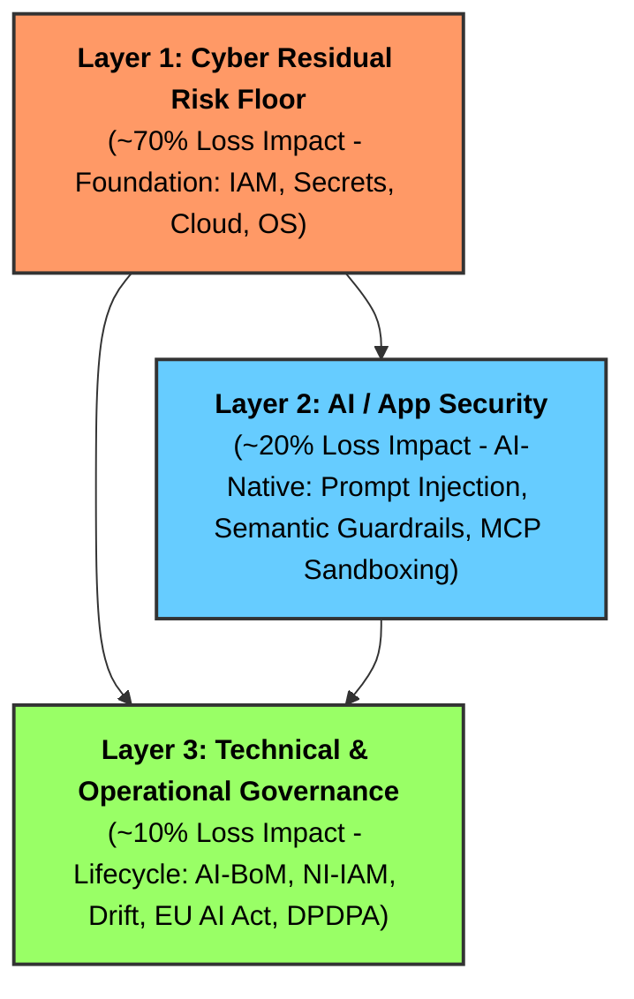

# 🔱 OWASP TriSuElla-AIDLCA Framework
> **AI-Driven Development Life Cycle & Autonomous Agent Governance (LLMSecOps)**  
> **Version**: 2.5 | **Status**: Institutionalized | **Total Checks**: 258

[](templates/.github/workflows/trisuella-gate.yml)
[](LICENSE)
[](TRISUELLA_MASTER_RULES_AND_CHECKS.md)
[](ai-bom.json)

---

## 🏛️ Executive Overview

The **TriSuElla-AIDLCA Framework** is an enterprise-grade, policy-governed architecture and security standard for **AI-assisted software engineering and autonomous multi-agent systems**. It ensures that machine intelligence operates with deterministic execution, zero-trust cryptographic verification, and coordinated human-in-the-loop governance.

Rooted in the symbolic **Trident (Trishula)** of Nordic and Sanskrit principles:
- 🔴 **SISU (Resilience & Execution)**: Agents execute with deterministic bounds, crash recovery, and safety invariants.
- 🔵 **TILLIT (Trust & Governance)**: Zero Trust ("Never Trust, Always Verify"), cryptographic identity, and tamper-evident audit trails.
- 🟢 **DUGNAD (Collective Collaboration)**: Multi-agent handoffs with mandatory **Dual-Key Human-in-the-Loop (HITL)** approval gates.

---

## 🛡️ The 3-Layer Risk-First AI Security Model

TriSuElla structures security investment according to where real-world operational and financial loss occurs:



---

## 📊 Summary of Master Rules & Checks (258 Total)

All rules are consolidated in [TRISUELLA_MASTER_RULES_AND_CHECKS.md](TRISUELLA_MASTER_RULES_AND_CHECKS.md):

| Section | Domain / Rule Family | Checks | Primary Standards / Anchors |
| :--- | :--- | :---: | :--- |
| **0–1** | Framework Charter & Core LLMSecOps Lifecycle | 15 | STRIDE-AI, ISO 5259, Cosign, AI-BoM |
| **2** | System Security Baseline (`TRISU-BASE`) | 15 | OWASP Top 10 (2026), API Security |
| **3** | AI & Agentic Security (`TRISU-SEC`) | 22 | OWASP LLM Top 10, Tool Sandboxing |
| **4** | Zero Trust Architecture (`TRISU-TRUST`) | 14 | CISA ZT Maturity Model, NIST SP 800-207 |
| **5** | Sensitive Data Security (`TRISU-DATA`) | 10 | DPDPA (India), GDPR, HIPAA, L0–L4 Classification |
| **6–8** | DLCA, Infra (`TRISU-INFRA`), Cloud (`TRISU-CLOUD`) | 41 | CIS Benchmarks, NIST SP 800-210, Kubernetes |
| **9–10** | Regional Compliance & Privacy by Design | 43 | Art. 25 GDPR, RBI Cyber Resilience, NIST SSDF |
| **11–13**| Testing, Checklists & CI/CD Gates | 45 | Garak, PyRIT, SAST, 20-Item Review Checklist |
| **14–20**| Tooling, Maturity Model, KPIs & RBI Sutras | 40 | Sisu-UI, RBI 7 Sutras, ISO 42001 AIMS |
| **21** | **Model Context Protocol Security (`TRISU-MCP`)** | **6** | MCP Schema Sanitization, Recursion Bounds, HITL |
| **22** | **EU AI Act High-Risk Compliance (`TRISU-EUAI`)** | **7** | EU Regulation 2024/1689 (Articles 9–15, CE Gate) |
| **TOTAL**| **Consolidated Invariants** | **258** | **Mandatory Blocking for [CRITICAL]/[HIGH]** |

---

## ⚡ Quick Start: 30 Seconds to Production Governance

### 1. Scaffold Any Project with `trisu-cli`
Run the zero-dependency CLI to instantly initialize TriSuElla in your existing repository:
```bash
python tools/trisu-cli/trisu_validator.py init --target /path/to/my-repo
```
This automatically scaffolds:
- `.cursorrules` (Cursor AI)
- `CLAUDE.md` (Claude Code / Claude Projects)
- `.windsurfrules` (Windsurf)
- `.github/copilot-instructions.md` (GitHub Copilot)
- `trisuella.config.yaml` (Project Policy Configuration)
- `.pre-commit-config.yaml` (Local git commit blocker)
- `.github/workflows/trisuella-gate.yml` (CI/CD PR gate)
- `audit.md` & `TRISUELLA-AIDLCA-state.md` (State & compliance tracking)

### 2. Run Policy Audits & SARIF Scans
```bash
# Check repository artifact readiness
python tools/trisu-cli/trisu_validator.py check

# Run blocking security audit and export to GitHub Code Scanning
python tools/trisu-cli/trisu_validator.py audit --sarif audit.sarif

# Generate a CycloneDX AI v1.6 Bill of Materials (AI-BoM)
python tools/trisu-cli/trisu_validator.py bom --output ai-bom.json
```

---

## 📁 Repository Structure

```
OWASP-TriSuElla-AIDLCA-FrameWork/
├── README.md                              # Main project entrypoint & quickstart
├── TRISUELLA_MASTER_RULES_AND_CHECKS.md   # Unified master rulebook (258 checks)
├── ai-bom.json                            # Machine-readable CycloneDX AI v1.6 BoM
├── templates/                             # Drop-in templates for all IDEs & CI/CD
│   ├── .cursorrules                       # Cursor IDE rules
│   ├── CLAUDE.md                          # Claude Code instructions
│   ├── .windsurfrules                     # Windsurf rules
│   ├── copilot-instructions.md            # GitHub Copilot instructions
│   ├── trisuella.config.yaml              # Declarative policy manifest
│   ├── .pre-commit-config.yaml            # Git pre-commit hook
│   └── .github/workflows/trisuella-gate.yml # GitHub Actions PR gate
├── tools/
│   ├── trisu-cli/trisu_validator.py       # Gatekeeper CLI (check, audit, init, bom)
│   └── sisu-ui/                           # Sisu Nexus visual compliance dashboard
├── TRISUELLA-AIDLCA-Rules/                # Core specifications, workflows & prompts
│   ├── README.md & CHARTER.md             # Philosophy, severity scale & charter
│   ├── FULL_README.md                     # Comprehensive developer manual & changelog
│   ├── TRISUELLA-AIDLCA-rules/            # core-workflow.md (active agent prompt)
│   ├── TRISUELLA-AIDLCA-rule-details/     # Modular extensions (MCP, EU AI, Zero Trust)
│   └── prompts/                           # Turnkey prompt library (P, B, T, A, C series)
├── TRISUELLA-AIDLCAa/                     # 8-Stage Autonomous Multi-Agent System
│   └── README.md                          # ZTP message protocol & orchestration
├── TRISUELLA-AIDLCA-docs/                 # State tracker & crosswalk matrices
└── Data-Source/                           # Regulatory baselines (RBI, ISO 42001, CSA AICM)
```

---

## 📜 Enforcement Guarantee
TriSuElla operates on a strict **Binary Enforcement Principle**:
- **`[CRITICAL]` / `[HIGH]`**: **Atomic Stop Gate**. Execution halts immediately. Code generation and deployment pipelines block until remediated.
- **`[MEDIUM]` / `[LOW]`**: Advisory. Requires documented justification and signed human steward acceptance in `audit.md`.

*v2.5 Institutionalized Release — Security-first, AI-native. Built for the era of Agentic Autonomy.*
