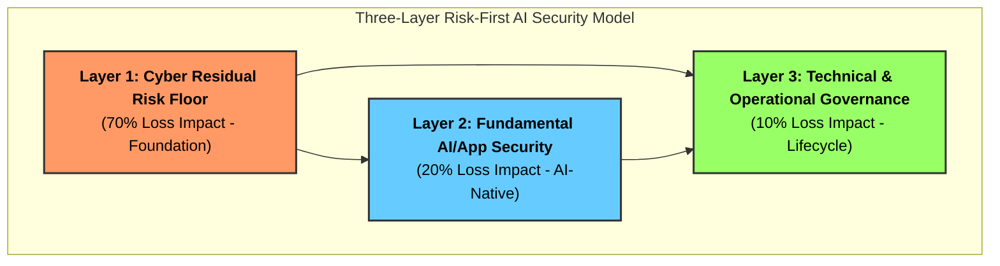

# TRISUELLA-AIDLCA Secure Development Framework

> **This framework establishes AI as a trusted, policy-governed, multi-role developer that builds, secures, tests, audits, and enforces global compliance across the software lifecycle, while incorporating human-in-the-loop governance to enable context-aware decisions aligned with project intent, functional requirements, and data sensitivity.**

**TriSuElla** is a foundational architectural and governance framework for AI-driven development that establishes a comprehensive, security-first and policy-driven approach to designing, building, and operating systems across the entire lifecycle, ensuring that AI operates not only with autonomous execution but also with enforced trust, regulatory compliance, auditability, and alignment to human intent; it is built on three integrated pillars—Sisu, Tillit, and Dugnad—where Sisu enables intelligent, resilient, and modular execution of development activities through AI agents across planning, design, build, testing, deployment, monitoring, and continuous improvement, Tillit governs all actions through Zero Trust security, multi-jurisdictional compliance including regulations such as DPDPA, GDPR, and HIPAA, and responsible AI principles such as explainability, bias control, validation, risk classification, and human-in-the-loop oversight to ensure trustworthy and context-aware decision-making, and Dugnad enables structured multi-agent and human collaboration through orchestration, communication protocols, shared knowledge systems, and coordinated task execution; the framework enforces policy-as-code governance, continuous testing including SAST, DAST, IAST, and AI output validation, automated threat modeling and risk management, full traceability and auditability of all actions and decisions, and dynamic compliance enforcement across regions, while distinguishing between mandatory rules that must be enforced and advisory guidelines that can be contextually applied with human oversight, ultimately enabling scalable, reusable, and continuously improving AI-driven development systems that are secure, compliant, collaborative, and trustworthy by design.

> **TriSuElla Purpose Statement:**
> TriSuElla exists to ensure that AI-driven development is executed with integrated governance, security, compliance, trust, and collaboration—enabling autonomous systems that are controlled, auditable, and aligned with human, organizational, and regulatory expectations.

## 🧭 Meaning & Symbolism
The name **TriSuElla** represents the convergence of three foundational forces, inspired by the **Trishula** (Trident).

- **Tri** → Three Pillars: **SISU** (Execution), **TILLIT** (Trust), and **DUGNAD** (Collaboration).
- **Symbolism**: Much like each prong of a trident, every pillar represents a core force. Together, they provide **Balance, Control, and Direction**.

> **The Core Philosophy:**
> Power comes not from one capability, but from the balance of three.

**TRISUELLA-AIDLCA (AI-Driven Development Life Cycle)** — A modern methodology for software development that integrates generative AI throughout every stage of the building process: from threat modeling and requirements, through design, code generation, security testing, deployment, and incident response.

**Version**: 3.1.0
**Author**: [Bhaskar Puppala (PATEL)](https://www.linkedin.com/in/bhaskerkpatel/)
**Last Updated**: 2026-09-12
**Status**: Institutionalized Release (Production-Ready, DevSecOps-Ready & CI-Verified)
**Total Consolidated Checks**: 299 (across 25 sections, 198 unique rules)

---

## 🚦 TriSuElla Severity Scale (Risk-First)
To ensure consistent governance, every rule in the TRISUELLA-AIDLCA ruleset is assigned a **Severity Rating** defining its enforcement priority:

*   **`[CRITICAL]`**: **Immediate systemic risk**. Non-compliance triggers an immediate "Halt" state. Must be resolved before *any* further progress (Atomic/Blocking Finding).
*   **`[HIGH]`**: **Significant operational or security risk**. Must be resolved before the current Phase (Inception/Construction/Operations) can be completed.
*   **`[MEDIUM]`**: **Moderate risk or non-functional violation**. Should be addressed before production release; may be deferred with documented justification.
*   **`[LOW]`**: **Best practice or hygiene finding**. Minor impact on security posture; recommended for long-term maintenance.

---

## 🛡️ Risk-First AI Security (The 3-Layer Model)
We prioritize security investment where the actual financial and operational loss occurs:



### 🏗️ The Financial Architecture of the 3-Layer Model
The model is based on the insight that AI systems don't exist in a vacuum; they sit on top of legacy infrastructure and under a governance umbrella.

| Layer | Focus | Est. Loss Impact | Why the "Next Dollar" belongs here: |
| :--- | :--- | :--- | :--- |
| **Layer 1: Cyber Residual Risk Floor** | Fundamentals: Identity (IAM), Cloud Posture, Patching, Endpoint Security. | **~70%** | **The Baseline:** Even if your LLM is perfectly secure, if an attacker steals the API key because of a misconfigured S3 bucket or an unpatched server, the AI system is compromised. This is where 70% of actual loss occurs in the real world. |
| **Layer 2: AI / App Security** | AI-Native Risks: Prompt Injection, Tool-use boundaries, Agent Sandboxing, Semantic WAFs. | **~20%** | **The New Surface:** This is the layer of "Prompt Injection" and "Excessive Agency." While high-profile, it accounts for a smaller fraction of total financial loss than Layer 1, but it requires specialized, AI-native security tools. |
| **Layer 3: Technical & Operational Governance** | Lifecycle & Oversight: NI-IAM, AI-BoM, Policy-as-Code, Human-in-the-Loop, Audit. | **~10%** | **The Long Game:** This layer manages the "silent failures"—model drift, compliance fines, and operational overreach. It is the cheapest to implement but the most critical for long-term legal and regulatory survival. |

### 🚀 Operational & Financial Benefits
*   **Prevents "Shiny Object Syndrome":** It stops organizations from spending their entire security budget on a "Prompt Injection" tool (Layer 2) while their Cloud IAM (Layer 1) remains wide open.
*   **CISO-Friendly Metrics:** By framing security as "Loss Impact (%)," it transforms AI security from a technical hurdle into a financial risk management discussion.
*   **Sequential Hardening:** The model mandates that an organization MUST harden Layer 1 (The Floor) before it can claim to have a "Secure AI System."

---

## What Is This?

The TRISUELLA-AIDLCA Secure Development Framework is a **rules kit for AI coding assistants and agent systems**. You load it into your AI tool once — as a system prompt, project instructions, or repository rules file — and every piece of code the AI generates from that point on follows production-grade security, privacy, and compliance standards automatically.

Traditional SDLC treats AI as a code autocomplete tool. TRISUELLA-AIDLCA is different: the AI model is an active participant in *every* phase of development — an architect in Inception, a security analyst in Threat Modeling, a designer in Construction, a QA engineer in Build & Test, and a DevOps engineer in Operations.

The result is a consistent, auditable, secure development workflow that works equally well for solo vibe coders, small teams, and regulated enterprise projects.

---

## 🌐 Platform Independence

This framework is **platform-agnostic** — copy it once, use it with any AI assistant or IDE:

| Platform | How to Activate |
|---|---|
| **Cursor** | Add to `.cursorrules`: `Always follow the TRISUELLA-AIDLCA workflow in .TRISUELLA-AIDLCA-rules/core-workflow.md` |
| **VS Code + Cline** | Add to `.clinerules`: `Always follow the TRISUELLA-AIDLCA workflow in .TRISUELLA-AIDLCA-rules/core-workflow.md` |
| **VS Code + GitHub Copilot** | Add to `.github/copilot-instructions.md` |
| **Claude Code / Claude Project** | Add to `CLAUDE.md` or paste into Project Instructions |
| **Windsurf / Codium** | Add to `.windsurfrules` |
| **Aider** | Pass `--read .TRISUELLA-AIDLCA-rules/core-workflow.md` at startup |
| **Any AI assistant** | Paste `core-workflow.md` contents into the system prompt |

---

## 📂 Complete Repository & Framework Directory Structure

```
OWASP-TriSuElla-AIDLCA-FrameWork/
├── README.md                                    ← Main project entrypoint & quickstart (v3.0)
├── Usage-Guide.md                                ← Turnkey setup & step-by-step usage guide
├── TRISUELLA_MASTER_RULES_AND_CHECKS.md         ← Unified master rulebook (305 checks, 204 rules)
├── ai-bom.json                                  ← Machine-readable CycloneDX AI v1.6 BoM
├── trisuella.config.yaml                        ← Declarative policy & CSPM manifest
├── CLAUDE.md & .cursorrules                     ← Workspace rules for Claude Code & Cursor
├── trisu.cmd & trisu                            ← Turnkey CLI wrappers for Windows & POSIX
├── LICENSE                                      ← Open-source license
│
├── templates/                                   ← Drop-in developer configs & CI/CD workflows
│   ├── .cursorrules                             ← Cursor IDE rules template
│   ├── CLAUDE.md                                ← Claude Code instructions template
│   ├── .windsurfrules                           ← Windsurf rules template
│   ├── copilot-instructions.md                  ← GitHub Copilot instructions template
│   ├── trisuella.config.yaml                    ← Declarative policy manifest template
│   ├── .pre-commit-config.yaml                  ← Git pre-commit hook template
│   └── .github/workflows/trisuella-gate.yml     ← GitHub Actions CI/CD blocking gate
│
├── tools/                                       ← Governance tooling & runtime gatekeepers
│   ├── trisu-cli/                               ← Policy gatekeeper CLI engine (v3.0.0)
│   │   ├── trisu_validator.py                   ← Zero-dependency CLI (check, audit, oss, init, bom, rules)
│   │   ├── pyproject.toml & setup.py            ← Pip packaging for global 'trisu' command
│   │   └── README.md                            ← CLI manual & multi-CI integration guide
│   └── sisu-ui/                                 ← Sisu Nexus visual compliance dashboard
│       ├── index.html                           ← Web UI dashboard interface
│       ├── sisu-ui-design-spec.md               ← UI/UX architecture & metrics specification
│       └── sample-data/                         ← Sample governance & compliance dataset
│
├── TRISUELLA-AIDLCAa/                           ← 8-Stage Autonomous Multi-Agent Governance
│   └── README.md                                ← Zero-Trust Protocol (ZTP), envelopes & Dual-Key HITL
│
├── TRISUELLA-AIDLCA-docs/                       ← Operational state tracking & crosswalk matrices
│   ├── TRISUELLA-AIDLCA-state.md                ← Runtime workflow state & extension tracking
│   └── AICM-AIDLCA-Crosswalk.md                 ← CSA AICM v1.0.3 to TriSuElla crosswalk
│
├── Data-Source/                                 ← Foundational regulatory baselines & standards
│   ├── AICMv1.0.3+AI_CAIQv1.0.2 bundle          ← CSA AI Control Matrix spreadsheets & guides
│   ├── Architecting_Cyber_Resilience_BFSI       ← RBI Cyber Resilience guidelines & manuscript
│   ├── FREE-AI_Committee_Report                 ← Responsible AI & ethical governance report
│   └── INDIAN_CYBERSECURITY                     ← CERT-In & statutory compliance references
│
└── TRISUELLA-AIDLCA-Rules/                      ← Core specifications, workflows & prompts
    ├── README.md                                ← Philosophy, severity scale & quick summary
    ├── CHARTER.md                               ← Strategic mission, foundational pillars & charter
    ├── FULL_README.md                           ← Comprehensive manual, CSPM crosswalk & changelog
    │
    ├── TRISUELLA-AIDLCA-rules/
    │   └── core-workflow.md                     ← Master TRISUELLA-AIDLCA workflow (all 3 phases)
    │
    ├── TRISUELLA-AIDLCA-rule-details/           ← Detailed rules per phase and extension
    │   │
    │   ├── common/                              ← Loaded at every workflow start (11 files)
    │   │   ├── process-overview.md              ← Full workflow diagram + stage descriptions
    │   │   ├── depth-levels.md                  ← Minimal / Standard / Comprehensive depth guide
    │   │   ├── question-format-guide.md         ← How to format [Answer]: tag questions
    │   │   ├── content-validation.md            ← Mermaid/ASCII/content validation rules
    │   │   ├── session-continuity.md            ← How to resume an interrupted workflow
    │   │   ├── error-handling.md                ← Error handling guidance for the AI
    │   │   ├── overconfidence-prevention.md     ← Rules to prevent AI from making bad assumptions
    │   │   ├── terminology.md                   ← TRISUELLA-AIDLCA term definitions
    │   │   ├── welcome-message.md               ← Displayed once at workflow start
    │   │   ├── workflow-changes.md              ← Rules for mid-workflow change requests
    │   │   └── ascii-diagram-standards.md       ← ASCII diagram formatting standards
    │   │
    │   ├── inception/                           ← Phase 1: Plan, model threats, design architecture
    │   │   ├── workspace-detection.md           ← Detect greenfield vs brownfield, scan workspace
    │   │   ├── reverse-engineering.md           ← Analyse existing codebase (brownfield only)
    │   │   ├── requirements-analysis.md         ← Gather functional + non-functional requirements
    │   │   ├── threat-modeling.md               ← STRIDE + STRIDEAI threat modeling
    │   │   ├── user-stories.md                  ← Generate user stories and personas
    │   │   ├── workflow-planning.md             ← Build the execution plan for Construction
    │   │   ├── application-design.md            ← High-level component + service layer design
    │   │   └── units-generation.md              ← Decompose into units of work
    │   │
    │   ├── construction/                        ← Phase 2: Design, generate, test per unit
    │   │   ├── functional-design.md             ← Business logic + domain model design per unit
    │   │   ├── nfr-requirements.md              ← Non-functional requirements + tech stack decisions
    │   │   ├── nfr-design.md                    ← NFR patterns and logical components per unit
    │   │   ├── infrastructure-design.md         ← Map components to cloud/infra + Secrets by Design
    │   │   ├── code-generation.md               ← Plan + generate code + 20-item Security Checklist
    │   │   └── build-and-test.md                ← SAST, DAST, secrets, container, AI tests
    │   │
    │   ├── operations/                          ← Phase 3: Deploy, observe, respond
    │   │   └── operations.md                    ← CI/CD gates, deployment, rollback, observability
    │   │
    │   └── extensions/                          ← Modular opt-in extensions
    │       │
    │       ├── security/                        ← Core technical security extensions
    │       │   ├── baseline/                    ← 15 SECURITY rules (OWASP Top 10 2026)
    │       │   │   ├── security-baseline.md
    │       │   │   └── security-baseline.opt-in.md
    │       │   ├── ai-agentic/                  ← 11 AI-SECURITY rules (OWASP LLM Top 10 2025)
    │       │   │   ├── ai-agentic-security.md
    │       │   │   └── ai-agentic-security.opt-in.md
    │       │   ├── cloud-security/              ← 24 CLOUD/CSPM rules (AWS/Azure/GCP/Alibaba/OCI)
    │       │   │   ├── cloud-security.md
    │       │   │   └── cloud-security.opt-in.md
    │       │   ├── infra-security/              ← 16 INFRA-SEC rules (CIS Controls v8, NIST, ISO)
    │       │   │   ├── infra-security.md
    │       │   │   └── infra-security.opt-in.md
    │       │   ├── privacy-secure-design/       ← 10 rules across Privacy/Secure/Safety by Design
    │       │   │   ├── privacy-secure-design.md
    │       │   │   └── privacy-secure-design.opt-in.md
    │       │   ├── sensitive-data/              ← 10 SENS rules (DPDPA, GDPR, HIPAA, L0-L4)
    │       │   │   ├── sensitive-data-security.md
    │       │   │   └── sensitive-data-security.opt-in.md
    │       │   └── zero-trust/                  ← 11 ZT rules (CISA ZT Pillars, NIST SP 800-207)
    │       │       ├── zero-trust.md
    │       │       └── zero-trust.opt-in.md
    │       │
    │       ├── compliance/                      ← Regulatory compliance extensions
    │       │   ├── compliance-mapping.md        ← DPDPA (8 rules), PCI-DSS v4, HIPAA, GDPR, SOC 2
    │       │   ├── compliance-mapping.opt-in.md
    │       │   ├── compliance-india-bfsi.md     ← 7 India BFSI mandates (CERT-In 6h, 5y logs)
    │       │   └── ai-dlca/                     ← AI-DLCA continuous lifecycle governance
    │       │       ├── ai-dlca.md
    │       │       └── ai-dlca.opt-in.md
    │       │
    │       └── testing/                         ← Advanced verification extensions
    │           └── property-based/              ← 10 PBT rules (hypothesis, fast-check, proptest)
    │               ├── property-based-testing.md
    │               └── property-based-testing.opt-in.md
    │
    ├── prompts/                                 ← Turnkey prompt library across all stages
    │   ├── README.md                            ← Index of all prompt suites (P, B, T, A, C)
    │   ├── planning/                            ← Requirements & STRIDE threat model prompts
    │   ├── build/                               ← Secure code generation & review prompts
    │   ├── test/                                ← Security test & prompt injection prompts
    │   ├── ai-agents/                           ← AI/agentic feature design & MCP review prompts
    │   └── compliance/                          ← DPDPA, GDPR, HIPAA, PCI compliance prompts
    │
    └── docs/                                    ← Developer and architectural documentation
        ├── faq.md                               ← 25+ frequently asked questions
        ├── benefits.md                          ← Benefits by role & 4 real-world scenarios
        ├── vibe-coding-guide.md                 ← Fast-track guide for vibe coders
        ├── which-extensions.md                  ← Decision tree for extension selection
        └── adr-template.md                      ← Architecture Decision Record template
```

---

## 🚀 Quick Setup

### Method A: Automated Scaffolding with `trisu-cli` (Recommended)

Run the zero-dependency TriSuElla validator CLI to scaffold drop-in rules, CI gates, and state tracking in 30 seconds:

```bash
# Option 1: Turnkey root wrappers (zero install)
.\trisu.cmd init --target /path/to/my-repo   # Windows
./trisu init --target /path/to/my-repo       # Linux / macOS

# Option 2: Global pip CLI
trisu init --target /path/to/my-repo

# Option 3: Direct python execution
python tools/trisu-cli/trisu_validator.py init --target /path/to/my-repo
```

### Method B: Manual Drop-In Integration

#### Step 1: Copy rules to your project

```bash
# From your project root
cp -r TRISUELLA-AIDLCA-Rules/TRISUELLA-AIDLCA-rule-details /path/to/my-repo/.TRISUELLA-AIDLCA-rule-details
mkdir -p /path/to/my-repo/.TRISUELLA-AIDLCA-rules
cp TRISUELLA-AIDLCA-Rules/TRISUELLA-AIDLCA-rules/core-workflow.md /path/to/my-repo/.TRISUELLA-AIDLCA-rules/core-workflow.md
```

#### Step 2: Activate in your AI assistant / IDE

**Cursor** — add to `.cursorrules`:
```
Always follow the TRISUELLA-AIDLCA workflow defined in .TRISUELLA-AIDLCA-rules/core-workflow.md
```

**VS Code + Cline** — add to `.clinerules`:
```
Always follow the TRISUELLA-AIDLCA workflow defined in .TRISUELLA-AIDLCA-rules/core-workflow.md
```

**Claude Code** — add to `CLAUDE.md`:
```
Always follow the TRISUELLA-AIDLCA workflow defined in .TRISUELLA-AIDLCA-rules/core-workflow.md
```

**Windsurf** — add to `.windsurfrules`:
```
Always follow the TRISUELLA-AIDLCA workflow defined in .TRISUELLA-AIDLCA-rules/core-workflow.md
```

**GitHub Copilot** — add to `.github/copilot-instructions.md`:
```
Always follow the TRISUELLA-AIDLCA workflow defined in .TRISUELLA-AIDLCA-rules/core-workflow.md
```

**Claude.ai Projects** — paste `core-workflow.md` contents into Project Instructions. Upload extension `.md` files as Project Knowledge.

### Step 3: Start building

Open a new conversation with your AI assistant and describe what you want to build. The workflow kicks in automatically.

Not sure which extensions to add? See [`docs/which-extensions.md`](docs/which-extensions.md) — answer 8 questions and get your exact combination.

---

## 📋 The Three Phases

### 🔵 Phase 1: Inception — Plan Before You Build

Every project starts here. The AI detects your workspace, gathers requirements, and — for any security-relevant scope — runs a full threat model before a single line of code is written.

| Stage | Always / Conditional | Purpose |
|---|---|---|
| Workspace Detection | **Always** | Detect greenfield/brownfield, scan existing code |
| Reverse Engineering | Conditional | Analyse existing codebase if brownfield |
| Requirements Analysis | **Always** | Gather functional + NFRs with adaptive depth |
| **Threat Modeling** | Conditional | STRIDE + STRIDEAI threat analysis, DREAD scoring |
| User Stories | Conditional | User personas and acceptance criteria |
| Workflow Planning | **Always** | Build the execution plan |
| Application Design | Conditional | High-level components and service design |
| Units Generation | Conditional | Decompose into parallel units of work |

### 🟢 Phase 2: Construction — Design, Code, and Verify

Each unit of work goes through design → code → security review before moving on. Build & Test runs once all units are complete.

| Stage | Always / Conditional | Purpose |
|---|---|---|
| Functional Design | Conditional per unit | Business logic and domain model |
| NFR Requirements | Conditional per unit | Performance, security, scalability NFRs |
| NFR Design | Conditional per unit | NFR patterns and logical components |
| Infrastructure Design | Conditional per unit | Cloud/infra mapping + Secrets Management by Design |
| **Code Generation** | **Always** per unit | Generate code + mandatory 20-item Security Code Review |
| **Build and Test** | **Always** | Unit, integration, performance, SAST, DAST, secrets scan |

### 🟡 Phase 3: Operations — Ship and Operate It

Closes the loop from code to running production system with full observability and incident readiness.

| Stage | Always / Conditional | Purpose |
|---|---|---|
| CI/CD Pipeline Generation | Conditional | Pipeline with security/quality gates |
| **Deployment Planning** | **Always** | Strategy, rollback, production readiness checklist |
| Observability Setup | Conditional | Metrics, alerts, dashboards (including AI-specific) |
| Incident Response Planning | Conditional | Runbooks, breach procedures, AI abuse playbook |

---

## 🛡️ Security Coverage & Consolidated Invariants

The framework enforces **299 consolidated checks** across 25 sections with **198 unique TRISU-* rule identifiers**, combining built-in lifecycle gates, modular extensions, and multi-cloud posture standards:

| Extension / Domain | Rules | What It Covers | Primary Standards |
|---|---|---|---|
| **Security Baseline** | 15 | Encryption, access control, input validation, supply chain, authentication, HTTP security headers, logging, misconfiguration prevention | OWASP Top 10 (2026) |
| **AI / Agentic / ML Security** | 11 | Prompt injection, secure agent tool use, memory guardrails, LLM I/O validation, model poisoning, RAG security, AI-Driven Collusion, Model-on-Model risks, Video KYC Deepfake Detection [CRITICAL] | OWASP LLM Top 10 (2025) |
| **Privacy + Secure + Safety by Design** | 10 | Data minimization, purpose limitation, privacy-by-default, data subject rights, retention, secure architecture, fail-safe defaults, misuse scenarios, human oversight | GDPR Art. 25, NIST SP 800-160 |
| **Cloud Security & Multi-Cloud CSPM** | 24 | Part A: 10 platform-agnostic cloud rules; Part B: 14 multi-cloud CSPM auditing standards (KSPM, DSPM, AI-CSPM/CWPP, CIEM, Edge WAF, Shift-Left IaC, WORM, HSM, Sovereignty) across AWS, Azure, GCP, Alibaba Cloud, and OCI | CIS Level 2, NIST SP 800-53, ISO 27001 |
| **Infrastructure Security** | 16 | Network zones, OS hardening, secrets at rest, IaC security, container supply chain (Cosign/SLSA), CI/CD (OIDC), logging/FIM, K8s RBAC, Docker, NTP synchronization for forensic integrity [INFRA-SEC-16] | CIS Controls v8, NIST SP 800-53, ISO 27001:2022 |
| **Sensitive Information Security** | 10 | Data classification (L0–L4), PII handling, financial, health, sensitive data in logs & AI, Automated Tagging [CRITICAL], Endpoint activity lockdown | GDPR, DPDPA, HIPAA, PCI-DSS, CCPA/CPRA |
| **Zero Trust Architecture & Code** | 22 | Identity, continuous authorization, device trust, micro-segmentation, ZT for AI agents, policy-as-code, and 8 in-code invariants (TRISU-ZTC-01..08) | CISA ZT Maturity Model, NIST SP 800-207, ASVS |
| **Compliance Mapping** | 41 | DPDPA India (8 rules COMP-DPDPA-01-08), India BFSI (7 rules CERT-In 6h, 5y Retention, .bank.in), PCI-DSS v4, HIPAA, GDPR, SOC 2, ISO 27001 | DPDPA 2023, RBI Cyber Resilience, PCI-DSS |
| **Property-Based Testing** | 10 | Round-trip, invariant, idempotency, oracle, stateful testing, generator quality, shrinking, reproducibility, framework selection | Property-based testing standards |
| **Model Context Protocol Security (TRISU-MCP)** | 6 | MCP Tool Schema Sanitization, Recursive Call Loop Prevention, Out-of-Band Human Authorization, Dynamic Credential Scoping, Server Origin Verification, Data Leak Prevention | Anthropic MCP Spec, OWASP Agentic Top 10 |
| **EU AI Act High-Risk Compliance (TRISU-EUAI)** | 7 | Risk Management (Art. 9), Data Governance (Art. 10), Technical Docs (Art. 11), Automatic Logging (Art. 12), Transparency (Art. 13), Human Oversight (Art. 14), Accuracy & Cybersecurity (Art. 15) | EU Regulation 2024/1689 |
| **Agentic Identity & Token Delegation (TRISU-AIAM)** | 5 | Ephemeral subagent tokens, RFC 8693 Token Exchange, SPIFFE/mTLS workload identity, blast radius containment, non-exportable cryptographic attestations | RFC 8693, SPIFFE/SPIRE, NIST SP 800-204 |
| **Open Source & Supply Chain Security (TRISU-OSS)** | 6 | Cryptographic lockfile pinning, SCA advisory gating (CVSS >= 7.0), license contamination defense, typosquatting prevention, CycloneDX AI-BoM, SLSA Level 2+ attestations | OpenSSF, NIST SP 800-218, SLSA v1.0, CycloneDX v1.6 |

**Grand Total: 299 Consolidated Checks | 198 Unique TRISU-* Rule Identifiers**

### Built-in Security (no extension needed)

These are wired into core stages and always active regardless of which extensions are loaded:
- **Security Code Review Checklist** — 20 mandatory items run at every Code Generation completion; any finding blocks stage advance
- **Secrets Management by Design** — mandatory section in every Infrastructure Design artifact
- **SAST / DAST / Secret scanning / Container scanning** — structured into Build & Test with tool recommendations per language and stack
- **AI/LLM security tests** — prompt injection batteries, tool boundary tests, and output validation tests built into Build & Test when the AI extension is active

---

## ☁️ Full-Spectrum Multi-Cloud CSPM & Auditing Architecture (TRISU-CSPM)

The **TRISU-CSPM** standard establishes comprehensive, automated Cloud Security Posture Management and infrastructure auditing across all five top Cloud Service Providers: **Amazon Web Services (AWS)**, **Microsoft Azure**, **Google Cloud Platform (GCP)**, **Alibaba Cloud (Aliyun)**, and **Oracle Cloud Infrastructure (OCI)**.

### The 14 CSPM Core Domains

1. **`TRISU-CSPM-01 [CRITICAL]`**: **Continuous Multi-Cloud Posture & CIS Level 2 Benchmarking** — 100% cloud estate coverage with hourly automated scanning and blocking gates.
2. **`TRISU-CSPM-02 [CRITICAL]`**: **Workload IAM & Non-Human Identity (NHI) Federation** — Zero static credentials/long-lived access keys; short-lived OIDC workload federation.
3. **`TRISU-CSPM-03 [HIGH]`**: **Storage Immutability, WORM Compliance & Public Lockdown** — Enforced public access blocks and object retention locks.
4. **`TRISU-CSPM-04 [CRITICAL]`**: **Zero-Trust Network Perimeter & Private Link Isolation** — No public endpoints for databases, AI inference perimeters, or storage; private transit only.
5. **`TRISU-CSPM-05 [HIGH]`**: **Tamper-Evident Multi-Region Audit Trails & Security Telemetry** — Immutable, centralized audit logging across 100% of regions with integrity validation.
6. **`TRISU-CSPM-06 [HIGH]`**: **Automated Drift Detection & Posture Self-Healing** — Continuous real-time detection of manual out-of-band console changes and automated remediation.
7. **`TRISU-CSPM-07 [HIGH]`**: **Hardware Security Module (HSM) & Customer-Managed Encryption (CMEK)** — FIPS 140-2 Level 3 / Level 2 hardware keys with automated annual rotation.
8. **`TRISU-CSPM-08 [HIGH]`**: **Sovereign Region Isolation & Cross-Border Residency** — Policy-driven geographic fencing preventing deployment outside authorized jurisdictions.
9. **`TRISU-CSPM-09 [CRITICAL]`**: **Kubernetes & Container Security Posture (KSPM)** — Managed K8s hardening (private API servers, admission controllers, non-root workloads).
10. **`TRISU-CSPM-10 [CRITICAL]`**: **Database & Data Store Posture (DSPM)** — Private endpoints, TLS 1.3, TDE encryption, automated point-in-time backups, and sensitive data discovery.
11. **`TRISU-CSPM-11 [HIGH]`**: **Compute, Serverless & AI/ML Workload Posture (AI-CSPM / CWPP)** — IMDSv2 enforcement, private AI perimeter, and runtime workload protection.
12. **`TRISU-CSPM-12 [HIGH]`**: **Cloud Infrastructure Entitlements & Over-Privilege Management (CIEM)** — Automated revocation of dormant credentials and excessive permissions.
13. **`TRISU-CSPM-13 [HIGH]`**: **Cloud Edge, Web Application Firewall & Anti-DDoS Ingress** — Managed Layer 7 WAF inspection, OWASP Core Rule Set, and Layer 3/4 DDoS protection.
14. **`TRISU-CSPM-14 [HIGH]`**: **Shift-Left Infrastructure-as-Code (IaC) Pre-Flight Auditing** — Blocking pre-merge scanning for Terraform, OpenTofu, ARM/Bicep, CloudFormation, and Helm.

### 14-Domain Multi-Cloud Technical Crosswalk Matrix

| Domain / Control | AWS | Microsoft Azure | Google Cloud (GCP) | Alibaba Cloud (Aliyun) | Oracle Cloud (OCI) |
| :--- | :--- | :--- | :--- | :--- | :--- |
| **1. Continuous CSPM & CIS** | AWS Security Hub (CIS v3.0 L2) | Microsoft Defender for Cloud | Security Command Center (SCC) Premium | Security Center Enterprise / ActionTrail | OCI Cloud Guard & Security Zones |
| **2. Workload IAM / NHI** | IAM Roles Anywhere / OIDC GitHub | Azure AD Workload Identity | Workload Identity Federation | RAM Role SSO / OIDC IdP | OCI Instance / Workload Principals |
| **3. Storage WORM & Block** | S3 Object Lock (Compliance Mode) | Azure Blob Immutability Policy | GCS Bucket Lock (Retention Policy) | OSS Retention Policy & WORM Lock | OCI Object Storage Retention Rules |
| **4. Zero-Trust Perimeter** | AWS PrivateLink & VPC Endpoints | Azure Private Link / Private Endpoints | Private Service Connect / VPC SC | VPC PrivateZone & PrivateLink | OCI Service Gateway & Private Endpoints |
| **5. Audit Logging** | CloudTrail Multi-Region Log Validation | Azure Monitor Activity & Log Analytics | Cloud Audit Logs (Admin + Data Access) | ActionTrail Multi-Region Delivery | OCI Audit Service (365-day retention) |
| **6. Drift Remediation** | AWS Config Conformance Packs + SSM | Azure Policy DeployIfNotExists | Eventarc + Cloud Functions Auto-Fix | Cloud Config Automated Remediation | OCI Event Service + Functions Auto-Fix |
| **7. Key Management / HSM** | AWS KMS (CMEK) / CloudHSM | Azure Key Vault Managed HSM | Cloud KMS / Cloud HSM | Alibaba Cloud KMS Hardware HSM | OCI Vault Dedicated KMS (FIPS 140-2 L3) |
| **8. Sovereign Geofencing** | SCP `aws:RequestedRegion` Deny | Azure Policy `allowed-locations` | Org Policy `constraints/gcp.resourceLocations` | Resource Management Control Policy | OCI Security Zones Region Policy |
| **9. KSPM (Kubernetes)** | Amazon EKS (Private Endpoint, GuardDuty) | Azure AKS (Private Cluster, Azure Policy) | Google GKE (Private Cluster, Datapath V2) | Alibaba ACK (Private Cluster, Security Inspector) | OCI OKE (Private K8s API & Seccomp) |
| **10. DSPM (Databases)** | Amazon RDS/Aurora (Private VPC, KMS) | Azure SQL/Cosmos DB (Private Link, TDE) | Cloud SQL/Spanner (Private IP, CMEK) | PolarDB/ApsaraDB (VPC Whitelist, TDE) | Autonomous DB (Private Endpoints, TDE) |
| **11. AI-CSPM / Workloads** | SageMaker Private VPC, IMDSv2, GuardDuty | Azure OpenAI Private Link, Defender CWPP | Vertex AI VPC SC, Security Health Analytics | PAI Private Link, Security Center CWPP | OCI Generative AI Private Endpoints |
| **12. CIEM (Entitlements)** | IAM Access Analyzer (Unused Access) | Microsoft Entra Permissions Management | IAM Recommender (Least-Privilege) | RAM ActionTrail Access Analyzer | OCI Identity IAM Policy Recommender |
| **13. Cloud Edge / WAF** | AWS WAF v2 + AWS Shield Advanced | Azure WAF v2 + Azure DDoS Protection | Google Cloud Armor (L7 WAF + DDoS) | Alibaba Cloud WAF 3.0 + Anti-DDoS Pro | OCI WAF (Edge Policy) + DDoS Protection |
| **14. Shift-Left IaC** | Checkov / cfn-guard / Trivy pre-commit | Checkov / tfsec / Bicep Linter | Checkov / KICS / Google Cloud CLI validate | Checkov / Terraform Alibaba Provider linter | Checkov / OCI Terraform Validator |

---

## 🔑 Design Principles

| Principle | What It Means in Practice |
|---|---|
| **Adaptive Workflow** | Only execute stages that add real value — a simple bug fix skips threat modeling; a new authentication system runs the full process |
| **Transparent Planning** | The AI shows its execution plan and gets your approval before proceeding to any stage |
| **User Control** | Every stage can be included or excluded on your direction |
| **Shift Left Security** | Threat modeling runs in Inception — before architecture is locked, before code is written |
| **Secure by Default** | Security controls are ON out of the box; less-secure configurations require explicit justification |
| **Privacy by Default** | Maximum privacy protection in every default configuration — analytics, tracking, AI training all off by default |
| **Safety by Design** | Misuse scenarios are documented; AI systems have scope limits, kill switches, and human oversight gates |
| **Zero Trust Native** | Every agent action authenticated, authorized, and audited; no implicit trust based on network location |
| **Complete Audit Trail** | Every user input, AI response, and approval logged to `TRISUELLA-AIDLCA-docs/audit.md` with timestamps |
| **Progress Tracking** | All workflow state in `TRISUELLA-AIDLCA-docs/TRISUELLA-AIDLCA-state.md` — resume any session from where it left off |
| **Platform Agnostic** | Works with any AI assistant, any OS, any cloud provider |

---

## 🤖 For Vibe Coders and First-Time Developers

You do not need to understand every rule to benefit from this framework. The workflow is designed so the AI does the analysis — you describe what you want, answer a few questions, and approve each stage.

**Minimal setup:**
1. Copy the rules folder into your project root (see Quick Setup above)
2. Tell your AI assistant: *"Follow the TRISUELLA-AIDLCA workflow in `.TRISUELLA-AIDLCA-rules/core-workflow.md`"*
3. Describe what you want to build
4. Answer the questions the AI asks
5. Review and approve each stage

**What you get without any extra effort:**
- Structured requirements before code is written
- An execution plan you approve before construction starts
- Every generated function checked against a 20-item security checklist
- Build and test instructions generated for your specific tech stack
- A production readiness checklist before you ship

**See the dedicated guide**: [`docs/vibe-coding-guide.md`](docs/vibe-coding-guide.md)

---

## 📁 Generated Project Artifacts

When the TRISUELLA-AIDLCA workflow runs on your project, it creates a structured documentation folder alongside your code:

```
your-project/
├── [your application code]
└── TRISUELLA-AIDLCA-docs/
    ├── TRISUELLA-AIDLCA-state.md                     ← Current workflow state and extension config
    ├── audit.md                           ← Complete interaction log with timestamps
    ├── inception/
    │   ├── requirements/requirements.md   ← Functional + NFR requirements
    │   ├── threat-model/
    │   │   ├── system-context.md          ← DFD / system context diagram
    │   │   ├── threat-model.md            ← Full threat register with DREAD scores
    │   │   └── security-requirements-from-threats.md
    │   ├── user-stories/stories.md
    │   └── application-design/
    ├── construction/
    │   └── {unit-name}/
    │       ├── functional-design/
    │       ├── nfr-requirements/
    │       ├── infrastructure-design/
    │       │   └── secrets-management-design.md
    │       └── code/
    │   └── build-and-test/
    │       ├── build-instructions.md
    │       ├── security-test-instructions.md
    │       └── build-and-test-summary.md
    └── operations/
        ├── cicd-pipeline.md
        ├── deployment-plan.md
        ├── production-readiness-checklist.md
        ├── observability-setup.md
        └── incident-response-runbook.md
```

These artifacts double as compliance evidence: `audit.md` supports SOC 2 change management, `threat-model.md` supports risk assessment, `incident-response-runbook.md` supports HIPAA breach notification readiness, and `secrets-management-design.md` supports PCI-DSS and DPDPA documentation requirements.

---

## 📚 Developer Documentation

| Document | What It Covers |
|---|---|
| [`docs/how-to-use.md`](docs/how-to-use.md) | Complete integration guide — setup for Cursor, Copilot, Claude, TRISUELLA-AIDLCAA agents; phase-by-phase walkthrough; tips |
| [`docs/vibe-coding-guide.md`](docs/vibe-coding-guide.md) | Streamlined guide for vibe coders — mindset, Claude Project setup, iterative workflow, 7-day SaaS example |
| [`docs/faq.md`](docs/faq.md) | 25+ frequently asked questions — general, setup, rules enforcement, AI-specific, vibe coding |
| [`docs/benefits.md`](docs/benefits.md) | Benefits by role (vibe coder / developer / CTO), by phase, comparison with alternatives, 4 real-world scenarios |
| [`docs/which-extensions.md`](docs/which-extensions.md) | Decision tree — answer 8 questions, get your exact extension combination + project-type reference table |
| [`docs/adr-template.md`](docs/adr-template.md) | Architecture Decision Record template with TRISUELLA-AIDLCA-specific fields: security impact, compliance impact, agent interaction impact |

## 🧰 Prompt Template Library

Ready-to-use prompts for every stage of the TRISUELLA-AIDLCA workflow. Copy, fill in the brackets, paste into your AI assistant.

| File | Prompts |
|---|---|
| [`prompts/planning/requirements-and-threat-model.md`](prompts/planning/requirements-and-threat-model.md) | Project kickoff, requirements deep dive, STRIDE threat model, user stories with security ACs, architecture security review |
| [`prompts/build/secure-code-generation.md`](prompts/build/secure-code-generation.md) | Secure API endpoint, security code review, secure Dockerfile, secure DB schema, refactor for security, auth implementation |
| [`prompts/test/security-testing.md`](prompts/test/security-testing.md) | API security tests, prompt injection suite, dependency scan setup, secret scan setup, AI model evaluation, infra security checklist |
| [`prompts/ai-agents/ai-agent-security-prompts.md`](prompts/ai-agents/ai-agent-security-prompts.md) | LLM feature design, multi-agent system design, RAG security, LLM output validation, prompt template review, MCP server review |
| [`prompts/compliance/compliance-prompts.md`](prompts/compliance/compliance-prompts.md) | GDPR checklist, DPDPA compliance check, HIPAA gap assessment, PCI-DSS scoping, data subject rights workflow |

---

## 🔄 Changelog

### v3.2.0 (2026-09-12) - Shadow AI Governance & AI-BOM Reconciliation
- **Shadow AI & Model Discovery Extension (`TRISU-SHADOW-01..06`)** — Governed undeclared model invocations, supplier whitelisting, Enterprise GenAI Gateway bypass detection, unapproved deployment prevention, prompt egress sanitization, and continuous shadow discovery across 26 security domains (204 unique rules, 305 checks).
- **Automated AST Shadow AI Scanner Engine (`trisu shadow`)** — Integrated Python AST and static regex scanner into the zero-dependency CLI (`tools/trisu-cli`) and wired shadow auditing into `audit` and `oss` gates with SARIF 2.1.0 reporting.
- **Enhanced CycloneDX AI v1.6 AI-BOM Schema** — Added model reconciliation properties (`sanctioned_status`, `approval_ref`) and updated master inventory to 305 checks across 26 domains and 204 unique rules.

### v3.0.1 (2026-09-12) - Production CI/CD Gate Verification & Turnkey Patch
- **Live CI/CD Policy Gate Verification** — Verified remote GitHub Actions run `34675720411` with 100% success across all 23 pipeline steps (artifact readiness, AST blocking audit, open source supply chain verification, rules index validation, CycloneDX AI-BoM generation, and dual OASIS SARIF 2.1.0 uploads).
- **Universal Multi-Platform CI/CD Support** — Validated zero-dependency local execution (`trisu.cmd`, `trisu`, `python trisu_validator.py`) and provided turnkey integration patterns for GitLab CI (`artifacts:reports:sast`), Azure DevOps (`PublishSecurityAnalysisLogs@3`), and Bitbucket/Jenkins.
- **Supply Chain & Reporting Hygiene** — Added `*.sarif` to `.gitignore` to maintain clean source trees while archiving build-time governance artifacts.

### v3.0 (2026-09-12) - Institutionalized Release
- **Zero Trust Code (ZTC) Extension (`TRISU-ZTC-01..08`)** — Enforced 8 in-code security invariants: explicit boundary validation, scoped object authorization, zero ambient credentials, deterministic fail-closed, banned dynamic deserialization, in-code audit telemetry, prohibited shell execution (`shell=True`), and agent tool confinement with mandatory HITL approval.
- **Open Source Security & Supply Chain (OSS) Extension (`TRISU-OSS-01..06`)** — Governed direct and transitive dependencies, deterministic lockfile pinning, build-time integrity hashing, copyleft license contamination checks, typosquatting defense, and CycloneDX SBOM/AI-BoM attestation.
- **Turnkey CLI & Packaging (`tools/trisu-cli`)** — Upgraded `trisu_validator.py` to v3.0 with AST-based static scanning, root discovery, domain breakdowns, `trisu oss` supply chain auditor, root convenience wrappers (`trisu.cmd`, `trisu`), and pip packaging (`pyproject.toml`, `setup.py`) for global `trisu` command execution.
- **Unified Master Rulebook (299 Checks, 198 Unique Rules)** — Recalibrated full master rules specification across 25 security domains.

### v2.5 (2026-04-01)
- **Unified Master Rulebook** — Consolidated **291 rules and checks** across 25 categories into `TRISUELLA_MASTER_RULES_AND_CHECKS.md`.
- **Full-Spectrum Multi-Cloud CSPM & Auditing Standard (`TRISU-CSPM`)** — Institutionalized 14 enterprise-grade CSPM controls across the top 5 cloud providers (**AWS**, **Microsoft Azure**, **Google Cloud Platform**, **Alibaba Cloud (Aliyun)**, and **Oracle Cloud Infrastructure**):
  - `TRISU-CSPM-01` to `TRISU-CSPM-08`: Continuous CSPM & CIS Level 2 scanning, Workload IAM & Non-Human Identity (NHI) federation, Storage WORM compliance locks, Private network perimeter isolation, Tamper-evident multi-region audit trails, Automated drift remediation, Dedicated Cloud HSM / CMK key management, and Sovereign region geofencing.
  - `TRISU-CSPM-09` to `TRISU-CSPM-14`: Kubernetes Security Posture Management (**KSPM** - EKS/AKS/GKE/ACK/OKE), Database & Data Store Posture (**DSPM** - RDS/Cosmos/Cloud SQL/PolarDB/Autonomous DB), Compute & AI/ML Workload Posture (**AI-CSPM / CWPP** - IMDSv2, SageMaker/Azure OpenAI/Vertex/PAI/GenAI), Cloud Infrastructure Entitlements (**CIEM** - dormant credential revocation & PCI < 15), Cloud Edge WAF & Anti-DDoS Ingress, and Shift-Left Infrastructure-as-Code (**IaC**) pre-flight scanning.
  - Comprehensive **14-Domain Technical Crosswalk Matrix** providing exact operational parity across all 5 major CSPs.
- **Three Pillars & 3-Layer Risk Model** — Formalized SISU, TILLIT, and DUGNAD with the Cyber Residual Risk Floor (70%/20%/10% loss distribution).
- **Automated Tooling (`tools/trisu-cli`)** — Implemented zero-dependency Python CLI (`trisu_validator.py`):
  - `init`: Instant project scaffolding of templates, state tracking, and CI gates.
  - `check`: Automated structural artifact verification.
  - `audit`: Blocking security checks, secret scanning, and native **OASIS SARIF 2.1.0** export for GitHub Code Scanning.
  - `bom`: Automated CycloneDX AI v1.6 AI-BoM generator.
  - `rules`: Rule ID index integrity validation (184 unique TRISU-* identifiers).
- **Developer Drop-in Templates (`templates/`)** — Created ready-to-use configurations: `.cursorrules`, `CLAUDE.md`, `.windsurfrules`, `copilot-instructions.md`, `trisuella.config.yaml` (with granular `cspm` and `posture_domains` blocks), and `.pre-commit-config.yaml`.
- **CI/CD Enforcement Gates** — Added automated GitHub Actions workflow (`.github/workflows/trisuella-gate.yml`) to enforce blocking `[CRITICAL]` checks on pull requests.
- **Multi-Agent Architecture (`TRISUELLA-AIDLCAa`)** — Published formal 8-agent zero-trust autonomous development taxonomy, ZTP message envelope, and Dual-Key HITL gates.
- **Tools Promotion** — Promoted SISU-UI governance dashboard to `tools/sisu-ui/` and structured sample data into `tools/sisu-ui/sample-data/`.

### v2.1 (2026-03-30)

**New extensions:**
- **Zero Trust Architecture** — 9 ZT rules covering all 5 CISA pillars; identity, device, network, application, data, monitoring, and policy-as-code. Mapped to CISA ZT Maturity Model and NIST SP 800-207.
- **Sensitive Information Security** — 8 SENS rules covering data classification (L0–L4), PII, financial, health/biometric, sensitive data in logs, sensitive data in AI systems, children's data, and right to erasure. Mapped to GDPR, DPDPA, HIPAA, PCI-DSS v4, CCPA/CPRA.
- **Infrastructure Security expanded** to 15 rules (up from 10): Kubernetes hardening (INFRA-SEC-11), Docker security (INFRA-SEC-12), virtual env + dependency isolation (INFRA-SEC-13), supply chain security / SLSA / SSDF (INFRA-SEC-14), secrets in code and pipelines (INFRA-SEC-15).
- **DPDPA compliance mapping** — 8 rules (COMP-DPDPA-01 through COMP-DPDPA-08) for India's Digital Personal Data Protection Act 2023.

**New documentation and developer experience:**
- `docs/how-to-use.md`, `docs/faq.md`, `docs/benefits.md`, `docs/vibe-coding-guide.md`, `docs/which-extensions.md`, `docs/adr-template.md`
- Prompt template library: 28 ready-to-use prompts across 5 categories (planning, build, test, AI/agents, compliance)

### v2.0 (2026-03-30)

**New phases and stages:**
- Threat Modeling (Inception) — STRIDE + STRIDEAI, DREAD scoring, system context diagrams
- CI/CD Pipeline Generation, Observability Setup, Incident Response Planning (all Operations)

**New extensions:**
- AI / Agentic / ML Security (8 rules, OWASP LLM Top 10)
- Privacy + Secure + Safety by Design (10 rules)
- Cloud Security (10 rules, CIS Benchmarks)
- Infrastructure Security (10 rules, CIS/NIST/ISO/PCI/HIPAA)
- Compliance Mapping (PCI-DSS, HIPAA, GDPR, SOC 2, ISO 27001)

**Enhanced stages:**
- Infrastructure Design — Mandatory Secrets Management by Design
- Code Generation — 20-item Security Code Review Checklist (blocking)
- Build and Test — SAST/DAST/secret scan/container scan + AI/LLM security tests

### v1.0 — Initial Release

Original TRISUELLA-AIDLCA rules kit, made platform-independent.

---

## 🗺️ Next-Generation Upgrades & Roadmap

### ✅ Completed & Institutionalized in v3.0
1. **MCP (Model Context Protocol) Security Specification (`TRISU-MCP-01..06`)** — COMPLETED: Tool schema sanitization, recursive loop bounds, and out-of-band human authorization.
2. **EU AI Act High-Risk Compliance (`TRISU-EUAI-01..07`)** — COMPLETED: Articles 9–15 high-risk classification and CE marking pre-deployment gates.
3. **Agentic Identity & Token Delegation (`TRISU-AIAM-01..05`)** — COMPLETED: RFC 8693 token exchange, ephemeral credentials, and SPIFFE/mTLS workload isolation.
4. **Automated AI-BoM Generator (CycloneDX AI v1.6)** — COMPLETED: Automated model, dataset, and agent bill of materials generation via `trisu bom`.
5. **Zero Trust Code & Supply Chain Scanners (`TRISU-ZTC` & `TRISU-OSS`)** — COMPLETED: Automated AST static verification and cryptographic lockfile hash pinning via `trisu audit` and `trisu oss`.
6. **Universal Multi-Platform CLI** — COMPLETED: Native `trisu.cmd`, `./trisu`, and `pip install -e tools/trisu-cli` packaging.

### 🔮 Future Evolution (v3.1 / v4.0 Horizon)
1. **Native Language Server Protocol (LSP) Engine**: Real-time IDE diagnostics and autofixes for VS Code, Cursor, and JetBrains IDEs.
2. **eBPF-Based Agent Runtime Enclave**: Dynamic runtime kernel sandboxing for autonomous agents executing local shell commands.
3. **Decentralized Multi-Agent Cryptographic Notary**: Distributed ledger attestations for multi-enterprise agent handoffs.

---

*TRISUELLA-AIDLCA Secure Development Framework v3.0.1 — Security-first, AI-native. From idea to production.*
