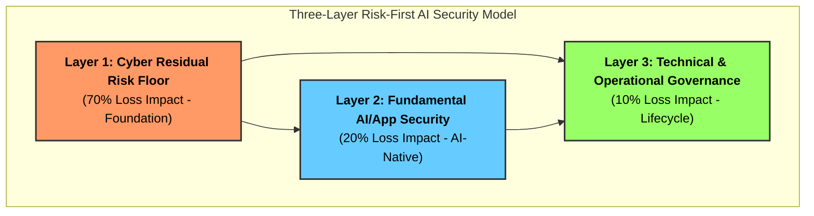

# TRISUELLA-AIDLCA Secure Development Framework

> **This framework establishes AI as a trusted, policy-governed, multi-role developer that builds, secures, tests, audits, and enforces global compliance across the software lifecycle, while incorporating human-in-the-loop governance to enable context-aware decisions aligned with project intent, functional requirements, and data sensitivity.**

**TriSuElla** is a foundational architectural and governance framework for AI-driven development that establishes a comprehensive, security-first and policy-driven approach to designing, building, and operating systems across the entire lifecycle, ensuring that AI operates not only with autonomous execution but also with enforced trust, regulatory compliance, auditability, and alignment to human intent; it is built on three integrated pillars—Sisu, Tillit, and Dugnad—where Sisu enables intelligent, resilient, and modular execution of development activities through AI agents across planning, design, build, testing, deployment, monitoring, and continuous improvement, Tillit governs all actions through Zero Trust security, multi-jurisdictional compliance including regulations such as DPDPA, GDPR, and HIPAA, and responsible AI principles such as explainability, bias control, validation, risk classification, and human-in-the-loop oversight to ensure trustworthy and context-aware decision-making, and Dugnad enables structured multi-agent and human collaboration through orchestration, communication protocols, shared knowledge systems, and coordinated task execution; the framework enforces policy-as-code governance, continuous testing including SAST, DAST, IAST, and AI output validation, automated threat modeling and risk management, full traceability and auditability of all actions and decisions, and dynamic compliance enforcement across regions, while distinguishing between mandatory rules that must be enforced and advisory guidelines that can be contextually applied with human oversight, ultimately enabling scalable, reusable, and continuously improving AI-driven development systems that are secure, compliant, collaborative, and trustworthy by design.

> **TriSuElla Purpose Statement:**
> TriSuElla exists to ensure that AI-driven development is executed with integrated governance, security, compliance, trust, and collaboration—enabling autonomous systems that are controlled, auditable, and aligned with human, organizational, and regulatory expectations.

## 🧭 Meaning & Symbolism
The name **TriSuElla** represents the convergence of three foundational forces, inspired by the **Trishula** (Trident).

- **Tri** → Three Pillars: **SISU** (Execution), **TILLIT** (Trust), and **DUGNAD** (Collaboration).
- **Symbolism**: Much like each prong of a trident, every pillar represents a core force. Together, they provide **Balance, Control, and Direction**.

> **The Core Philosophy:**
> Power comes not from one capability, but from the balance of three.

**TRISUELLA-AIDLCA (AI-Driven Development Life Cycle)** — A modern methodology for software development that integrates generative AI throughout every stage of the building process: from threat modeling and requirements, through design, code generation, security testing, deployment, and incident response.

**Version**: 2.5
**Author**: [Bhaskar Puppala (PATEL)](https://www.linkedin.com/in/bhaskerkpatel/)
**Last Updated**: 2026-04-01
**Status**: Production-ready (Institutionalized)
**Total Consolidated Checks**: 285 (across 24 sections)

---

## 🚦 TriSuElla Severity Scale (Risk-First)
To ensure consistent governance, every rule in the TRISUELLA-AIDLCA ruleset is assigned a **Severity Rating** defining its enforcement priority:

*   **`[CRITICAL]`**: **Immediate systemic risk**. Non-compliance triggers an immediate "Halt" state. Must be resolved before *any* further progress (Atomic/Blocking Finding).
*   **`[HIGH]`**: **Significant operational or security risk**. Must be resolved before the current Phase (Inception/Construction/Operations) can be completed.
*   **`[MEDIUM]`**: **Moderate risk or non-functional violation**. Should be addressed before production release; may be deferred with documented justification.
*   **`[LOW]`**: **Best practice or hygiene finding**. Minor impact on security posture; recommended for long-term maintenance.

---

## 🛡️ Risk-First AI Security (The 3-Layer Model)
We prioritize security investment where the actual financial and operational loss occurs:



### 🏗️ The Financial Architecture of the 3-Layer Model
The model is based on the insight that AI systems don't exist in a vacuum; they sit on top of legacy infrastructure and under a governance umbrella.

| Layer | Focus | Est. Loss Impact | Why the "Next Dollar" belongs here: |
| :--- | :--- | :--- | :--- |
| **Layer 1: Cyber Residual Risk Floor** | Fundamentals: Identity (IAM), Cloud Posture, Patching, Endpoint Security. | **~70%** | **The Baseline:** Even if your LLM is perfectly secure, if an attacker steals the API key because of a misconfigured S3 bucket or an unpatched server, the AI system is compromised. This is where 70% of actual loss occurs in the real world. |
| **Layer 2: AI / App Security** | AI-Native Risks: Prompt Injection, Tool-use boundaries, Agent Sandboxing, Semantic WAFs. | **~20%** | **The New Surface:** This is the layer of "Prompt Injection" and "Excessive Agency." While high-profile, it accounts for a smaller fraction of total financial loss than Layer 1, but it requires specialized, AI-native security tools. |
| **Layer 3: Technical & Operational Governance** | Lifecycle & Oversight: NI-IAM, AI-BoM, Policy-as-Code, Human-in-the-Loop, Audit. | **~10%** | **The Long Game:** This layer manages the "silent failures"—model drift, compliance fines, and operational overreach. It is the cheapest to implement but the most critical for long-term legal and regulatory survival. |

### 🚀 Operational & Financial Benefits
*   **Prevents "Shiny Object Syndrome":** It stops organizations from spending their entire security budget on a "Prompt Injection" tool (Layer 2) while their Cloud IAM (Layer 1) remains wide open.
*   **CISO-Friendly Metrics:** By framing security as "Loss Impact (%)," it transforms AI security from a technical hurdle into a financial risk management discussion.
*   **Sequential Hardening:** The model mandates that an organization MUST harden Layer 1 (The Floor) before it can claim to have a "Secure AI System."

---

## What Is This?

The TRISUELLA-AIDLCA Secure Development Framework is a **rules kit for AI coding assistants and agent systems**. You load it into your AI tool once — as a system prompt, project instructions, or repository rules file — and every piece of code the AI generates from that point on follows production-grade security, privacy, and compliance standards automatically.

Traditional SDLC treats AI as a code autocomplete tool. TRISUELLA-AIDLCA is different: the AI model is an active participant in *every* phase of development — an architect in Inception, a security analyst in Threat Modeling, a designer in Construction, a QA engineer in Build & Test, and a DevOps engineer in Operations.

The result is a consistent, auditable, secure development workflow that works equally well for solo vibe coders, small teams, and regulated enterprise projects.

---

## 🌐 Platform Independence

This framework is **platform-agnostic** — copy it once, use it with any AI assistant or IDE:

| Platform | How to Activate |
|---|---|
| **Cursor** | Add to `.cursorrules`: `Always follow the TRISUELLA-AIDLCA workflow in .TRISUELLA-AIDLCA-rules/core-workflow.md` |
| **VS Code + Cline** | Add to `.clinerules`: `Always follow the TRISUELLA-AIDLCA workflow in .TRISUELLA-AIDLCA-rules/core-workflow.md` |
| **VS Code + GitHub Copilot** | Add to `.github/copilot-instructions.md` |
| **Claude Code / Claude Project** | Add to `CLAUDE.md` or paste into Project Instructions |
| **Windsurf / Codium** | Add to `.windsurfrules` |
| **Aider** | Pass `--read .TRISUELLA-AIDLCA-rules/core-workflow.md` at startup |
| **Any AI assistant** | Paste `core-workflow.md` contents into the system prompt |

---

## 📂 Complete Directory Structure

```
TRISUELLA-AIDLCA-secure-rules/
│
├── README.md                                    ← This file
│
├── TRISUELLA-AIDLCA-rules/
│   └── core-workflow.md                         ← Master TRISUELLA-AIDLCA workflow (all phases)
│                                                   Load this in your AI assistant first
│
├── TRISUELLA-AIDLCA-rule-details/                          ← Detailed rules per phase and extension
│   │
│   ├── common/                                  ← Loaded at every workflow start
│   │   ├── process-overview.md                  ← Full workflow diagram + stage descriptions
│   │   ├── depth-levels.md                      ← Minimal / Standard / Comprehensive depth guide
│   │   ├── question-format-guide.md             ← How to format [Answer]: tag questions
│   │   ├── content-validation.md                ← Mermaid/ASCII/content validation rules
│   │   ├── session-continuity.md                ← How to resume an interrupted workflow
│   │   ├── error-handling.md                    ← Error handling guidance for the AI
│   │   ├── overconfidence-prevention.md         ← Rules to prevent AI from making bad assumptions
│   │   ├── terminology.md                       ← TRISUELLA-AIDLCA term definitions
│   │   ├── welcome-message.md                   ← Displayed once at workflow start
│   │   ├── workflow-changes.md                  ← Rules for mid-workflow change requests
│   │   └── ascii-diagram-standards.md           ← ASCII diagram formatting standards
│   │
│   ├── inception/                               ← Phase 1: Plan, model threats, design architecture
│   │   ├── workspace-detection.md               ← Detect greenfield vs brownfield, scan workspace
│   │   ├── reverse-engineering.md               ← Analyse existing codebase (brownfield only)
│   │   ├── requirements-analysis.md             ← Gather functional + non-functional requirements
│   │   ├── threat-modeling.md                   ← STRIDE + STRIDEAI threat modeling
│   │   │                                           Covers: system context, trust boundaries, DREAD
│   │   │                                           scoring, AI/agentic-specific threat categories
│   │   ├── user-stories.md                      ← Generate user stories and personas
│   │   ├── workflow-planning.md                 ← Build the execution plan for Construction
│   │   ├── application-design.md                ← High-level component + service layer design
│   │   └── units-generation.md                  ← Decompose into units of work (for complex systems)
│   │
│   ├── construction/                            ← Phase 2: Design, generate, test per unit
│   │   ├── functional-design.md                 ← Business logic + domain model design per unit
│   │   ├── nfr-requirements.md                  ← Non-functional requirements + tech stack decisions
│   │   ├── nfr-design.md                        ← NFR patterns and logical components per unit
│   │   ├── infrastructure-design.md             ← Map components to cloud/infra services
│   │   │                                           + Mandatory Secrets Management by Design section
│   │   ├── code-generation.md                   ← Plan + generate code per unit
│   │   │                                           + Mandatory 20-item Security Code Review Checklist
│   │   └── build-and-test.md                    ← Build + comprehensive test execution
│   │                                               SAST, DAST, secret scanning, container scanning,
│   │                                               AI/LLM security tests, pen testing guidance
│   │
│   ├── operations/                              ← Phase 3: Deploy, observe, respond
│   │   └── operations.md                        ← Fully built-out Operations phase
│   │                                               CI/CD pipeline generation (with security gates)
│   │                                               Deployment planning + rollback procedures
│   │                                               Production readiness checklist
│   │                                               Observability: metrics, alerts, dashboards
│   │                                               Incident response runbooks (breach, AI abuse,
│   │                                               credential compromise) + post-mortem template
│   │
│   └── extensions/                              ← Opt-in extensions loaded during Requirements
│       │                                           Analysis; full files loaded only when opted in
│       │
│       ├── security/
│       │   │
│       │   ├── baseline/
│       │   │   ├── security-baseline.md          ← 15 SECURITY rules mapped to OWASP Top 10 (2025)
│       │   │   │                                    Encryption, access control, input validation,
│       │   │   │                                    supply chain, authentication, logging,
│       │   │   │                                    HTTP headers, misconfiguration prevention
│       │   │   └── security-baseline.opt-in.md
│       │   │
│       │   ├── ai-agentic/
│       │   │   ├── ai-agentic-security.md         ← 11 AI-SECURITY rules
│       │   │   │                                    Mapped to OWASP LLM Top 10 (2025)
│       │   │   │                                    Prompt injection, secure agentic tool use, 
│       │   │   │                                    AI-Driven Collusion, Model-on-Model Risks,
│       │   │   │                                    Video KYC Deepfake Detection [CRITICAL]
│       │   │   └── ai-agentic-security.opt-in.md
│       │   │
│       │   ├── privacy-secure-design/
│       │   │   ├── privacy-secure-design.md       ← 10 rules across four design philosophies:
│       │   │   │                                    Privacy by Design: data minimization, purpose
│       │   │   │                                    limitation, privacy-by-default config, data
│       │   │   │                                    subject rights, retention + disposal
│       │   │   │                                    Secure by Design: secure architecture principles,
│       │   │   │                                    security-by-default configuration, fail-safe
│       │   │   │                                    defaults, secure development defaults
│       │   │   │                                    Safety by Design: misuse scenario analysis,
│       │   │   │                                    output filtering, human oversight mechanisms
│       │   │   └── privacy-secure-design.opt-in.md
│       │   │
│       │   ├── infra-security/
│       │   │   ├── infra-security.md              ← 16 INFRA-SEC rules — full infrastructure layer
│       │   │   │   ├── ... rules 01-15 ...
│       │   │   │   └── [INFRA-SEC-16] NTP Synchronization for Forensic Integrity (CERT-In/RBI)
│       │   │   │   Maps to: CIS Controls v8, NIST SP 800-53, ISO 27001:2022, PCI-DSS v4, HIPAA
│       │   │   └── infra-security.opt-in.md
│       │   │
│       │   ├── sensitive-data/
│       │   │   ├── sensitive-data-security.md     ← 10 SENS rules — data-centric protection
│       │   │   │   ├── [SENS-01] Data minimisation + purpose limitation (retention defaults)
│       │   │   │   ├── ... rules 02-08 ...
│       │   │   │   ├── [SENS-09] Automated Data Tagging & Classification [CRITICAL]
│       │   │   │   └── [SENS-10] Endpoint activity lockdown (Copy/Paste/Screenshot)
│       │   │   │   Maps to: GDPR, DPDPA, HIPAA, PCI-DSS, CCPA/CPRA, NIST SP 800-53
│       │   │   └── sensitive-data-security.opt-in.md
│       │   │
│       │   └── zero-trust/
│       │       ├── zero-trust.md                  ← 11 ZT rules — full Zero Trust Architecture
│       │       │   ├── ... rules 01-09 ...
│       │       │   ├── [ZT-10] Dynamic 2FA & 12-Hour Reset Cooling [CRITICAL]
│       │       │   └── [ZT-11] Shadow API Discovery & Governance
│       │       │   Maps to: CISA ZT Pillars, NIST SP 800-207, ISO 27001:2022, NIST SP 800-53
│       │       └── zero-trust.opt-in.md
│       │
│       ├── cloud-security/
│       │   ├── cloud-security.md                  ← 24 cloud security & multi-cloud CSPM rules
│       │   │                                         AWS, Azure, GCP, Alibaba Cloud (Aliyun), OCI
│       │   │                                         Part A: 10 platform-agnostic cloud rules
│       │   │                                         Part B: 14 multi-cloud CSPM auditing standards
│       │   │                                         KSPM, DSPM, AI-CSPM/CWPP, CIEM, Edge WAF,
│       │   │                                         Shift-Left IaC, Storage WORM, HSM, Sovereignty
│       │   │                                         Maps to: CIS Level 2, NIST SP 800-53, ISO 27001
│       │   └── cloud-security.opt-in.md
│       │
│       ├── compliance/
│       │   ├── compliance-mapping.md              ← Framework-specific compliance requirements
│       │   │                                         PCI-DSS v4, HIPAA, GDPR, SOC 2, ISO 27001,
│       │   │                                         DPDPA (India — 8 rules, COMP-DPDPA-01–08)
│       │   ├── compliance-mapping.opt-in.md
│       │   └── compliance-india-bfsi.md           ← **NEW**: 7 India BFSI-specific mandates
│       │                                              CERT-In 6-Hour reporting, 5-Year retention,
│       │                                              .bank.in migration, 12-hour cooling period
│       │
│       └── testing/
│           └── property-based/
│               ├── property-based-testing.md      ← 10 PBT rules: round-trip, invariant,
│               │                                    idempotency, oracle, stateful, generator
│               │                                    quality, shrinking, reproducibility,
│               │                                    framework selection, complementary strategy
│               └── property-based-testing.opt-in.md

docs/
├── how-to-use.md              ← Complete integration guide for all AI tools
│                                  Setup patterns: single session, Claude Project, team repo, TRISUELLA-AIDLCAA
│                                  Phase-by-phase walkthrough, file reference, tips
├── faq.md                     ← 25+ questions covering general use, setup,
│                                  rules enforcement, AI-specific behaviour, vibe coding
├── benefits.md                ← Benefits by role (vibe coder, developer, CTO)
│                                  Benefits by phase, comparison with alternatives,
│                                  4 real-world scenarios
├── vibe-coding-guide.md       ← Streamlined guide for AI-assisted / vibe coding
│                                  Claude Project setup, iterative workflow, common mistakes
│                                  the framework catches, 7-day SaaS build example
├── which-extensions.md        ← Decision tree — 8 yes/no questions map to
│                                  extension combinations for any project type
└── adr-template.md            ← Architecture Decision Record template with
                                   TRISUELLA-AIDLCA-specific fields: security impact, compliance
                                   impact, AI agent interaction impact

prompts/
├── README.md                  ← Index of all prompt categories
├── planning/
│   └── requirements-and-threat-model.md   ← 5 prompts: kickoff, requirements, STRIDE
│                                              threat model, user stories, architecture review
├── build/
│   └── secure-code-generation.md          ← 6 prompts: secure API endpoint, security code
│                                              review, secure Dockerfile, secure DB schema,
│                                              refactor for security, auth implementation
├── test/
│   └── security-testing.md                ← 6 prompts: API security tests, prompt injection
│                                              suite, dependency scan setup, secret scan setup,
│                                              AI model evaluation, infra security checklist
├── ai-agents/
│   └── ai-agent-security-prompts.md       ← 6 prompts: secure LLM feature design, multi-agent
│                                              system design, RAG security design, LLM output
│                                              validation, prompt template review, MCP server review
└── compliance/
    └── compliance-prompts.md              ← 5 prompts: GDPR checklist, DPDPA compliance check,
                                              HIPAA gap assessment, PCI-DSS scoping, data
                                              subject rights workflow design
```

---

## 🚀 Quick Setup

### Step 1: Copy to your project

```bash
# From your project root
cp -r /path/to/TRISUELLA-AIDLCA-secure-rules/TRISUELLA-AIDLCA-rule-details .TRISUELLA-AIDLCA-rule-details
mkdir -p .TRISUELLA-AIDLCA-rules
cp /path/to/TRISUELLA-AIDLCA-secure-rules/TRISUELLA-AIDLCA-rules/core-workflow.md .TRISUELLA-AIDLCA-rules/core-workflow.md
```

### Step 2: Activate in your AI assistant

**Cursor** — add to `.cursorrules`:
```
Always follow the TRISUELLA-AIDLCA workflow defined in .TRISUELLA-AIDLCA-rules/core-workflow.md
```

**VS Code + Cline** — add to `.clinerules`:
```
Always follow the TRISUELLA-AIDLCA workflow defined in .TRISUELLA-AIDLCA-rules/core-workflow.md
```

**Claude Code** — add to `CLAUDE.md`:
```
Always follow the TRISUELLA-AIDLCA workflow defined in .TRISUELLA-AIDLCA-rules/core-workflow.md
```

**Windsurf** — add to `.windsurfrules`:
```
Always follow the TRISUELLA-AIDLCA workflow defined in .TRISUELLA-AIDLCA-rules/core-workflow.md
```

**Claude.ai Projects** — paste `core-workflow.md` contents into Project Instructions. Upload extension `.md` files as Project Knowledge.

### Step 3: Start building

Open a new conversation with your AI assistant and describe what you want to build. The workflow kicks in automatically.

Not sure which extensions to add? See [`docs/which-extensions.md`](docs/which-extensions.md) — answer 8 questions and get your exact combination.

---

## 📋 The Three Phases

### 🔵 Phase 1: Inception — Plan Before You Build

Every project starts here. The AI detects your workspace, gathers requirements, and — for any security-relevant scope — runs a full threat model before a single line of code is written.

| Stage | Always / Conditional | Purpose |
|---|---|---|
| Workspace Detection | **Always** | Detect greenfield/brownfield, scan existing code |
| Reverse Engineering | Conditional | Analyse existing codebase if brownfield |
| Requirements Analysis | **Always** | Gather functional + NFRs with adaptive depth |
| **Threat Modeling** | Conditional | STRIDE + STRIDEAI threat analysis, DREAD scoring |
| User Stories | Conditional | User personas and acceptance criteria |
| Workflow Planning | **Always** | Build the execution plan |
| Application Design | Conditional | High-level components and service design |
| Units Generation | Conditional | Decompose into parallel units of work |

### 🟢 Phase 2: Construction — Design, Code, and Verify

Each unit of work goes through design → code → security review before moving on. Build & Test runs once all units are complete.

| Stage | Always / Conditional | Purpose |
|---|---|---|
| Functional Design | Conditional per unit | Business logic and domain model |
| NFR Requirements | Conditional per unit | Performance, security, scalability NFRs |
| NFR Design | Conditional per unit | NFR patterns and logical components |
| Infrastructure Design | Conditional per unit | Cloud/infra mapping + Secrets Management by Design |
| **Code Generation** | **Always** per unit | Generate code + mandatory 20-item Security Code Review |
| **Build and Test** | **Always** | Unit, integration, performance, SAST, DAST, secrets scan |

### 🟡 Phase 3: Operations — Ship and Operate It

Closes the loop from code to running production system with full observability and incident readiness.

| Stage | Always / Conditional | Purpose |
|---|---|---|
| CI/CD Pipeline Generation | Conditional | Pipeline with security/quality gates |
| **Deployment Planning** | **Always** | Strategy, rollback, production readiness checklist |
| Observability Setup | Conditional | Metrics, alerts, dashboards (including AI-specific) |
| Incident Response Planning | Conditional | Runbooks, breach procedures, AI abuse playbook |

---

## 🛡️ Security Coverage

Eight extensions plus built-in core security controls. Each extension is an opt-in — full rule files load only when opted in, keeping context lean for simpler projects.

| Extension | Rules | What It Covers | Standards |
|---|---|---|---|
| **Security Baseline** | 15 | Encryption, access control, input validation, supply chain, authentication, HTTP security headers, logging, misconfiguration prevention | OWASP Top 10 (2025) |
| **AI / Agentic / ML Security** | 8 | Prompt injection (direct + indirect), secure tool use, agent memory, LLM I/O validation, model/training security, RAG security, AI safety, AI observability | OWASP LLM Top 10 (2025) |
| **Privacy + Secure + Safety by Design** | 10 | Data minimization, purpose limitation, privacy-by-default, data subject rights, retention, secure architecture, fail-safe defaults, misuse scenarios, human oversight | GDPR Art. 25, NIST SP 800-160 |
| **Cloud Security** | 10 | IAM least privilege, storage security, network perimeter, compute + container hardening, cloud secrets, audit logging, IaC scanning, encryption + KMS, account hygiene, CI/CD supply chain. AWS / Azure / GCP / Kubernetes / serverless | CIS Benchmarks, OWASP Cloud-Native Top 10 |
| **Infrastructure Security** | 15 | Network zones, OS hardening (CIS), secrets at rest, IaC security, container supply chain (Cosign/SLSA), CI/CD pipeline (OIDC/SHA-pinned), logging + FIM, WAF + DDoS + TLS, vulnerability management, backup/DR, **Kubernetes** (RBAC/NetworkPolicy/etcd encryption), **Docker** (daemon/Dockerfile rules/Falco), **virtual env + dependency isolation** (lockfiles/SBOM), **supply chain** (SLSA levels 1–3+/SSDF), **secrets in code** (pre-commit/LLM prompt hygiene) | CIS Controls v8, NIST SP 800-53, ISO 27001:2022, PCI-DSS v4, HIPAA |
| **Sensitive Information Security** | 10 | Data classification (L0–L4), PII handling, financial, health, sensitive data in logs, sensitive data in AI, children's data, erasure, **Automated Tagging [CRITICAL]**, **Endpoint Lockdown**. | GDPR, DPDPA, HIPAA, PCI-DSS, CCPA/CPRA, NIST SP 800-53 |
| **Zero Trust Architecture** | 11 | Identity, continuous authorization, device trust, micro-segmentation, ZT code patterns, ZT for AI agents, data-centric trust, ZT monitoring, policy-as-code, **Dynamic 2FA [CRITICAL]**, **Shadow API Discovery**. | CISA ZT Maturity Model, NIST SP 800-207, ISO 27001:2022 |
| **Compliance Mapping** | Framework-specific | PCI-DSS v4, HIPAA, GDPR, SOC 2, ISO 27001, DPDPA (India), **India BFSI (CERT-In 6h, 5y Retention, .bank.in)** | PCI-DSS v4, HIPAA, GDPR, SOC 2, ISO 27001, DPDPA 2023 |
| **Property-Based Testing** | 10 | PBT identification, round-trip, invariant, idempotency, oracle, stateful testing, generator quality, shrinking, reproducibility, framework selection | — |

**Total: 95 rules across 9 extensions**

### Built-in Security (no extension needed)

These are wired into core stages and always active regardless of which extensions are loaded:

- **Security Code Review Checklist** — 20 mandatory items run at every Code Generation completion; any finding blocks stage advance
- **Secrets Management by Design** — mandatory section in every Infrastructure Design artifact
- **SAST / DAST / Secret scanning / Container scanning** — structured into Build & Test with tool recommendations per language and stack
- **AI/LLM security tests** — prompt injection batteries, tool boundary tests, and output validation tests built into Build & Test when the AI extension is active

---

## 🔑 Design Principles

| Principle | What It Means in Practice |
|---|---|
| **Adaptive Workflow** | Only execute stages that add real value — a simple bug fix skips threat modeling; a new authentication system runs the full process |
| **Transparent Planning** | The AI shows its execution plan and gets your approval before proceeding to any stage |
| **User Control** | Every stage can be included or excluded on your direction |
| **Shift Left Security** | Threat modeling runs in Inception — before architecture is locked, before code is written |
| **Secure by Default** | Security controls are ON out of the box; less-secure configurations require explicit justification |
| **Privacy by Default** | Maximum privacy protection in every default configuration — analytics, tracking, AI training all off by default |
| **Safety by Design** | Misuse scenarios are documented; AI systems have scope limits, kill switches, and human oversight gates |
| **Zero Trust Native** | Every agent action authenticated, authorized, and audited; no implicit trust based on network location |
| **Complete Audit Trail** | Every user input, AI response, and approval logged to `TRISUELLA-AIDLCA-docs/audit.md` with timestamps |
| **Progress Tracking** | All workflow state in `TRISUELLA-AIDLCA-docs/TRISUELLA-AIDLCA-state.md` — resume any session from where it left off |
| **Platform Agnostic** | Works with any AI assistant, any OS, any cloud provider |

---

## 🤖 For Vibe Coders and First-Time Developers

You do not need to understand every rule to benefit from this framework. The workflow is designed so the AI does the analysis — you describe what you want, answer a few questions, and approve each stage.

**Minimal setup:**
1. Copy the rules folder into your project root (see Quick Setup above)
2. Tell your AI assistant: *"Follow the TRISUELLA-AIDLCA workflow in `.TRISUELLA-AIDLCA-rules/core-workflow.md`"*
3. Describe what you want to build
4. Answer the questions the AI asks
5. Review and approve each stage

**What you get without any extra effort:**
- Structured requirements before code is written
- An execution plan you approve before construction starts
- Every generated function checked against a 20-item security checklist
- Build and test instructions generated for your specific tech stack
- A production readiness checklist before you ship

**See the dedicated guide**: [`docs/vibe-coding-guide.md`](docs/vibe-coding-guide.md)

---

## 📁 Generated Project Artifacts

When the TRISUELLA-AIDLCA workflow runs on your project, it creates a structured documentation folder alongside your code:

```
your-project/
├── [your application code]
└── TRISUELLA-AIDLCA-docs/
    ├── TRISUELLA-AIDLCA-state.md                     ← Current workflow state and extension config
    ├── audit.md                           ← Complete interaction log with timestamps
    ├── inception/
    │   ├── requirements/requirements.md   ← Functional + NFR requirements
    │   ├── threat-model/
    │   │   ├── system-context.md          ← DFD / system context diagram
    │   │   ├── threat-model.md            ← Full threat register with DREAD scores
    │   │   └── security-requirements-from-threats.md
    │   ├── user-stories/stories.md
    │   └── application-design/
    ├── construction/
    │   └── {unit-name}/
    │       ├── functional-design/
    │       ├── nfr-requirements/
    │       ├── infrastructure-design/
    │       │   └── secrets-management-design.md
    │       └── code/
    │   └── build-and-test/
    │       ├── build-instructions.md
    │       ├── security-test-instructions.md
    │       └── build-and-test-summary.md
    └── operations/
        ├── cicd-pipeline.md
        ├── deployment-plan.md
        ├── production-readiness-checklist.md
        ├── observability-setup.md
        └── incident-response-runbook.md
```

These artifacts double as compliance evidence: `audit.md` supports SOC 2 change management, `threat-model.md` supports risk assessment, `incident-response-runbook.md` supports HIPAA breach notification readiness, and `secrets-management-design.md` supports PCI-DSS and DPDPA documentation requirements.

---

## 📚 Developer Documentation

| Document | What It Covers |
|---|---|
| [`docs/how-to-use.md`](docs/how-to-use.md) | Complete integration guide — setup for Cursor, Copilot, Claude, TRISUELLA-AIDLCAA agents; phase-by-phase walkthrough; tips |
| [`docs/vibe-coding-guide.md`](docs/vibe-coding-guide.md) | Streamlined guide for vibe coders — mindset, Claude Project setup, iterative workflow, 7-day SaaS example |
| [`docs/faq.md`](docs/faq.md) | 25+ frequently asked questions — general, setup, rules enforcement, AI-specific, vibe coding |
| [`docs/benefits.md`](docs/benefits.md) | Benefits by role (vibe coder / developer / CTO), by phase, comparison with alternatives, 4 real-world scenarios |
| [`docs/which-extensions.md`](docs/which-extensions.md) | Decision tree — answer 8 questions, get your exact extension combination + project-type reference table |
| [`docs/adr-template.md`](docs/adr-template.md) | Architecture Decision Record template with TRISUELLA-AIDLCA-specific fields: security impact, compliance impact, agent interaction impact |

## 🧰 Prompt Template Library

Ready-to-use prompts for every stage of the TRISUELLA-AIDLCA workflow. Copy, fill in the brackets, paste into your AI assistant.

| File | Prompts |
|---|---|
| [`prompts/planning/requirements-and-threat-model.md`](prompts/planning/requirements-and-threat-model.md) | Project kickoff, requirements deep dive, STRIDE threat model, user stories with security ACs, architecture security review |
| [`prompts/build/secure-code-generation.md`](prompts/build/secure-code-generation.md) | Secure API endpoint, security code review, secure Dockerfile, secure DB schema, refactor for security, auth implementation |
| [`prompts/test/security-testing.md`](prompts/test/security-testing.md) | API security tests, prompt injection suite, dependency scan setup, secret scan setup, AI model evaluation, infra security checklist |
| [`prompts/ai-agents/ai-agent-security-prompts.md`](prompts/ai-agents/ai-agent-security-prompts.md) | LLM feature design, multi-agent system design, RAG security, LLM output validation, prompt template review, MCP server review |
| [`prompts/compliance/compliance-prompts.md`](prompts/compliance/compliance-prompts.md) | GDPR checklist, DPDPA compliance check, HIPAA gap assessment, PCI-DSS scoping, data subject rights workflow |

---

## 🔄 Changelog

### v2.5 (2026-04-01) - Institutionalized Release
- **Unified Master Rulebook** — Consolidated **285 rules and checks** across 24 categories with **184 unique TRISU-* rule identifiers** into `TRISUELLA_MASTER_RULES_AND_CHECKS.md`.
- **Full-Spectrum Multi-Cloud CSPM & Auditing Standard (`TRISU-CSPM`)** — Institutionalized 14 enterprise-grade CSPM controls across the top 5 cloud providers (**AWS**, **Microsoft Azure**, **Google Cloud Platform**, **Alibaba Cloud (Aliyun)**, and **Oracle Cloud Infrastructure**):
  - `TRISU-CSPM-01` to `TRISU-CSPM-08`: Continuous CSPM & CIS Level 2 scanning, Workload IAM & Non-Human Identity (NHI) federation, Storage WORM compliance locks, Private network perimeter isolation, Tamper-evident multi-region audit trails, Automated drift remediation, Dedicated Cloud HSM / CMK key management, and Sovereign region geofencing.
  - `TRISU-CSPM-09` to `TRISU-CSPM-14`: Kubernetes Security Posture Management (**KSPM** - EKS/AKS/GKE/ACK/OKE), Database & Data Store Posture (**DSPM** - RDS/Cosmos/Cloud SQL/PolarDB/Autonomous DB), Compute & AI/ML Workload Posture (**AI-CSPM / CWPP** - IMDSv2, SageMaker/Azure OpenAI/Vertex/PAI/GenAI), Cloud Infrastructure Entitlements (**CIEM** - dormant credential revocation & PCI < 15), Cloud Edge WAF & Anti-DDoS Ingress, and Shift-Left Infrastructure-as-Code (**IaC**) pre-flight scanning.
  - Comprehensive **14-Domain Technical Crosswalk Matrix** providing exact operational parity across all 5 major CSPs.
- **Three Pillars & 3-Layer Risk Model** — Formalized SISU, TILLIT, and DUGNAD with the Cyber Residual Risk Floor (70%/20%/10% loss distribution).
- **Automated Tooling (`tools/trisu-cli`)** — Implemented zero-dependency Python CLI (`trisu_validator.py`):
  - `init`: Instant project scaffolding of templates, state tracking, and CI gates.
  - `check`: Automated structural artifact verification.
  - `audit`: Blocking security checks, secret scanning, and native **OASIS SARIF 2.1.0** export for GitHub Code Scanning.
  - `bom`: Automated CycloneDX AI v1.6 AI-BoM generator.
  - `rules`: Rule ID index integrity validation (184 unique TRISU-* identifiers).
- **Developer Drop-in Templates (`templates/`)** — Created ready-to-use configurations: `.cursorrules`, `CLAUDE.md`, `.windsurfrules`, `copilot-instructions.md`, `trisuella.config.yaml` (with granular `cspm` and `posture_domains` blocks), and `.pre-commit-config.yaml`.
- **CI/CD Enforcement Gates** — Added automated GitHub Actions workflow (`.github/workflows/trisuella-gate.yml`) to enforce blocking `[CRITICAL]` checks on pull requests.
- **Multi-Agent Architecture (`TRISUELLA-AIDLCAa`)** — Published formal 8-agent zero-trust autonomous development taxonomy, ZTP message envelope, and Dual-Key HITL gates.
- **Tools Promotion** — Promoted SISU-UI governance dashboard to `tools/sisu-ui/` and structured sample data into `tools/sisu-ui/sample-data/`.

### v2.1 (2026-03-30)

**New extensions:**
- **Zero Trust Architecture** — 9 ZT rules covering all 5 CISA pillars; identity, device, network, application, data, monitoring, and policy-as-code. Mapped to CISA ZT Maturity Model and NIST SP 800-207.
- **Sensitive Information Security** — 8 SENS rules covering data classification (L0–L4), PII, financial, health/biometric, sensitive data in logs, sensitive data in AI systems, children's data, and right to erasure. Mapped to GDPR, DPDPA, HIPAA, PCI-DSS v4, CCPA/CPRA.
- **Infrastructure Security expanded** to 15 rules (up from 10): Kubernetes hardening (INFRA-SEC-11), Docker security (INFRA-SEC-12), virtual env + dependency isolation (INFRA-SEC-13), supply chain security / SLSA / SSDF (INFRA-SEC-14), secrets in code and pipelines (INFRA-SEC-15).
- **DPDPA compliance mapping** — 8 rules (COMP-DPDPA-01 through COMP-DPDPA-08) for India's Digital Personal Data Protection Act 2023.

**New documentation and developer experience:**
- `docs/how-to-use.md`, `docs/faq.md`, `docs/benefits.md`, `docs/vibe-coding-guide.md`, `docs/which-extensions.md`, `docs/adr-template.md`
- Prompt template library: 28 ready-to-use prompts across 5 categories (planning, build, test, AI/agents, compliance)

### v2.0 (2026-03-30)

**New phases and stages:**
- Threat Modeling (Inception) — STRIDE + STRIDEAI, DREAD scoring, system context diagrams
- CI/CD Pipeline Generation, Observability Setup, Incident Response Planning (all Operations)

**New extensions:**
- AI / Agentic / ML Security (8 rules, OWASP LLM Top 10)
- Privacy + Secure + Safety by Design (10 rules)
- Cloud Security (10 rules, CIS Benchmarks)
- Infrastructure Security (10 rules, CIS/NIST/ISO/PCI/HIPAA)
- Compliance Mapping (PCI-DSS, HIPAA, GDPR, SOC 2, ISO 27001)

**Enhanced stages:**
- Infrastructure Design — Mandatory Secrets Management by Design
- Code Generation — 20-item Security Code Review Checklist (blocking)
- Build and Test — SAST/DAST/secret scan/container scan + AI/LLM security tests

### v1.0 — Initial Release

Original TRISUELLA-AIDLCA rules kit, made platform-independent.

---

## 🗺️ Next-Generation Upgrades & Roadmap

The following strategic enhancements are identified for upcoming releases:

1. **MCP (Model Context Protocol) Security Specification (`TRISU-MCP`)**:
   - Explicit guardrails against prompt injection via tool descriptions, recursive tool-calling loops, and malicious MCP server payloads.
   - Granular capability negotiation and least-privilege scoping for autonomous tool-use.

2. **EU AI Act High-Risk Compliance Module**:
   - Comprehensive control checklist mapping to Articles 9–15 (Risk management, Data governance, Technical documentation, Record-keeping, Transparency, Human oversight, and Cybersecurity).

3. **Agentic Workload Identity & Token Delegation (A-IAM / NI-IAM)**:
   - Cryptographic SPIFFE/mTLS token issuance and ephemeral credentials for subagents, preventing lateral token abuse and session replay.

4. **Automated AI-BoM Generator (CycloneDX AI Extension)**:
   - Tooling extension in `trisu-cli` to automatically inspect weights, datasets, prompt templates, and vector databases to output verifiable, signed AI Bills of Materials.

5. **IDE Extensions**:
   - VS Code and JetBrains extension packaging for real-time linting of active TriSuElla rules during code generation.

---

*TRISUELLA-AIDLCA Secure Development Framework v2.5 — Security-first, AI-native. From idea to production.*
