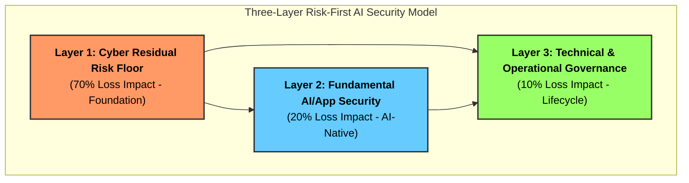

# 🔱 TriSuElla-AIDLCA Secure Development Framework
> **Version**: 3.0 | **Status**: Institutionalized | **Checks**: 285  
> **Author**: [Bhaskar Puppala (PATEL)](https://www.linkedin.com/in/bhaskerkpatel/)  
> **AI-Driven. Policy-Governed. Trustworthy by Design.**

**TriSuElla** is the foundational governance framework for AI-driven development. It ensures that AI agents operate within secure, compliant, and human-aligned boundaries across the entire software lifecycle.

---

## 🚦 TriSuElla Severity Scale
Every rule in this framework is assigned a severity rating based on its risk-first impact:
*   `[CRITICAL]`: Immediate risk of systemic compromise or data breach. **Atomic/Blocking**.
*   `[HIGH]`: Significant risk of exploitation or non-compliance. Must be resolved within the phase.
*   `[MEDIUM]`: Moderate risk; best practice or deferred hardening.
*   `[LOW]`: Minor optimization or UI/UX hygiene.

---

## 🏗️ The Three Pillars
1.  🔴 **SISU (Execution & Intelligence)**: Intelligent, resilient execution of development tasks.
2.  🔵 **TILLIT (Trust, Security & Compliance)**: Zero Trust governance and regulatory alignment.
3.  🟢 **DUGNAD (Collaboration & Orchestration)**: Multi-agent and human-in-the-loop coordination.

---

## 🛡️ Risk-First AI Security (The 3-Layer Model)
We prioritize security investment where the actual financial and operational loss occurs:



### 🏗️ The Financial Architecture of the 3-Layer Model
The model is based on the insight that AI systems don't exist in a vacuum; they sit on top of legacy infrastructure and under a governance umbrella.

| Layer | Focus | Est. Loss Impact | Why the "Next Dollar" belongs here: |
| :--- | :--- | :--- | :--- |
| **Layer 1: Cyber Residual Risk Floor** | Fundamentals: Identity (IAM), Cloud Posture, Patching, Endpoint Security. | **~70%** | **The Baseline:** Even if your LLM is perfectly secure, if an attacker steals the API key because of a misconfigured S3 bucket or an unpatched server, the AI system is compromised. This is where 70% of actual loss occurs in the real world. |
| **Layer 2: AI / App Security** | AI-Native Risks: Prompt Injection, Tool-use boundaries, Agent Sandboxing, Semantic WAFs. | **~20%** | **The New Surface:** This is the layer of "Prompt Injection" and "Excessive Agency." While high-profile, it accounts for a smaller fraction of total financial loss than Layer 1, but it requires specialized, AI-native security tools. |
| **Layer 3: Technical & Operational Governance** | Lifecycle & Oversight: NI-IAM, AI-BoM, Policy-as-Code, Human-in-the-Loop, Audit. | **~10%** | **The Long Game:** This layer manages the "silent failures"—model drift, compliance fines, and operational overreach. It is the cheapest to implement but the most critical for long-term legal and regulatory survival. |

### 🚀 Operational & Financial Benefits
*   **Prevents "Shiny Object Syndrome":** It stops organizations from spending their entire security budget on a "Prompt Injection" tool (Layer 2) while their Cloud IAM (Layer 1) remains wide open.
*   **CISO-Friendly Metrics:** By framing security as "Loss Impact (%)," it transforms AI security from a technical hurdle into a financial risk management discussion.
*   **Sequential Hardening:** The model mandates that an organization MUST harden Layer 1 (The Floor) before it can claim to have a "Secure AI System," ensuring a strong foundation for the [Three Pillars](#️-the-three-pillars).

> [!NOTE]
> **🔱 Summary:** In the TriSuElla framework, the **3-Layer Risk Model** acts as the **"Balance"** in the Trident. It ensures that the speed of AI adoption (**Sisu**) is balanced by a realistic understanding of where the real risks lie (**Tillit**), ultimately leading to coordinated and safe collaboration (**Dugnad**).


---

## 🚀 Quick Setup (30 Seconds)

### Option A: Turnkey Scaffolding with `trisu-cli`
Run the zero-dependency CLI to instantly configure any project repository:
```bash
python tools/trisu-cli/trisu_validator.py init --target .
```
This automatically scaffolds `.cursorrules`, `CLAUDE.md`, `.windsurfrules`, `.github/copilot-instructions.md`, `trisuella.config.yaml`, and the PR verification gate (`.github/workflows/trisuella-gate.yml`).

### Option B: Direct AI Assistant Instruction
1.  **Activate**: Tell your AI assistant (Cursor, Claude, Copilot, Windsurf):
    > *"Follow the TRISUELLA-AIDLCA v3.0 workflow defined in TRISUELLA-AIDLCA-rules/core-workflow.md"*
2.  **Initialize**: Describe what you want to build. The framework handles the rest.
3.  **Enforce**: All code generated is automatically audited against the 20-item **Security Review Checklist** and 285 consolidated invariants.

---

## 📚 Documentation & Key References
*   📖 **[Master Rules & Checks Reference (285 Checks)](../TRISUELLA_MASTER_RULES_AND_CHECKS.md)**
*   📘 **[Framework Usage Guide (v3.0)](docs/Usage-Guide.md)**
*   📜 **[Complete Rule Directory & Detailed Guide](FULL_README.md)**
*   🏛️ **[Framework Charter & Philosophy](CHARTER.md)**
*   🔌 **[Model Context Protocol Security (TRISU-MCP)](TRISUELLA-AIDLCA-rule-details/extensions/security/ai-agentic/mcp-security.md)**
*   🇪🇺 **[EU AI Act High-Risk Compliance (TRISU-EUAI)](TRISUELLA-AIDLCA-rule-details/extensions/compliance/compliance-eu-ai-act.md)**
*   🤝 **[Multi-Agent System & Protocol (TRISUELLA-AIDLCAa)](../TRISUELLA-AIDLCAa/README.md)**
*   ⚡ **[Top 20 AI Agent Security Controls (2026)](../Data-Source/AI_AGENT_Top_Control.md)**
*   🧠 **[The Risk-First AI Security Mental Model](../Data-Source/AI_Security_Risk_First_Model.md)**

---

*v3.0 — Security-first, AI-native. Built for the era of Agentic Autonomy.*
