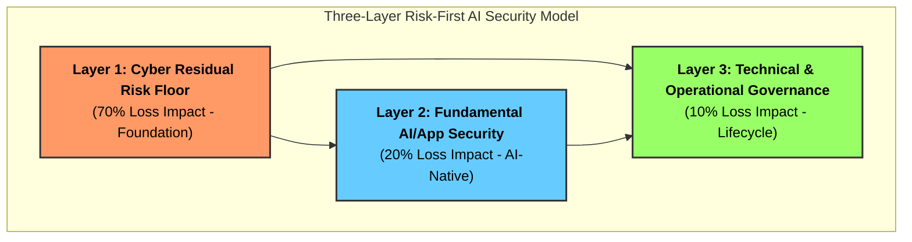

# 🔱 TriSuElla-AIDLCA Secure Development Framework
> **Version**: 3.3.0 | **Status**: Institutionalized (Production-Ready, DevSecOps-Ready & CI-Verified) | **Checks**: 313 | **Rules**: 212 | **Domain Families**: 27  
> **Author**: [Bhaskar Puppala (PATEL)](https://www.linkedin.com/in/bhaskerkpatel/)  
> **AI-Driven. Policy-Governed. Trustworthy by Design.**

**TriSuElla** is the foundational governance framework for AI-driven development. It ensures that AI agents operate within secure, compliant, and human-aligned boundaries across the entire software lifecycle.

---

## 📈 Progress & Implementation Milestones (v3.3.0 Institutionalized & CI-Verified)

The framework has attained **100% completion** across all 27 governance families and automated enforcement tools:

| Domain & Invariant Category | Rule Count | Scope & Standards | Progress |
| :--- | :---: | :--- | :---: |
| **System Security Baseline (`TRISU-BASE`)** | 15 | OWASP Top 10 (2026), API security, encryption | 100% |
| **AI & Agentic Security (`TRISU-SEC`)** | 22 | OWASP LLM Top 10, Agentic Top 20, Video KYC Deepfake Gate | 100% |
| **Data Literacy & Integrity (`TRISU-DLIT`)** | 8 | Provenance attestation, vector retrieval ACL, air-gap PII defense | 100% |
| **Shadow AI & Model Discovery (`TRISU-SHADOW`)**| 6 | AST & regex scan, AI-BOM reconciliation, Gateway bypass gate | 100% |
| **Zero Trust Architecture & Code (`TRISU-TRUST`/`ZTC`)** | 22 | CISA ZT Model, NIST SP 800-207, 8 in-code AST invariants | 100% |
| **Sensitive Data Security (`TRISU-DATA`)** | 10 | DPDPA (India), GDPR, HIPAA, L0–L4 Classification | 100% |
| **Infrastructure & NTP Integrity (`TRISU-INFRA`)** | 16 | CIS Benchmarks, Cosign/SLSA container gates, NTP sync | 100% |
| **Cloud & Multi-Cloud CSPM (`TRISU-CLOUD`/`CSPM`)** | 24 | 14 CSPM controls across AWS, Azure, GCP, Alibaba, OCI | 100% |
| **Privacy, Secure & Safety by Design (`TRISU-DESIGN`)** | 10 | Art. 25 GDPR, NIST SSDF, Privacy-by-Default | 100% |
| **Regulatory & BFSI Compliance (`TRISU-COMP`/`ISO-IND`)**| 41 | India BFSI (CERT-In 6h), DPDPA, PCI-DSS v4, HIPAA, SOC 2 | 100% |
| **Property-Based Testing (`TRISU-TEST`)** | 10 | Hypothesis, fast-check, proptest invariant verification | 100% |
| **Model Context Protocol Security (`TRISU-MCP`)** | 6 | MCP Schema Sanitization, Recursion Bounds, HITL | 100% |
| **EU AI Act High-Risk Compliance (`TRISU-EUAI`)** | 7 | EU Regulation 2024/1689 (Articles 9–15, CE Gate) | 100% |
| **Agentic Identity & Delegation (`TRISU-AIAM`)** | 5 | RFC 8693 Token Exchange, SPIFFE/mTLS, Ephemeral Keys | 100% |
| **Open Source & Supply Chain Security (`TRISU-OSS`)** | 6 | Lockfile hash pinning, license scan, CycloneDX AI v1.6 | 100% |
| **TOTAL INVARIANTS & POLICIES** | **212 Rules / 313 Checks** | **100% Enforced in Master Rules & Automated CLI** | **100%** |

---

## 🚦 TriSuElla Severity Scale
Every rule in this framework is assigned a severity rating based on its risk-first impact:
*   `[CRITICAL]`: Immediate risk of systemic compromise or data breach. **Atomic/Blocking**.
*   `[HIGH]`: Significant risk of exploitation or non-compliance. Must be resolved within the phase.
*   `[MEDIUM]`: Moderate risk; best practice or deferred hardening.
*   `[LOW]`: Minor optimization or UI/UX hygiene.

---

## 🏗️ The Three Pillars
1.  🔴 **SISU (Execution & Intelligence)**: Intelligent, resilient execution of development tasks.
2.  🔵 **TILLIT (Trust, Security & Compliance)**: Zero Trust governance and regulatory alignment.
3.  🟢 **DUGNAD (Collaboration & Orchestration)**: Multi-agent and human-in-the-loop coordination.

---

## 🛡️ Risk-First AI Security (The 3-Layer Model)
We prioritize security investment where the actual financial and operational loss occurs:



### 🏗️ The Financial Architecture of the 3-Layer Model
The model is based on the insight that AI systems don't exist in a vacuum; they sit on top of legacy infrastructure and under a governance umbrella.

| Layer | Focus | Est. Loss Impact | Why the "Next Dollar" belongs here: |
| :--- | :--- | :--- | :--- |
| **Layer 1: Cyber Residual Risk Floor** | Fundamentals: Identity (IAM), Cloud Posture, Patching, Endpoint Security. | **~70%** | **The Baseline:** Even if your LLM is perfectly secure, if an attacker steals the API key because of a misconfigured S3 bucket or an unpatched server, the AI system is compromised. This is where 70% of actual loss occurs in the real world. |
| **Layer 2: AI / App Security** | AI-Native Risks: Prompt Injection, Tool-use boundaries, Agent Sandboxing, Semantic WAFs. | **~20%** | **The New Surface:** This is the layer of "Prompt Injection" and "Excessive Agency." While high-profile, it accounts for a smaller fraction of total financial loss than Layer 1, but it requires specialized, AI-native security tools. |
| **Layer 3: Technical & Operational Governance** | Lifecycle & Oversight: NI-IAM, AI-BoM, Policy-as-Code, Human-in-the-Loop, Audit. | **~10%** | **The Long Game:** This layer manages the "silent failures"—model drift, compliance fines, and operational overreach. It is the cheapest to implement but the most critical for long-term legal and regulatory survival. |

---

## 🚀 Quick Setup (30 Seconds)

### Option A: Turnkey Zero-Setup Scaffolding
From the repository root:
```bash
# Windows
.\trisu.cmd init --target /path/to/my-repo

# Linux / macOS / Git Bash
./trisu init --target /path/to/my-repo

# Global CLI (via pip install -e tools/trisu-cli)
trisu init --target /path/to/my-repo
```
This automatically scaffolds `.cursorrules`, `CLAUDE.md`, `.windsurfrules`, `.github/copilot-instructions.md`, `trisuella.config.yaml`, and the PR verification gate (`.github/workflows/trisuella-gate.yml`).

### Option B: Direct AI Assistant Instruction
1.  **Activate**: Tell your AI assistant (Cursor, Claude, Copilot, Windsurf):
    > *"Follow the TRISUELLA-AIDLCA v3.0 workflow defined in TRISUELLA-AIDLCA-rules/core-workflow.md"*
2.  **Initialize**: Describe what you want to build. The framework handles the rest.
3.  **Enforce**: All code generated is automatically audited against the 20-item **Security Review Checklist** and 313 consolidated invariants.

---

## 📚 Documentation & Key References
*   📖 **[Master Rules & Checks Reference (313 Checks)](../TRISUELLA_MASTER_RULES_AND_CHECKS.md)**
*   📘 **[Framework Usage Guide (v3.0)](../Usage-Guide.md)**
*   📜 **[Complete Rule Directory & Detailed Guide](FULL_README.md)**
*   🏛️ **[Framework Charter & Philosophy](CHARTER.md)**
*   🛡️ **[Zero Trust Code (TRISU-ZTC)](TRISUELLA-AIDLCA-rule-details/extensions/security/system-baseline/zero-trust-code.md)**
*   📦 **[Open Source Security & Supply Chain (TRISU-OSS)](TRISUELLA-AIDLCA-rule-details/extensions/security/system-baseline/open-source-security.md)**
*   ☁️ **[Multi-Cloud CSPM Architecture (TRISU-CSPM)](TRISUELLA-AIDLCA-rule-details/extensions/infrastructure/cloud-cspm-rules.md)**
*   🔌 **[Model Context Protocol Security (TRISU-MCP)](TRISUELLA-AIDLCA-rule-details/extensions/security/ai-agentic/mcp-security.md)**
*   🇪🇺 **[EU AI Act High-Risk Compliance (TRISU-EUAI)](TRISUELLA-AIDLCA-rule-details/extensions/compliance/compliance-eu-ai-act.md)**
*   🔑 **[Agentic Identity & Delegation (TRISU-AIAM)](TRISUELLA-AIDLCA-rule-details/extensions/security/ai-agentic/agentic-identity-delegation.md)**
*   🛠️ **[Validator CLI Manual (`trisu`)](../tools/trisu-cli/README.md)**
*   🤝 **[Multi-Agent System & Protocol (TRISUELLA-AIDLCAa)](../TRISUELLA-AIDLCAa/README.md)**

---

*v3.3.0 — Security-first, AI-native. Built for the era of Agentic Autonomy.*

