# TRISU Adaptive Workflow Overview

**Purpose**: Technical reference for AI agents and human stewards to understand the complete TRISU governance lifecycle.

---

## The Three-Phase Lifecycle

The TRISU framework operates within three high-level lifecycle phases:
- 🔵 **INCEPTION PHASE**: Strategic planning, architectural invariants, and security design (Workspace Detection + Threat Modeling + Workflow Planning).
- 🟢 **CONSTRUCTION PHASE**: Detailed design, implementation, and rigorous verification (Per-unit design + Code Generation + Build & Test).
- 🟡 **OPERATIONS PHASE**: Release engineering, deployment planning, and incident response readiness.

---

## The Adaptive Workflow Logic

TRISU uses a non-linear, adaptive execution model:
1. **Workspace Detection** (Always): Initial analysis of environment and project context.
2. **Reverse Engineering** (Conditional): Deep-dive into legacy code for brownfield transitions.
3. **Requirements Analysis** (Always): Adaptive-depth discovery of functional and non-functional needs.
4. **Threat Modeling** (Conditional): Risk identification using advanced assessment logic.
5. **Workflow Planning** (Always): Creating the execution map for the active session.
6. **Code Generation** (Always): Multi-part implementation following TRISU-SEC and TRISU-BASE standards.
7. **Build and Test** (Always): Automated verification including **TRISU-TEST** property-based proofs.

---

## Collective Stewardship (DUGNAD)

- **Interactive Questioning**: Stewards provide context and choices (A, B, C, D) to guide the AI’s logic.
- **Phase Approval**: Every phase transition requires explicit validation against the **TILLIT** (Trust) pillar.
- **Continuous Audit**: All decisions are recorded in a tamper-evident audit stream.

---

## TRISU Workflow Visualization

```mermaid
flowchart TD
    Start(["Strategic Intent"])

    subgraph INCEPTION["🔵 INCEPTION PHASE"]
        WD["Workspace Detection<br/><b>ALWAYS</b>"]
        RE["Reverse Engineering<br/><b>CONDITIONAL</b>"]
        RA["Requirements Analysis<br/><b>ALWAYS</b>"]
        TM["Threat Modeling<br/><b>CONDITIONAL</b>"]
        Stories["User Stories<br/><b>CONDITIONAL</b>"]
        WP["Workflow Planning<br/><b>ALWAYS</b>"]
        AppDesign["Application Design<br/><b>CONDITIONAL</b>"]
        UnitsG["Units Generation<br/><b>CONDITIONAL</b>"]
    end

    subgraph CONSTRUCTION["🟢 CONSTRUCTION PHASE"]
        FD["Functional Design<br/><b>CONDITIONAL</b>"]
        NFRA["NFR Requirements<br/><b>CONDITIONAL</b>"]
        NFRD["NFR Design<br/><b>CONDITIONAL</b>"]
        ID["Infrastructure Design<br/><b>CONDITIONAL</b>"]
        CG["Code Generation<br/><b>ALWAYS</b>"]
        BT["Build and Test<br/><b>ALWAYS</b>"]
    end

    subgraph OPERATIONS["🟡 OPERATIONS PHASE"]
        CICD["CI/CD Pipeline Gen<br/><b>CONDITIONAL</b>"]
        DP["Deployment Planning<br/><b>ALWAYS</b>"]
        OBS["Observability Setup<br/><b>CONDITIONAL</b>"]
        IR["Incident Response<br/><b>CONDITIONAL</b>"]
    end

    Start --> WD
    WD -.-> RE
    WD --> RA
    RE --> RA

    RA -.-> TM
    RA -.-> Stories
    RA --> WP
    TM --> WP
    Stories --> WP

    WP -.-> AppDesign
    WP -.-> UnitsG
    AppDesign -.-> UnitsG
    UnitsG --> FD
    FD -.-> NFRA
    NFRA -.-> NFRD
    NFRD -.-> ID

    WP --> CG
    FD --> CG
    NFRA --> CG
    NFRD --> CG
    ID --> CG
    CG -.->|Next Unit| FD
    CG --> BT
    BT -.-> CICD
    BT --> DP
    CICD --> DP
    DP -.-> OBS
    OBS -.-> IR
    IR --> End(["Operational Readiness"])
    DP --> End

    style WD fill:#4CAF50,stroke:#1B5E20,stroke-width:3px,color:#fff
    style RA fill:#4CAF50,stroke:#1B5E20,stroke-width:3px,color:#fff
    style WP fill:#4CAF50,stroke:#1B5E20,stroke-width:3px,color:#fff
    style CG fill:#4CAF50,stroke:#1B5E20,stroke-width:3px,color:#fff
    style BT fill:#4CAF50,stroke:#1B5E20,stroke-width:3px,color:#fff
    style DP fill:#4CAF50,stroke:#1B5E20,stroke-width:3px,color:#fff

    style TM fill:#E53935,stroke:#B71C1C,stroke-width:3px,stroke-dasharray: 5 5,color:#fff
    style RE fill:#FFA726,stroke:#E65100,stroke-width:3px,stroke-dasharray: 5 5,color:#000
    style Stories fill:#FFA726,stroke:#E65100,stroke-width:3px,stroke-dasharray: 5 5,color:#000
    style AppDesign fill:#FFA726,stroke:#E65100,stroke-width:3px,stroke-dasharray: 5 5,color:#000
    style UnitsG fill:#FFA726,stroke:#E65100,stroke-width:3px,stroke-dasharray: 5 5,color:#000
    style FD fill:#FFA726,stroke:#E65100,stroke-width:3px,stroke-dasharray: 5 5,color:#000
    style NFRA fill:#FFA726,stroke:#E65100,stroke-width:3px,stroke-dasharray: 5 5,color:#000
    style NFRD fill:#FFA726,stroke:#E65100,stroke-width:3px,stroke-dasharray: 5 5,color:#000
    style ID fill:#FFA726,stroke:#E65100,stroke-width:3px,stroke-dasharray: 5 5,color:#000
    style CICD fill:#FFA726,stroke:#E65100,stroke-width:3px,stroke-dasharray: 5 5,color:#000
    style OBS fill:#FFA726,stroke:#E65100,stroke-width:3px,stroke-dasharray: 5 5,color:#000
    style IR fill:#FFA726,stroke:#E65100,stroke-width:3px,stroke-dasharray: 5 5,color:#000

    style INCEPTION fill:#BBDEFB,stroke:#1565C0,stroke-width:3px, color:#000
    style CONSTRUCTION fill:#C8E6C9,stroke:#2E7D32,stroke-width:3px, color:#000
    style OPERATIONS fill:#FFF59D,stroke:#F57F17,stroke-width:3px, color:#000
    style Start fill:#CE93D8,stroke:#6A1B9A,stroke-width:3px,color:#000
    style End fill:#CE93D8,stroke:#6A1B9A,stroke-width:3px,color:#000

    linkStyle default stroke:#333,stroke-width:2px
```

---

## Stage Definitions

### 🔵 INCEPTION PHASE: Strategic Alignment & Design
- **Workspace Detection**: Autonomous situational analysis of the current environment.
- **Requirements Analysis**: Deep discovery governed by **TRISU-DESIGN** principles.
- **Threat Modeling**: Identification of attack vectors using a risk-first 3-layer model.
- **Workflow Planning**: Real-time construction of the adaptive execution path.

### 🟢 CONSTRUCTION PHASE: Design & Rigorous Implementation
- **Functional & NFR Design**: Discrete logic and non-functional invariant planning.
- **Infrastructure Design**: Secure mapping to sovereign resources and cloud platforms.
- **Code Generation**: Automated implementation guided by **TRISU-SEC** and **TRISU-BASE**.
- **Build and Test**: Multi-dimensional verification, including **TRISU-TEST** and vulnerability scanning.

### 🟡 OPERATIONS PHASE: Deployment & Resilience
- **Deployment Planning**: Rollout strategy, environment isolation, and rollback logic.
- **Observability Setup**: Monitoring for security, performance, and cognitive drift signals.
- **Incident Response**: Automated runbooks and breach protocols for rapid recovery.
