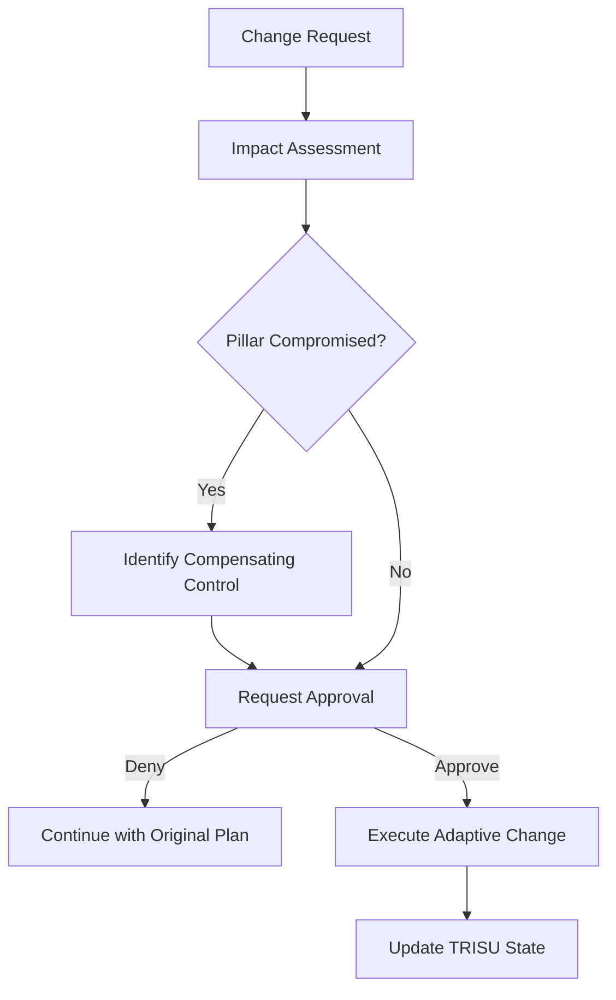

# TRISU Phase Management & Adaptive Flux

## Overview

The TRISU framework is designed for **Adaptive Flux**—recognizing that strategic intent and requirements may evolve during the development lifecycle. This document provides the protocol for handling mid-workflow changes securely and transparently.

---

## Change Categories

### 1. Retroactive Phase Activation
**Scenario**: A steward decides to activate a previously skipped phase.
- **Protocol**:
    1. **Dependency Verification**: Ensure all prerequisite logic for the new phase is available.
    2. **Strategic Update**: Revise the `execution-plan.md` to reflect the new inclusion.
    3. **State Transition**: Mark the phase as `PENDING` in the **TRISU State** file.
    4. **DUGNAD Synchronization**: Inform all human stewards of the increased scope and timeline impact.

### 2. Strategic Phase Exclusion
**Scenario**: A steward decides to skip a previously planned phase.
- **Protocol**:
    1. **Risk Impact Assessment**: Identify any [CRITICAL] or [HIGH] TRISU rules that would remain un-verified if the phase is skipped.
    2. **Mandatory Warning**: Explicitly detail the governance gap created by the exclusion.
    3. **Steward Confirmation**: Require explicit, documented acceptance of the risk.
    4. **State Transition**: Mark as `EXCLUDED` in the TRISU State file.

### 3. Stage Reset & Logic Refactoring
**Scenario**: The output of a stage does not meet the **SISU** (Resilience) or **TILLIT** (Trust) invariants.
- **Protocol**:
    1. **Root Cause Analysis**: Identify why the stage failed to meet the required standard.
    2. **Non-Destructive Archiving**: Backup current artifacts as `{artifact}.fail_repro.{timestamp}`.
    3. **Logic Reset**: Clear stage checkboxes and re-initialize the stage planning artifacts.
    4. **Corrective Re-execution**: Execute the stage again with adjusted parameters or more comprehensive depth.

### 4. Depth Escalation
**Scenario**: The complexity of a unit is discovered to be higher than initial assessment, requiring a shift from `Standard` to `Comprehensive`.
- **Protocol**:
    1. **Transition Update**: Update the `workflow-planning.md` to reflect the escalated depth level.
    2. **Pillar Alignment**: Ensure all **TRISU-BASE** and **TRISU-SEC** controls for `Comprehensive` depth are activated.

---

## TRISU Governance Guidelines for Change

### Integrity First
Every change request MUST be evaluated against the core TRISU pillars. If a requested skip compromises the **TILLIT** (Trust) invariant, it MUST be flagged as a **Mandatory Halt** until a compensating control is identified.

### Transparent Traceability
All mid-workflow changes MUST be recorded in the tamper-evident audit stream, including:
- **Requester Identity**.
- **Strategic Rationale**.
- **Consequence Summary**.
- **Steward Approval Stamp**.

---

## Change Decision Flow

---

## Best Practices
1. **Never Assume Trust**: Always confirm destructive changes through a direct DUGNAD checkpoint.
2. **Detail the Downstream**: Explain exactly how redoing Phase A will affect the timelines and artifacts of Phase B and C.
3. **Sisu Resilience**: Ensure the system can recover to a stable state even if the change is aborted.
