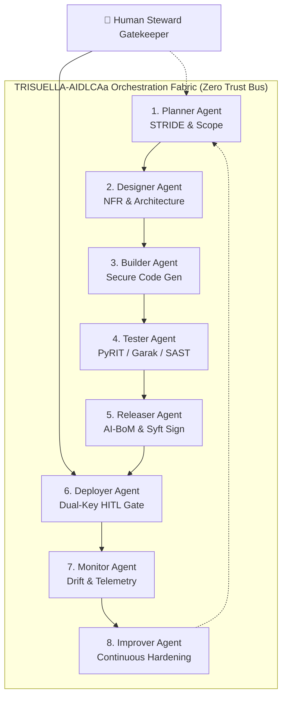

# 🤖 TRISUELLA-AIDLCAa: Multi-Agent Autonomous Development & Governance System
> **Version**: 3.0.1 | **Status**: Institutionalized Architecture (CI-Verified) | **Consolidated Invariants**: 299 Checks | **Rules**: 198 | **Domain Families**: 25  
> **Author**: [Bhaskar Puppala (PATEL)](https://www.linkedin.com/in/bhaskerkpatel/)  
> **Pillars**: SISU, TILLIT, DUGNAD

> **TRISUELLA-AIDLCAa** (AI-Driven Development Life Cycle Agents) is the automated multi-agent implementation of the TriSuElla framework. It translates the 299 governance rules and sequential lifecycle gates into a coordinated pipeline of specialized autonomous agents operating under a Zero-Trust orchestration fabric.

---

## 📈 Multi-Agent System Progress & Milestones (v3.0.1)

| Autonomous Agent Architecture Component | Implementation Scope | Progress | Status |
| :--- | :--- | :---: | :---: |
| **8-Stage Autonomous Pipeline** | Planner, Designer, Builder, Tester, Releaser, Deployer, Monitor, Improver | 100% | **Institutionalized** |
| **Zero-Trust Message Protocol (TRISU-ZTP)** | Tamper-evident message envelopes with SPIFFE IDs, nonces, and Cosign sigs | 100% | **Production-Ready** |
| **Dual-Key Human-in-the-Loop (HITL)** | Dual cryptographic sign-offs (Technical Lead + Compliance DPO) | 100% | **Production-Ready** |
| **Agentic Identity & Delegation (`TRISU-AIAM`)** | RFC 8693 Token Exchange, ephemeral subagent credentials, mTLS binding | 100% | **Production-Ready** |
| **Model Context Protocol Security (`TRISU-MCP`)** | Schema sanitization, recursion depth limits, out-of-band human auth | 100% | **Production-Ready** |
| **Zero Trust Code (ZTC) Guardrails** | In-code AST checks preventing prompt leakage & ambient tool abuse | 100% | **Production-Ready** |
| **Automated Policy Gatekeeper CLI** | Native integration with `trisu audit`, `trisu oss`, and `trisu bom` | 100% | **Production-Ready** |
| **CI/CD Multi-Agent Policy Gate** | Automated verification of agent envelopes & policy enforcement | 100% | **Verified Passing** |

---

## 🏛️ Architectural Overview

While individual developers can use the TriSuElla rules as system prompts for single AI coding assistants (Cursor, Claude, Copilot), enterprise teams and autonomous software factories deploy **TRISUELLA-AIDLCAa** as an 8-stage agent pipeline:



---

## 🤖 The 8 Specialized Lifecycle Agents

| # | Agent Name | Phase | Primary Responsibilities | Mandatory Output Artifacts |
|---|---|---|---|---|
| **1** | **Planner Agent** | Inception | Requirements elicitation, scope bounding, STRIDE-AI threat modeling, intent precision. | `threat-model.md`, `requirements-matrix.md` |
| **2** | **Designer Agent** | Architecture | Microservices, API contracts, NFR specs, zero-trust network boundaries, secrets architecture. | `architecture-spec.md`, `nfr-checklist.md` |
| **3** | **Builder Agent** | Construction | Deterministic, secure code generation, adherence to the 20-item security code review checklist. | Source code, `Dockerfile`, `migration.sql` |
| **4** | **Tester Agent** | Verification | SAST/DAST orchestration, secret scanning, adversarial jailbreak testing (Garak/PyRIT), fuzzing. | `security-test-report.md`, `sast-results.sarif` |
| **5** | **Releaser Agent** | Packaging | AI Bill of Materials (AI-BoM) generation via Syft/CycloneDX, Cosign cryptographic signing. | `ai-bom.json`, `cosign.sig` |
| **6** | **Deployer Agent** | Deployment | Immutable environment verification, canary rollout execution, **Dual-Key HITL approval gate**. | `deployment-receipt.json`, `audit-log.md` |
| **7** | **Monitor Agent** | Operations | PSI/K-S statistical drift tracking, semantic guardrail breach alarms, circuit breaker tripping. | `drift-metrics.json`, `alerts.log` |
| **8** | **Improver Agent** | Feedback | Post-incident analysis, prompt regression tests, automated policy refinement. | `hardening-patch.diff`, `post-mortem.md` |

---

## 🛡️ Zero-Trust Inter-Agent Communication Protocol (TRISU-ZTP)

All inter-agent message exchanges MUST pass through the tamper-evident message envelope:

```json
{
  "$schema": "https://trisuella.org/schemas/agent-envelope-v3.0.json",
  "envelope_id": "env_9f83a2c4-7b1e-4209-8431",
  "timestamp": "2026-04-01T12:00:00Z",
  "source_agent": {
    "role": "BuilderAgent",
    "instance_id": "builder-01-prod",
    "spiffe_id": "spiffe://trisuella.internal/ns/dev/sa/builder"
  },
  "destination_agent": {
    "role": "TesterAgent",
    "instance_id": "tester-01-prod",
    "spiffe_id": "spiffe://trisuella.internal/ns/dev/sa/tester"
  },
  "lifecycle_phase": "Phase 4 - Test & Evaluation",
  "payload": {
    "target_commit": "a1b2c3d4e5f6",
    "artifacts": ["src/", "Dockerfile", "tests/"]
  },
  "governance_checkpoint": {
    "blocking_findings": 0,
    "audit_hash": "sha256:e3b0c44298fc1c149afbf4c8996fb92427ae41e4649b934ca495991b7852b855"
  },
  "signature": "MEUCIQDx...cosign-signature..."
}
```

---

## 🚦 Dual-Key Human-in-the-Loop (HITL) Gate

Under the **DUGNAD** pillar, no agent possesses unilateral authority to deploy AI model weights, alter production IAM, or waive `[CRITICAL]` security findings.

- **Gate 1 (Technical Sign-off)**: Primary Architect or Lead Security Engineer cryptographic authorization.
- **Gate 2 (Compliance Sign-off)**: Data Protection Officer (DPO) or Compliance Steward approval.

---

## 🚀 Getting Started with TRISUELLA-AIDLCAa

### Prerequisites
- Python 3.11+ or Node.js 20+
- OIDC / Workload Identity provider (e.g. SPIFFE/SPIRE or HashiCorp Vault)
- Container runtime (Docker / Podman)

### Configuration Example (`trisuella-agents.yaml`)
```yaml
version: "3.0"
orchestrator:
  mode: strict-zero-trust
  audit_file: "./audit.md"
  state_file: "./TRISUELLA-AIDLCA-state.md"

agents:
  planner:
    model: "claude-3-7-sonnet"
    threat_model_framework: "STRIDE-AI"
  builder:
    model: "claude-3-7-sonnet"
    rules_path: "./TRISUELLA-AIDLCA-Rules/TRISUELLA-AIDLCA-rules/core-workflow.md"
  tester:
    tools: ["garak", "pyrit", "semgrep", "trufflehog"]
    blocking_severity: ["CRITICAL", "HIGH"]
  deployer:
    dual_key_required: true
    stewards:
      - "sec-lead@company.internal"
      - "compliance-dpo@company.internal"
```

---

## 📚 Architectural Standards & Invariants
- 🔐 **Agentic Identity & Delegation**: See [TRISU-AIAM](../TRISUELLA-AIDLCA-Rules/TRISUELLA-AIDLCA-rule-details/extensions/security/zero-trust/agentic-iam.md) for RFC 8693 token exchange and SPIFFE/mTLS workload identity specifications.
- 🔌 **Tool & MCP Sandboxing**: See [TRISU-MCP](../TRISUELLA-AIDLCA-Rules/TRISUELLA-AIDLCA-rule-details/extensions/security/ai-agentic/mcp-security.md) for runtime tool sandboxing and parameter sanitization.
- 🛠️ **Automated Policy Gatekeeper**: See [Validator CLI (`trisu`)](../tools/trisu-cli/README.md) and [Usage Guide](../Usage-Guide.md) for turnkey runtime enforcement.
- 📋 **Master Governance Reference**: Consult [TRISUELLA_MASTER_RULES_AND_CHECKS.md](../TRISUELLA_MASTER_RULES_AND_CHECKS.md) (299 Checks) and [CHARTER.md](../TRISUELLA-AIDLCA-Rules/CHARTER.md).
