# 🔱 Welcome to the OWASP TriSuElla-AIDLCA Wiki

> **Software Version**: 3.4.0 | **Framework Version**: 3.4.0 | **Status**: Institutionalized (Production-Ready, DevSecOps-Ready & CI-Verified)  
> **Consolidated Invariants**: 338 Checks | **Rules**: 237 | **Domain Families**: 33  
> **Author**: [Bhaskar Puppala (PATEL)](https://www.linkedin.com/in/bhaskerkpatel/)  
> **Repository**: [OWASP/OWASP-TriSuElla-AIDLCA-Framework](https://github.com/OWASP/OWASP-TriSuElla-AIDLCA-Framework)

---

## 🏛️ Strategic Vision: Continuous Trust & Assurance Platform

**OWASP TriSuElla** is a unified **Continuous Trust, Security, AI & Compliance Platform for Digital and AI Systems**.

Rather than treating compliance, AI governance, AppSec, and cloud security as isolated checklists, TriSuElla serves as the **master control-and-validation layer** connecting:

$$\textbf{Risk} \longrightarrow \textbf{Controls} \longrightarrow \textbf{Technical Reality} \longrightarrow \textbf{Evidence} \longrightarrow \textbf{Validation}$$

```mermaid
graph LR
    subgraph TRI["<b>TRI (Trust)</b>"]
        T1["Identity & IAM<br/>(RFC 8693 / SPIFFE)"]
        T2["Data Lineage<br/>(CycloneDX AI v1.6)"]
        T3["Supply Chain<br/>(SLSA / Cosign)"]
    end

    subgraph SU["<b>SU (Secure)</b>"]
        S1["Cybersecurity & Cloud<br/>(CSPM / CIS / Zero Trust)"]
        S2["AppSec & APIs<br/>(OWASP Top 10 / ASVS)"]
        S3["LLM & Agent Security<br/>(MCP Sandboxing / ZTC)"]
    end

    subgraph ELLA["<b>ELLA (Evaluate·Learn·Look·Act)</b>"]
        E1["Risk & Red Teaming<br/>(NIST AI RMF / PyRIT)"]
        E2["Continuous Telemetry<br/>(Drift & Anomaly Alarms)"]
        E3["Audit & Validation<br/>(SOC 2 / ISO 27001 / SARIF)"]
    end

    TRI --> SU
    SU --> ELLA
    ELLA -.->|Closed Feedback Loop| TRI

    style TRI fill:#e8f4fd,stroke:#0969da,stroke-width:2px,color:#000
    style SU fill:#fff8c5,stroke:#9a6700,stroke-width:2px,color:#000
    style ELLA fill:#dafbe1,stroke:#1a7f37,stroke-width:2px,color:#000
```



---

## 🖼️ Official Platform Architecture Blueprint


---

## 🔱 The TriSuElla Engine Triad

TriSuElla derives its strength from three integrated operational engines:

| Engine | Core Domain | Scope & Primary Enforcements |
| :--- | :--- | :--- |
| **TRI (TRUST)** | **Identity, Provenance, Supply Chain, Governance** | Workload Identity (SPIFFE/mTLS), Attenuated Token Exchange (RFC 8693), Training & RAG Dataset Provenance (SHA-256), Open-Source Software Supply Chain (SLSA Level 2+, Hash-pinned lockfiles), and Cryptographic Attestations. |
| **SU (SECURE)** | **Cybersecurity, AppSec, CloudSec, LLM & Agent Security** | In-Code AST Invariants (Zero Trust Code), OWASP API Security Top 10, OWASP Mobile Top 10, OWASP ASVS v4.0, Multi-Cloud CSPM (AWS, Azure, GCP, Alibaba, OCI), and Model Context Protocol (MCP) Tool Sandboxing. |
| **ELLA** | **Evaluate → Learn → Look → Act** | NIST AI RMF Risk Scoring, Automated Adversarial Stress Testing (PyRIT/Garak), Real-Time Statistical Drift Telemetry (PSI / K-S Test), Immutable SARIF 2.1.0 Evidence, and Automated Blocker Circuit Breakers. |

---

## 🧱 The 9 Modular Solution Layers

TriSuElla organizes modern digital and AI defense into 9 structural tiers:

1. **Layer 1: Core Enterprise GRC & Compliance** — SOC 2 Type II, ISO/IEC 27001:2022, ISO/IEC 27701, ISO 42001, NIST CSF 2.0, NIST SP 800-53 Rev. 5, CIS Controls v8, COBIT, CSA CCM v4.
2. **Layer 2: AI Governance, Safety & Risk** — NIST AI RMF 1.0, NIST GenAI Profile (NIST.IR.8596), EU AI Act (2024/1689), OECD AI Principles, AI Incident Management, AI Model Inventory.
3. **Layer 3: Application & LLM/Agent Security** — OWASP Top 10 for LLM Applications (2025 Standard), OWASP Agentic AI, OWASP ASVS v4.0, OWASP API Security Top 10, MCP Security.
4. **Layer 4: Software Supply-Chain Trust** — `Code → Dependency → Package → Container → Build → Artifact → Deployment` (CycloneDX AI v1.6, SLSA, Sigstore/Cosign, in-toto).
5. **Layer 5: Cloud & Infrastructure Posture** — Multi-Cloud CSPM across AWS, Azure, GCP, Alibaba Cloud, and OCI. Kubernetes KSPM, Secrets Lifecycle (Vault), Zero Trust (NIST SP 800-207).
6. **Layer 6: Privacy & Data Protection** — EU GDPR, India DPDP Act 2023, ISO 27701, L0–L4 Data Classification, Vector Store Pre-Retrieval ACLs, and Production Data Air-Gaps.
7. **Layer 7: Cyber Resilience & Operational Continuity** — Business Continuity (ISO 22301), DORA, NIS2, SEBI/RBI CSCRF, Ransomware WORM Locks, DR Verification.
8. **Layer 8: Third-Party & Vendor Risk (TPRM)** — Continuous Vendor-to-AI Risk Scoring: `Vendor → Product → Components → Data → AI → Controls → Risk → Evidence`.
9. **Layer 9: Sector-Specific Compliance Packs** — Healthcare (HIPAA, HITRUST, FDA AI/ML), BFSI (PCI-DSS v4.0, DORA, RBI 7 Sutras), Sovereign India, and Sovereign EU.

---

## ⚡ Zero-Dependency CLI Gatekeeper (`trisu`)

The framework ships with an enterprise-grade CLI requiring **zero external dependencies**:

```bash
# 1. Verify repository artifacts and developer templates
trisu check

# 2. Run blocking security & Zero Trust Code AST gate
trisu audit --sarif audit.sarif

# 3. Audit software supply chain & hash-pinned dependencies
trisu oss --sarif oss.sarif

# 4. Scan codebase for Shadow AI & undeclared model invocations
trisu shadow --sarif shadow.sarif

# 5. Inspect all 237 rule identifiers across 33 domain families
trisu rules

# 6. Display unified compliance crosswalk matrix
trisu matrix

# 7. Generate CycloneDX AI v1.6 Bill of Materials (AI-BoM)
trisu bom --output ai-bom.json

# 8. Scaffold complete governance into an existing repository
trisu init --target ./my-project
```

---

## 📚 Wiki Navigation

* 📖 **[The 9 Solution Layers](The-9-Solution-Layers)**: Detailed breakdown of each solution layer and mapped standards.
* 🔱 **[The TRI-SU-ELLA Engine Triad](TRI-SU-ELLA-Engine-Triad)**: How Trust, Security, and Continuous Evaluation operate.
* 🛠️ **[CLI Tooling & DevSecOps Guide](CLI-Tooling-and-DevSecOps)**: Installation, command reference, and CI/CD integration.
* 🌐 **[Multi-Standard Compliance Crosswalk](Multi-Standard-Compliance-Crosswalk)**: SOC 2, ISO 27001, NIST AI RMF, and EU AI Act mappings.
* 🤖 **[TRISUELLA-AIDLCAa Multi-Agent System](Multi-Agent-Lifecycle-Architecture)**: Autonomous 8-stage agent pipeline and ZTP protocol.
* 🚀 **[Quickstart & Scaffolding](Quickstart-and-Scaffolding)**: Getting started in under 30 seconds.
