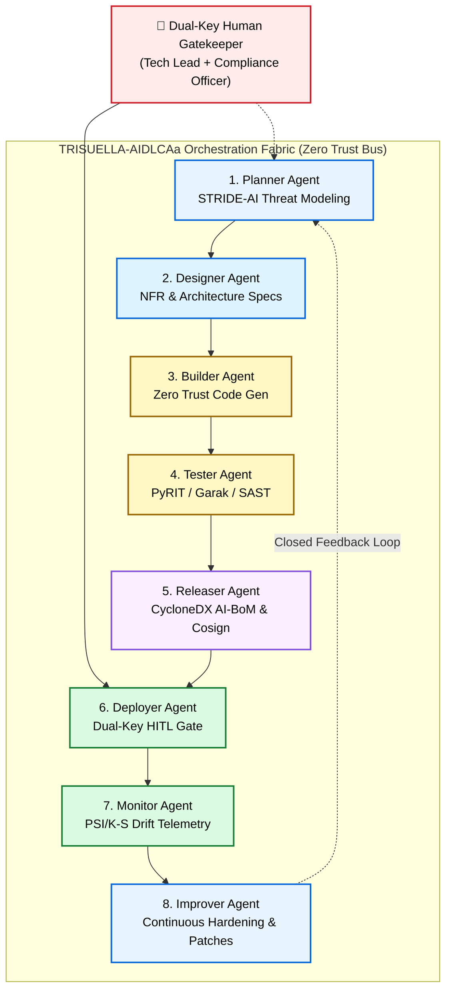

# 🤖 Multi-Agent Lifecycle Architecture (TRISUELLA-AIDLCAa)

> **Platform Version**: 3.4.0 | **Consolidated Invariants**: 338 Checks | **Rules**: 237  
> **Repository**: [OWASP/OWASP-TriSuElla-AIDLCA-Framework](https://github.com/OWASP/OWASP-TriSuElla-AIDLCA-Framework)

---

## 🧭 Autonomous Multi-Agent Governance

**TRISUELLA-AIDLCAa** (AI-Driven Development Life Cycle Agents) is the automated multi-agent operational fabric of the TriSuElla platform. It translates the 338 governance checks and sequential lifecycle gates into a coordinated pipeline of specialized autonomous agents operating under a Zero-Trust orchestration bus.

While individual engineers can apply the TriSuElla rules as system instructions in AI IDEs (such as Antigravity, Cursor, Copilot, or Claude Code), autonomous software factories and enterprise DevSecOps teams run the full 8-stage agent pipeline.



---

## 🤖 The 8 Specialized Lifecycle Agents

| Stage | Agent Name | Phase | Core Operational Responsibilities | Mandatory Artifact Generated |
| :---: | :--- | :--- | :--- | :--- |
| **1** | **Planner Agent** | Inception | Requirements elicitation, scope bounding, STRIDE-AI threat modeling, and intent precision. | `threat-model.md`, `requirements-matrix.md` |
| **2** | **Designer Agent** | Architecture | Microservices, API contracts, NFR specs, zero-trust network boundaries, secrets architecture. | `architecture-spec.md`, `nfr-checklist.md` |
| **3** | **Builder Agent** | Construction | Deterministic, secure code generation, adherence to the 20-item security code review checklist. | Source code, `Dockerfile`, `migration.sql` |
| **4** | **Tester Agent** | Verification | SAST/DAST orchestration, secret scanning, adversarial jailbreak testing (Garak/PyRIT), fuzzing. | `security-test-report.md`, `sast-results.sarif` |
| **5** | **Releaser Agent** | Packaging | AI Bill of Materials (AI-BoM) generation via CycloneDX v1.6, Cosign cryptographic signing. | `ai-bom.json`, `cosign.sig` |
| **6** | **Deployer Agent** | Deployment | Immutable environment verification, canary rollout execution, **Dual-Key HITL approval gate**. | `deployment-receipt.json`, `audit-log.md` |
| **7** | **Monitor Agent** | Operations | PSI/K-S statistical drift tracking, semantic guardrail breach alarms, circuit breaker tripping. | `drift-metrics.json`, `alerts.log` |
| **8** | **Improver Agent** | Feedback | Post-incident analysis, prompt regression tests, automated policy refinement, and self-healing. | `hardening-patch.diff`, `post-mortem.md` |

---

## 🛡️ Zero-Trust Inter-Agent Communication Protocol (TRISU-ZTP)

Autonomous agents never communicate over open, unauthenticated channels. Every inter-agent payload is enveloped in a cryptographically signed **TRISU-ZTP** message envelope:

```json
{
  "$schema": "https://trisuella.org/schemas/agent-envelope-v3.4.json",
  "envelope_id": "env_9f83a2c4-7b1e-4209-8431-18e390c8a201",
  "timestamp": "2026-09-14T18:00:00Z",
  "sender": {
    "agent_id": "trisuella-builder-01",
    "spiffe_id": "spiffe://trisuella.internal/ns/pipeline/sa/builder",
    "role": "BUILDER"
  },
  "recipient": {
    "agent_id": "trisuella-tester-01",
    "role": "TESTER"
  },
  "authorization": {
    "token_exchange_standard": "RFC_8693",
    "delegation_depth": 1,
    "max_allowed_depth": 3,
    "scopes": ["read:source", "execute:sast", "emit:sarif"]
  },
  "payload_hash": "sha256:7f83b1657ff1fc53b92dc18148a1d65dfc2d4b1fa3d677284addd200126d9069",
  "signature": {
    "algorithm": "Ed25519",
    "public_key_id": "cosign-key-builder-2026",
    "signature_bytes": "base64EncodedSignatureHere..."
  }
}
```

---

## 🔑 Dual-Key Human-in-the-Loop (HITL) Gate

For production promotions and destructive actions, the Deployer Agent enforces **Dual-Key Cryptographic Sign-Off**:
1. **Key 1 (Technical Steward)**: Validates code review, test coverage (≥80%), and clean SARIF reports (`trisu audit`).
2. **Key 2 (Compliance / DPO Steward)**: Validates CycloneDX AI-BoM (`trisu bom`), privacy reviews, and algorithmic impact assessments.

Without both digital signatures, the deployment gate remains locked (`fail-closed`).

---

[← Multi-Standard Compliance Matrix](Multi-Standard-Compliance-Crosswalk) | [Proceed to Quickstart & Scaffolding →](Quickstart-and-Scaffolding)
