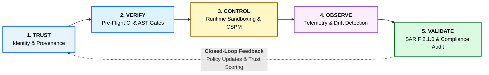

# 🔱 The TRI-SU-ELLA Engine Triad & Closed-Loop Architecture

> **Platform Version**: 3.4.0 | **Consolidated Invariants**: 338 Checks | **Rules**: 237  
> **Repository**: [OWASP/OWASP-TriSuElla-AIDLCA-Framework](https://github.com/OWASP/OWASP-TriSuElla-AIDLCA-Framework)

---

## 🧭 The Core Engine Triad

The OWASP TriSuElla Framework derives its protective and governance capabilities from three tightly coupled operational engines:

```
                  +-----------------------------------+
                  |         TRI (TRUST ENGINE)        |
                  | Identity, Provenance, Supply Chain|
                  +-----------------+-----------------+
                                    |
                                    v
                  +-----------------+-----------------+
                  |         SU (SECURE ENGINE)        |
                  | Cybersecurity, AppSec, Cloud, MCP |
                  +-----------------+-----------------+
                                    |
                                    v
                  +-----------------+-----------------+
                  |        ELLA (EVALUATE ENGINE)     |
                  | Evaluate, Learn, Look, Act (SARIF)|
                  +-----------------+-----------------+
                                    |
            [Continuous Closed-Loop Feedback Flow]
                                    |
                                    +-----------------> (↺ Feeds back to TRI)
```

---

## 1. Engine TRI (TRUST)
**Focus**: Identity, Provenance, Supply Chain, Governance, Ownership.

The TRI Engine ensures that nothing enters the system without a verifiable identity, cryptographic origin, and clear governance mandate:

- **Workload Identity Federation**: Zero hardcoded credentials. All workloads authenticate via SPIFFE/SPIRE, mTLS, or RFC 8693 Token Exchange with cryptographic attenuation.
- **Dataset Lineage & Integrity**: Every training dataset, fine-tuning split, and RAG vector store maintains SHA-256 cryptographic hashes and data cards detailing origin, licensing, and consent under CycloneDX AI v1.6.
- **Open Source Supply Chain**: Enforces SLSA Level 2+ build integrity, hash-pinned lockfiles (`poetry.lock`, `package-lock.json`, `Cargo.lock`), and binary signature verification using Sigstore/Cosign.

---

## 2. Engine SU (SECURE)
**Focus**: Cybersecurity, Application Security, Cloud Security, LLM & Agent Security, Data Security.

The SU Engine actively guards the runtime execution boundaries against compromise, lateral movement, and systemic exploit:

- **Zero Trust Code (ZTC) AST Invariants**: Pre-commit and CI-blocking static analysis enforcing parameterization over concatenation, secure serialization (banning `eval` and `pickle`), and robust exception handling.
- **Multi-Cloud CSPM & KSPM**: Continuous alignment with CIS Benchmarks across AWS, Azure, GCP, Alibaba, and OCI; enforcing hardened Kubernetes pods, network policies, and automated secret rotation.
- **LLM & Model Context Protocol (MCP) Sandboxing**: Defense against OWASP Top 10 for LLM Applications (Prompt Injection, Insecure Output, Model Denial of Service). For autonomous agents, SU enforces containerized micro-isolation, ephemeral execution contexts, and strict tool-call argument schemas.

---

## 3. Engine ELLA (EVALUATE → LEARN → LOOK → ACT)
**Focus**: Risk Assessment, Adversarial Red-Teaming, Continuous Telemetry, Evidence Collection, Remediation, Independent Validation.

ELLA is the dynamic cognitive telemetry engine of the framework:

```
[EVALUATE] ──> [LEARN] ──> [LOOK] ──> [ACT]
```

- **EVALUATE**: Runs automated adversarial evaluations using tools like PyRIT, Garak, and prompt mutation fuzzers to benchmark hallucination rates, toxicity, and extraction vulnerability against NIST AI RMF targets.
- **LEARN**: Continuously analyzes operational telemetry, model inference metrics, and statistical distributions to compute Population Stability Index (PSI) and Kolmogorov-Smirnov (K-S) drift tests.
- **LOOK**: Deep real-time observability across prompt/response tokens, tool invocation payloads, latency histograms, and system anomaly indicators.
- **ACT**: Automated circuit-breakers that fail-closed when drift thresholds or anomalous egress patterns are breached, emitting OASIS SARIF 2.1.0 audit records and initiating corrective remediation.

---

## 🔄 The Universal Closed-Loop Formula

Traditional compliance frameworks are linear: write a document, perform an annual audit, and file a report. TriSuElla replaces this with an **active, continuous closed loop**:

$$\mathbf{[TRUST]} \longrightarrow \mathbf{[VERIFY]} \longrightarrow \mathbf{[CONTROL]} \longrightarrow \mathbf{[OBSERVE]} \longrightarrow \mathbf{[VALIDATE]} \mathrel{\mathbf{\circlearrowleft}} \mathbf{[TRUST]}$$



### Closed-Loop Dynamics:
1. **Validation Feeds Trust**: When `[VALIDATE]` identifies drift, new vulnerabilities, or anomalous agent behavior via SARIF reports, it automatically adjusts the trust score of the workload in `[TRUST]`.
2. **Policy Auto-Adaptation**: Policy violations trigger automated pull-request checks and circuit breakers, ensuring that systemic risk does not accumulate undetected.
3. **Audit-Ready Continuous Assurance**: The closed loop generates verifiable, tamper-evident audit trails satisfying auditors without manual screenshot collection.

---

[← The 9 Solution Layers](The-9-Solution-Layers) | [Proceed to CLI Tooling & DevSecOps Guide →](CLI-Tooling-and-DevSecOps)
