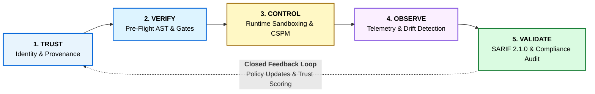

# 🔱 OWASP TriSuElla-AIDLCA Master Wiki

> **Continuous Trust, Security, AI & Compliance Platform for Digital and AI Systems**  
> **Software Version**: 3.4.0 | **Framework Version**: 3.4.0 | **Status**: Institutionalized (Production-Ready, DevSecOps-Ready & CI-Verified)  
> **Consolidated Invariants**: 338 Checks | **Rules**: 237 | **Domain Families**: 33  
> **Author**: [Bhaskar Puppala (PATEL)](https://www.linkedin.com/in/bhaskerkpatel/)  
> **Repositories**:  
> • GitHub OWASP: [OWASP/OWASP-TriSuElla-AIDLCA-Framework](https://github.com/OWASP/OWASP-TriSuElla-AIDLCA-Framework)  
> • GitHub Source: [thundel/TriSuElla-AIDLCA-Framework](https://github.com/thundel/TriSuElla-AIDLCA-Framework)

---

## 📑 Table of Contents

1. [Executive Summary & Strategic Vision](#1-executive-summary--strategic-vision)
2. [Official Platform Architecture Blueprint](#2-official-platform-architecture-blueprint)
3. [The Universal Operating Formula (Closed-Loop)](#3-the-universal-operating-formula-closed-loop)
4. [The TRI-SU-ELLA Engine Triad](#4-the-tri-su-ella-engine-triad)
5. [The 9 Modular Solution Layers](#5-the-9-modular-solution-layers)
6. [Multi-Standard Regulatory Crosswalk Matrix](#6-multi-standard-regulatory-crosswalk-matrix)
7. [Zero-Dependency CLI Gatekeeper (`trisu`)](#7-zero-dependency-cli-gatekeeper-trisu)
8. [DevSecOps, GitHub Actions & SARIF Ingestion](#8-devsecops-github-actions--sarif-ingestion)
9. [Autonomous Multi-Agent System (TRISUELLA-AIDLCAa)](#9-autonomous-multi-agent-system-trisuella-aidlaa)
10. [Quickstart & Project Onboarding](#10-quickstart--project-onboarding)

---

## 1. Executive Summary & Strategic Vision

Modern digital enterprises face an unprecedented convergence of risks: legacy application vulnerabilities, cloud configuration drift, unvetted software supply chains, and the explosive proliferation of **Generative AI and Autonomous Agents**.

Traditional compliance frameworks are static, manual, and disconnected from code. **OWASP TriSuElla** solves this by establishing a continuous, code-level control plane connecting:

$$\mathbf{Risk} \longrightarrow \mathbf{Controls} \longrightarrow \mathbf{Technical\ Reality} \longrightarrow \mathbf{Evidence} \longrightarrow \mathbf{Validation}$$

Every governance claim made in an enterprise policy is backed by deterministic AST code checks, cryptographic attestations, and continuous operational telemetry.

---

## 2. Official Platform Architecture Blueprint

Below is the certified architectural blueprint of the OWASP TriSuElla platform, illustrating the operational layers, engine interactions, and active feedback loops:


---

## 3. The Universal Operating Formula (Closed-Loop)

Security and compliance are not one-way checklists. TriSuElla operates on a **continuous closed loop**:

$$\mathbf{[TRUST]} \longrightarrow \mathbf{[VERIFY]} \longrightarrow \mathbf{[CONTROL]} \longrightarrow \mathbf{[OBSERVE]} \longrightarrow \mathbf{[VALIDATE]} \mathrel{\mathbf{\circlearrowleft}} \mathbf{[TRUST]}$$



1. **TRUST**: Establishes cryptographic identity (SPIFFE/mTLS) and provenance for all code, models, and datasets.
2. **VERIFY**: Enforces pre-flight static AST invariants and lockfile hash validations prior to build.
3. **CONTROL**: Applies runtime micro-segmentation, cloud CSPM, and Model Context Protocol (MCP) tool isolation.
4. **OBSERVE**: Continuously captures statistical drift (PSI / K-S tests), latency metrics, and prompt telemetry.
5. **VALIDATE**: Generates immutable OASIS SARIF 2.1.0 evidence and audit reports.
6. **FEEDBACK (↺)**: Telemetry alerts and audit findings dynamically adjust workload trust scores and trigger automated policy self-healing.

---

## 4. The TRI-SU-ELLA Engine Triad

| Engine | Primary Domain | Core Responsibilities & Enforcements |
| :--- | :--- | :--- |
| **TRI (TRUST)** | **Identity, Provenance, Supply Chain** | SPIFFE/SPIRE workload identities, RFC 8693 token exchanges, CycloneDX AI v1.6 AI-BoM provenance, SLSA Level 2+ supply-chain integrity, and hash-pinned dependency lockfiles. |
| **SU (SECURE)** | **Cybersecurity, AppSec, Cloud, MCP** | Zero Trust Code (ZTC) AST scanning, OWASP ASVS v4.0 verification, OWASP Top 10 for LLM Applications defense, Multi-Cloud CSPM (AWS, Azure, GCP, OCI, Alibaba), and Model Context Protocol (MCP) tool sandboxing. |
| **ELLA** | **Evaluate → Learn → Look → Act** | Continuous risk scoring (NIST AI RMF), automated red-teaming (PyRIT/Garak), real-time drift telemetry (PSI / K-S tests), OASIS SARIF 2.1.0 reporting, and automated circuit-breaker fail-closed controls. |

---

## 5. The 9 Modular Solution Layers

1. **Layer 1: Core Enterprise GRC & Compliance** — SOC 2 Type II, ISO/IEC 27001:2022, ISO/IEC 27701, ISO 42001 (AIMS), ISO 23894, NIST CSF 2.0, NIST SP 800-53 Rev. 5, CIS Controls v8, COBIT, CSA CCM v4.
2. **Layer 2: AI Governance, Safety & Risk** — NIST AI RMF 1.0, NIST GenAI Profile (NIST.IR.8596), EU AI Act (2024/1689), OECD AI Principles, AI Incident Management, Model Inventory, Algorithmic Impact Assessments.
3. **Layer 3: Application & LLM/Agent Security** — OWASP Top 10 for LLM Applications (2025 Standard), OWASP Agentic AI Security, OWASP ASVS v4.0, OWASP API Security Top 10, MCP Security, MITRE ATLAS.
4. **Layer 4: Software Supply-Chain Trust** — `Code → Dependency → Package → Container → Build → Artifact → Deployment` (CycloneDX AI v1.6, SLSA Level 2+, Sigstore/Cosign, in-toto, hash-pinned lockfiles).
5. **Layer 5: Cloud & Infrastructure Posture** — Multi-Cloud CSPM across AWS, Azure, GCP, Alibaba, and OCI. Kubernetes KSPM, Secrets Lifecycle (Vault), Zero Trust Architecture (NIST SP 800-207).
6. **Layer 6: Privacy & Data Protection** — EU GDPR, India DPDP Act 2023, ISO 27701, L0–L4 Data Classification, Vector Store Pre-Retrieval ACLs, and Production Data Air-Gapping.
7. **Layer 7: Cyber Resilience & Operational Continuity** — Business Continuity (ISO 22301), EU DORA, NIS2 Directive, SEBI/RBI CSCRF, Ransomware WORM Immutable Storage, Automated DR Failover Testing.
8. **Layer 8: Third-Party & Vendor Risk Management (TPRM)** — Continuous Vendor-to-AI Risk Scoring: `Vendor → Product → Components → Data → AI → Controls → Risk → Evidence`.
9. **Layer 9: Sector-Specific Compliance Packs** — Healthcare (HIPAA, HITRUST, FDA SaMD), BFSI (PCI-DSS v4.0, DORA, RBI 7 Sutras), Sovereign India (DPDPA, CERT-In, SEBI), and Sovereign EU (GDPR, EU AI Act, NIS2).

---

## 6. Multi-Standard Regulatory Crosswalk Matrix

| Rule Domain Family | TriSuElla Invariants | Primary Global Standards Mapped | Key Assurance Focus |
| :--- | :--- | :--- | :--- |
| **Zero Trust Code (`TRISU-ZTC`)** | 8 Rules / 12 Invariants | OWASP ASVS v4.0, CWE Top 25, NIST CSF 2.0 (PR.DS), SOC 2 CC6.1 | AST prevention of SQLi, hardcoded credentials, unsafe execution (`eval`), and loose subprocess calls. |
| **Shadow AI & Catalog (`TRISU-SHADOW`)** | 6 Rules / 14 Invariants | EU AI Act Art. 10/12, NIST AI RMF GOVERN 1.2, ISO 42001 Cl. 8, SOC 2 CC6.6 | Code-to-BOM reconciliation, unauthorized foundation models, enterprise GenAI gateway enforcement. |
| **Supply Chain & OSS (`TRISU-OSS`)** | 4 Rules / 10 Invariants | CycloneDX AI v1.6, SLSA Level 2+, Sigstore/Cosign, NIST SP 800-161, EO 14028 | Hash-pinned lockfiles, license compliance, AI Bill of Materials provenance, dependency vulnerability gates. |
| **Agentic AI & MCP (`TRISU-AGENT`)** | 8 Rules / 16 Invariants | OWASP Agentic AI Security, NIST AI RMF MANAGE 2.4, EU AI Act Art. 14 | Model Context Protocol tool sandboxing, unconstrained execution defense, human-in-the-loop (HITL) gates. |
| **Data & Privacy (`TRISU-PRIV`)** | 12 Rules / 24 Invariants | EU GDPR, India DPDP Act 2023, ISO/IEC 27701, HIPAA § 164.312, NIST Privacy | Production data air-gapping, automated PII/PHI redaction, pre-retrieval vector store ACLs. |
| **Cloud & K8s Posture (`TRISU-CSPM`)** | 14 Rules / 28 Invariants | CIS Benchmarks (AWS, Azure, GCP, OCI, Alibaba), NIST SP 800-207, SOC 2 CC6.3 | Zero-trust workload identity (SPIFFE/mTLS), immutable infrastructure, cloud drift defense. |
| **Resilience & Continuity (`TRISU-CONT`)** | 6 Rules / 12 Invariants | ISO 22301, EU DORA, NIS2 Directive, SEBI/RBI CSCRF | Ransomware WORM immutable storage, automated DR failover verification, RTO/RPO enforcement. |
| **Vendor & Third-Party (`TRISU-TPRM`)** | 8 Rules / 16 Invariants | NIST SP 800-161, ISO 27036, SOC 2 CC9.2 | Continuous AI model provider due diligence, vendor no-training-on-tenant-data contractual verification. |
| **Healthcare Pack (`TRISU-HLTH`)** | 6 Rules / 12 Invariants | HIPAA Security/Privacy, HITRUST CSF v11, FDA SaMD AI/ML Action Plan | PHI de-identification, clinical validation, algorithmic change control protocols (PCCP). |
| **BFSI & Financials (`TRISU-BFSI`)** | 8 Rules / 16 Invariants | PCI-DSS v4.0, EU DORA, RBI Master Direction on IT Governance, NYDFS 23 NYCRR 500 | Cardholder data environment (CDE) air-gapping, financial model explainability, real-time fraud circuit breakers. |

---

## 7. Zero-Dependency CLI Gatekeeper (`trisu`)

The `trisu` CLI requires **zero external pip dependencies** and runs natively on Python 3.9+:

```bash
# 1. Verify governance templates and charters
./trisu check

# 2. Run AST code security audit & generate SARIF
./trisu audit --sarif trisuella-audit.sarif

# 3. Detect Shadow AI & uncatalogued foundation models
./trisu shadow --sarif trisuella-shadow.sarif

# 4. Audit open-source dependencies & lockfile hashes
./trisu oss --sarif trisuella-oss.sarif

# 5. Generate CycloneDX AI v1.6 Bill of Materials (AI-BoM)
./trisu bom --output ai-bom.json

# 6. List all 237 rule definitions across 33 domain families
./trisu rules

# 7. Print compliance crosswalk matrix
./trisu matrix

# 8. Scaffold governance files into an existing project
./trisu init --target ./my-project
```

---

## 8. DevSecOps, GitHub Actions & SARIF Ingestion

Easily integrate TriSuElla as an automated blocking gate in your GitHub repository:

```yaml
name: TriSuElla Security Gate
on: [push, pull_request]

jobs:
  audit:
    runs-on: ubuntu-latest
    steps:
      - uses: actions/checkout@v4
      - uses: actions/setup-python@v5
        with:
          python-version: '3.11'
      - name: Run TriSuElla Audit
        run: python tools/trisu-cli/trisu_validator.py audit --sarif audit.sarif
      - name: Upload SARIF to GitHub Code Scanning
        uses: github/codeql-action/upload-sarif@v3
        if: always()
        with:
          sarif_file: audit.sarif
```

---

## 9. Autonomous Multi-Agent System (TRISUELLA-AIDLCAa)

For autonomous agent factories, TriSuElla provides the **TRISUELLA-AIDLCAa** 8-stage pipeline:

```
[1. Planner] ──> [2. Designer] ──> [3. Builder] ──> [4. Tester]
                                                          |
[8. Improver] <── [7. Monitor] <── [6. Deployer] <── [5. Releaser]
      |                                  ^
      +──────────────────────────────────+ (Dual-Key Human Gatekeeper)
```

- **Protocol**: All agents communicate via tamper-evident **TRISU-ZTP** message envelopes with SPIFFE IDs, RFC 8693 token attenuation, and Ed25519 signatures.
- **Safety Gate**: The Deployer Agent requires **Dual-Key Cryptographic Sign-Off** from both the Technical Lead and the Data Protection / Compliance Officer before any production promotion.

---

## 10. Quickstart & Project Onboarding

1. Clone the repository or copy `tools/trisu-cli/`.
2. Initialize your target project: `./trisu init --target /path/to/project`.
3. Configure thresholds in `trisuella.config.yaml`.
4. Run `./trisu check` and `./trisu audit` to verify your baseline.
5. Commit and enjoy continuous, automated compliance and security!

---

<p align="center">
  <b>OWASP TriSuElla-AIDLCA Framework v3.4.0</b><br/>
  Authored by <a href="https://www.linkedin.com/in/bhaskerkpatel/">Bhaskar Puppala (PATEL)</a>
</p>
